# 阅前必看

>  **本学习笔记面向对象：初学C语言的小白同学。**
>
> 下面提到的所有资源都在这个链接里：https://xianchengyue.lanzoui.com/b026am1uh	密码:6124


笔者是跟着B站[比特鹏哥](https://space.bilibili.com/456828781?spm_id_from=333.788.b_765f7570696e666f.1)的C语言视频学习C语言的。个人认为这就是<span style="color: #b91919; text-decoration: none; font-weight: bolder;">全网最好的C语言教学视频！</span>没有之一！我也非常感谢鹏哥愿意免费分享视频，让我们观看、学习。

2020版的C语言视频，我学习了接近一个月。收获匪浅。这套学习笔记便是成果。

笔者是C语言初学者，学识浅薄，如果在后面的内容中出现了错误，还请多多包容，你也可以直接修改源文件。[源文件+PDF链接](https://xianchengyue.lanzoui.com/b026frm3g)   密码:6124。如果需要联系我，这是我的联系方式：khi1215215@163.com。

想要查看、修改源文件，需要一些工具，下面我会介绍。源文件必须和图片文件夹处于**同一路径**。一旦更改，图片无法正确显示。

## 一、视频介绍

- **C语言视频链接：**
  - [（2020版）C语言教程_比特鹏哥](https://www.bilibili.com/video/BV1oi4y1g7CF)，这是旧版本，也是笔者学习的版本。
  - [（2021版）C语言教程_比特鹏哥](https://www.bilibili.com/video/BV1U44y1y7xN)，新版本收音很好，视频时长也控制得不错。
- **对应配套资料：**
  - 2020版：
    - [课件](https://xianchengyue.lanzoui.com/iGmYdtbhu0h)  密码:6124。
    - 源码：https://gitee.com/bitpg/bit-c-code
  - 2021版：
    - [课件](https://xianchengyue.lanzoui.com/iB1w4tbhsbg)  密码:6124。
    - [源码+上课板书](https://xianchengyue.lanzoui.com/ionfUtbiclg)   密码:6124，网页链接：https://gitee.com/bitpg/class101
- 个人认为2020版课件与2021版课件相比，基本没有太大改动，但是2021版的C语言视频录制、剪辑、内容都优于2020版。所以我推荐想要学习C语言的同学看2021版视频。

如果你看完了鹏哥的视频，觉得不错，可以看看这个：[比特课程介绍](https://xianchengyue.lanzoui.com/ihhWvtbk7uh)  密码:6124。这是他们的官网：http://www.bitejiuyeke.com/

## 二、编译器选择

C语言的编译器有很多，但我只推荐VS系列（2010及以上）、VS Code。其余的编译器不是太老，就是界面太丑，果断pass。

小白第一次使用VS 2019，建议看这个视频 **→** [VS 2019权威指南_Frank-FuckPPT](https://www.bilibili.com/video/BV1Xt411g7jT)。看完这个视频，你就基本掌握了VS 2019的使用。

VS Code编写C代码，需要配置C/C++环境，~~请自行上网查找，B站、知乎都有教程~~。我在B站看到了有大佬开发了一键配置C/C++环境的工具，并发布了视频，有需要的同学可以看下。
这是链接：

- [【一键】20秒配置VScodeC语言C++开发环境！免费开源_bilibili](https://www.bilibili.com/video/BV1r4411E7Be)
- [如何使用 VS Code 搭建 C++ 环境（简单快捷，适合小白）_bilibili](https://www.bilibili.com/video/BV1ZT4y1g7zt)
  如果上面的视频话是不行，就自行在网上搜索教程吧 or 放弃，使用VS 2019。大学生应具备**资源检索**能力。前端使用VS Code是很舒服的，不用配置环境。我就在用VS Code学习前端。
  突然想起，VS Code配置C/C++环境，要使用mingw，这玩意国内下载速度贼慢，我把它传到蓝奏云：[mingw下载](https://xianchengyue.lanzoui.com/iNSoItblych)   密码:6124。

我配置了好几次，都有问题。所以我使用VS 2019学习C语言。得心应手！😀

## 三、源文件编辑

首先你需要了解、使用[markdown](https://baike.baidu.com/item/markdown/3245829)，相信我，当你学会使用Markdown语法后，你可能会爱上Markdown，从而抛弃功能繁杂的word。**教程链接：**[Markdown 语法教程](https://markdown.com.cn/)

工欲善其事，必先利其器。typora绝对是md编辑器中top级别的，这是官网：https://typora.io。官网下载很慢，这是链接：[typora下载](https://xianchengyue.lanzoui.com/i2s8ktbnu4h)  密码:6124。[Typora完全使用详解 - 少数派](https://sspai.com/post/54912)

使用typora打开源文件，就可以进行编辑了。不过typora自带的主题比较丑（个人认为），建议使用我的主题：[moon](https://xianchengyue.lanzoui.com/iMlpEtbpklg)  密码:6124。[Typora添加主题教程_故丨是的博客-CSDN博客](https://blog.csdn.net/weixin_45965432/article/details/108922587)

本笔记绘图工具：Snipaste、Xmind、Word、win10自带画图。

## 四、题外话（可不看）

如果在大学期间，你想构建自己的知识体系，你可以尝试使用[思源笔记](https://b3log.org/siyuan/) or [obsidian](https://obsidian.md/)。

个人认为，大学给予我们最宝贵的财富是**时间**。在大学，我们有着充足的时间去做我们想做的事。 但可笑的是，大多数大学生包括我，都时常感叹时间不够用。我深知，我缺少的不是时间，而是执行力。浑浑噩噩的大一已经过去，希望在大二，我能做出改变。

仰天大笑出门去，我辈岂是蓬蒿人。没有人想碌碌无为过一生吧。

# 目录

[TOC]
# 第一章	初识C语言

## 一、什么是C语言

[C语言](https://baike.baidu.com/item/c%E8%AF%AD%E8%A8%80)是一门通用的[计算机编程语言](https://baike.baidu.com/item/%E8%AE%A1%E7%AE%97%E6%9C%BA%E7%BC%96%E7%A8%8B%E8%AF%AD%E8%A8%80)，广泛应用于底层开发。C语言的设计目标是提供一种能以简易的方式[编译](https://baike.baidu.com/item/%E7%BC%96%E8%AF%91/1258343)、处理低级[存储器](https://baike.baidu.com/item/%E5%AD%98%E5%82%A8%E5%99%A8/1583185)、产生少量的[机器码](https://baike.baidu.com/item/%E6%9C%BA%E5%99%A8%E6%8C%87%E4%BB%A4%E7%A0%81/22035973?fromtitle=%E6%9C%BA%E5%99%A8%E7%A0%81&fromid=86125)以及不需要任何运行环境支持便能运行的编程语言。尽管C语言提供了许多低级处理的功能，却仍然保持着良好的跨平台特性，一个标准规格写出的C语言程序可以在许多电脑平台上进行编译，甚至包含一些嵌入式[处理器](https://baike.baidu.com/item/%E4%B8%AD%E5%A4%AE%E5%A4%84%E7%90%86%E5%99%A8/284033?fromtitle=%E5%A4%84%E7%90%86%E5%99%A8&fromid=914419)（单片机或称[MCU](https://baike.baidu.com/item/MCU/62773)）以及超级电脑等作业平台。

二十世纪八十年代，为避免各开发厂商使用的C语言语法产生差异，[美国国家标准局](https://baike.baidu.com/item/%E7%BE%8E%E5%9B%BD%E5%9B%BD%E5%AE%B6%E6%A0%87%E5%87%86%E5%AD%A6%E4%BC%9A/1351184?fromtitle=%E7%BE%8E%E5%9B%BD%E5%9B%BD%E5%AE%B6%E6%A0%87%E5%87%86%E5%B1%80&fromid=3350884)为C语言制定了一套完整的美国国家标准语法，称为[ANSI C](https://baike.baidu.com/item/ANSI%20C)，作为C语言最初的标准。2011年12月8日，[国际标准化组织](https://baike.baidu.com/item/%E5%9B%BD%E9%99%85%E6%A0%87%E5%87%86%E5%8C%96%E7%BB%84%E7%BB%87/779832?fr=aladdin)（ISO）和[国际电工委员会](https://baike.baidu.com/item/%E5%9B%BD%E9%99%85%E7%94%B5%E5%B7%A5%E5%A7%94%E5%91%98%E4%BC%9A)（IEC）发布的**C11 标准**是C语言的第三个官方标准，也是C语言的最新标准。该标准更好地支持了汉字函数名和汉字标识符，一定程度上实现了汉字编程。 C语言是一门**<u>面向过程</u>**的计算机编程语言，与C++，Java等面向对象的编程语言有所不同。

C语言编译器主要有Clang、GCC、WIN-TC、SUBLIME、MSVC、Turbo C、VS 2019、VS Code等。推荐使用VS 2019或者VS Code。

## 二、第一个C语言程序

基本上每一门语言都是以hello world开始的。

```c
#include<stdio.h>
int main()
{
    printf("hello world\n");
    printf("你好，镜湖月！\n");
    return 0;
}
```

## 三、数据类型

````c
char         //字符数据类型 
short        //短整型 
int          //整形
long         //长整型
long long    //更长的整形
float        //单精度浮点数
double       //双精度浮点数
    
//C语言没有字符串类型，我们可以使用字符数组，或者用指针指向字符串。
````

以上类型都有两种子类型：有符号数（signed XXX）、无符号数（unsigned XXX）。二者最大的区别：表示的值的范围大小不同，signed $>$​​ unsigned。

这些数据类型有什么区别？见如下代码。

```c
#include<stdio.h>
int main()
{
    //sizeof：计算()内数据所占内存空间大小，单位是字节。
    printf("char = %d\n", sizeof(char));
    printf("short = %d\n", sizeof(short));
    printf("int = %d\n", sizeof(int));
    printf("long = %d\n", sizeof(long));
    printf("long long = %d\n", sizeof(long long));
    printf("float = %d\n", sizeof(float));
    printf("double = %d\n", sizeof(double));
    printf("long double = %d\n", sizeof(long double));
    return 0;
}
```


打印出来的1、2、4、4、8……是什么呢？首先我们需要对计算机存储单位有一定了解。

计算机最小的存储单位：bit — 比特位。一个比特位存放一个[二进制](https://baike.baidu.com/item/%E4%BA%8C%E8%BF%9B%E5%88%B6/361457?fr=aladdin)数字（0 / 1）。再大一点的单位是byte — 字节。一个字节 $=$​​​​​​​​​ 8个比特位。接着就是kb、mb、gb、tb、pb……它们之间的换算规则是这样的：$1\ kb=1024\ byte，1\ mb=1024\ kb，1\ gb=1024\ mb，1\ tb=1024\ gb……$​​​​

上图的内容指明了不同类型的数据所占内存空间的大小。

[C 数据类型](https://www.runoob.com/cprogramming/c-data-types.html)，主要看整型、浮点型。剩余的类型会在后面讲到。

`sizeof(long)` = 4 / 8，C语言标准规定，`sizeof(long)` $>$ `sizeof(int)`就可以。一般在32位平台下，sizeof(long) =4；在64位平台下，sizeof(long) = 8。

## 四、变量、常量

生活中的有些值是不变的，eg：身份证号码，血型等等；有些值是可变的，eg：年龄，体重，薪资。不变的值，C语言用**常量**来表示；可变的值，C语言用**变量**来表示。

### （一）定义变量的方法

````c
int age = 100;
char ch = 'x';
float weight = 71.2f;
````

**问题：**float定义变量为什么加`f`？

**答：**像2.5这样的数，C语言默认为double类型，从double向float转换自然要警告，因为是高精度向低精度转换会丢失数据。2.5f中加上个`f`，告诉编译器这个浮点数为float类型。

### （二）变量的分类

变量分为两类：全局变量、局部变量。使用见下方实例。

```c
#include<stdio.h>
int num2 = 100;//全局变量
int main()
{
    int num1 = 10;//局部变量
    printf("num1 = %d\n", num1);
}
```

1、全局变量：定义在代码块（`{}`）**外**的变量。

2、局部变量：定义在代码块（`{}`）**内**的变量。

下面我们来看一段代码，这样的定义有没有问题？

```c
#include<stdio.h>
int num1 = 100;
int main()
{
    int num1 = 10;
    printf("num1 = %d\n", num1);
}
//打印结果：10。
```

事实上，这样定义并没有问题，但是不推荐这样使用。全局变量和局部变量的名字相同，容易误会，可能会产生bug。那为什么打印结果是10？因为当局部变量和全局变量<u>同名</u>时，**局部变量优先使用**。

### （三）变量的作用域和生命周期

#### 1、作用域

作用域（scope），属于程序设计概念。通常来说，一段代码中所用到的变量并不总是有效的 or 可用的。限定这个变量可用性的<u>代码范围</u>就是这个变量的**作用域**。

**示例**

```c
#include<stdio.h>
int num2 = 100;
int main()
{
    {
        int num1 = 10; 
    }
    printf("num1 = %d\n", num1);
。
//运行报错。
```

原因：作用域在起作用，局部变量仅在其作用域内可用。

- **作用域范围**
  - 局部变量的作用域是变量所在的<u>局部</u>范围。
  - 全局变量的作用域是<u>整个</u>工程。

#### 2、生命周期

变量的生命周期指的是变量的<u>创建</u>到变量的<u>销毁</u>之间的一个**时间段**。

- 局部变量的生命周期：进入作用域，生命周期开始；出作用域，生命周期结束。
- 全局变量的生命周期：整个程序的生命周期。

### （四）常量

C语言中的常量分为： 字面常量、`const`修饰的常变量、`#define`定义的标识符常量、枚举常量（后面两个知识点会在后文细讲）。

1、字面常量

```c
#include<stdio.h>
int main()
{
    100;//字面常量
    2.5;//字面常量
    1;//字面常量
}
```

2、`const`修饰的常变量			[C语言中的const](https://baike.baidu.com/item/CONST/1036?fr=aladdin)

```c
#include<stdio.h>
int main()
{
    const int num = 10;
    printf("%d\n", num);
    num = 20;
    printf("%d\n", num);
    return 0;
}
```

const — 常属性。num：const修饰的**常变量**，本质上，num还是一个变量。

3、`#define`定义的标识符常量

```c
#define MAX 100
#include<stdio.h>
int main()
{
    int num = MAX;
    printf("%d\n", num);
    return 0;
}
```

4、枚举常量

生活中有一些事物是可以一一列举的，eg：星期、颜色、性别、月份等等。

枚举常量关键字：`enum`

```c
#include<stdio.h>
enum week //星期 
{
    Mon,
    Tues,
    Wed,
    Thur,
    Fri,
    Sat,
    Sun
};
int main()
{
    enum week day = Mon;
    return 0;
}
```

## 五、字符串、转义字符、注释

### （一）字符串

````c
"hello world"
"hello jinghu-moon"
""//空字符串
````

这种由双引号（double quote — `""`）引起来的一串字符称为字符串字面值（String Literal），简称字符串。
注：字符串的结束标志是一个`\0`的转义字符。在计算字符串长度（strlen）时， `\0` 是结束标志，不是字符串内容。`\0` 对字符串来说，很重要。

**示例**

```c
#include<stdio.h>
#include<string.h>
int main()
{
    char arr1[] = "jing";
    char arr2[] = { 'j','i','n','g' };
    printf("arr1 = %s\n", arr1);
    printf("arr2 = %s\n", arr2);
    printf("\n");
    printf("arr1 = %d\n", strlen(arr1));
    printf("arr2 = %d\n", strlen(arr2));
    return 0;
}
//strlen函数：计算字符串长度，遇到'\0'停止。
```

[C语言库函数 - strlen( ) _菜鸟教程](https://www.runoob.com/cprogramming/c-function-strlen.html)


在输出字符串、计算字符串长度时，strlen函数会在数组内容里寻找`\0`，找到`\0`后，才会输出结果。由于数组arr2内容末尾没有`\0`，使得输出值为**随机值**。假如在数组arr2末尾加上`0`或者`\0`，输出结果，arr1与arr2一致。

另外，在ASCII码表中`\0`的值就是`0`。	[ASCII_百度百科](https://baike.baidu.com/item/ASCII/309296?fr=aladdin)		[ASCII码一览表、ASCII码对照表](http://www.purinatural.com/)

### （二）[转义字符](https://baike.baidu.com/item/%E8%BD%AC%E4%B9%89%E5%AD%97%E7%AC%A6/86397?fr=aladdin)

如果我们要在屏幕上打印一个路径：*C:\normal_file\code\test.c*，打印结果如何？

```c
#include<stdio.h>
int main()
{
    printf("C:\normal_file\code\test.c");
    return 0;
}
```


可以看到有些字符没有显示出来（`n 、t`）。则我们可以明白，在C语言中`\` $+$​​ 特定的字母，有着与该字母本身不同的含义，即字母含义发生了转变。

所有的[ASCII码](https://baike.baidu.com/item/ASCII码)都可以用`"\"`加数字（一般是[8进制](https://baike.baidu.com/item/%E5%85%AB%E8%BF%9B%E5%88%B6/4230825?fromtitle=8%E8%BF%9B%E5%88%B6&fromid=17712662&fr=aladdin)数字）来表示。而C语言定义了一些字母前加`"\"`来表示常见的、<u>不能显示</u>的ASCII字符，如`\0、\t、\n`等等。它们被称为**转义字符**，因为这样的[字符](https://baike.baidu.com/item/字符/4768913)，都不是它本来的ASCII字符意思。

<center style="color: #b91919; text-decoration: none; font-weight: bolder;">常见的转义字符</center> 

| 转移字符 | 释义                                                         |
| -------- | ------------------------------------------------------------ |
| \?       | 在书写连续多个问号时使用，防止他们被解析成三字母词           |
| \\'      | 用于表示一个字符串内部的单引号 — `'`                         |
| \\"      | 用于表示一个字符串内部的双引号 — `"`                         |
| `\\`     | 用于表示一个反斜杠，防止它被解释为一个转义序列符。           |
| \a       | 警告字符，蜂鸣                                               |
| \b       | 退格符                                                       |
| \f       | 换页。将当前位置移到下一页的开头。                           |
| `\n`     | 换行                                                         |
| \r       | 回车。将当前位置移到本行的开头。                             |
| `\t`     | 水平制表符。将当前位置移到下一个tab位置。                    |
| \v       | 垂直制表符                                                   |
| \ddd     | ddd表示1 $\sim$​ 3个八进制的数字。eg：\130                    |
| \xdd     | dd表示2个[十六进制](https://baike.baidu.com/item/%E5%8D%81%E5%85%AD%E8%BF%9B%E5%88%B6/4162457?fr=aladdin)数字。eg：\x300 |

- 参考资料
  - 三字母词：https://blog.csdn.net/daheiantian/article/details/6095507
  - 对C语言中空白字符的理解：https://blog.csdn.net/boyinnju/article/details/6877087
  - 斜杠`'/'`和反斜杠`'\'`的理解：https://blog.csdn.net/weixin_39986952/article/details/86585990

**面试题**

请说出下列代码的输入结果。

````c
#include<stdio.h>
#include<string.h>
int main()
{
    printf("%d\n",strlen("C:\test\32\code\test.c"));
    return 0;
}
````


- 结果解释
  - 红色字符：一个字符算一个，13个。
  - 紫色字符：`\`与其后面的（紫色）字符合起来算一个字符，4个。
  - 单独的一个`\`不计算长度。
- `\32`解释
  - 32是2个8进制数字。
  - 8进制的32转换成十进制数字为26。
  - 26作为ASCII码值，找到对应的字符 — Z。

### （三）注释

1、方法

````c
（1）c注释
    /* xxxxxx */ 
//缺点：不能嵌套注释
    
（2）C++注释 
    //xxxxxxxx
    //xxxxxxxx
//优点：可以注释一行也可以注释多行
````

2、用途

- 代码中有不需要的代码可以直接删除，也可以注释掉。
- 代码中有些代码比较难懂，加注释，便于理解。

## 六、常见关键字

```c
//类型名        
short int long char float double void

//选择、循坏
if else for switch break continue case default do while goto return

//自定义类型
struct union typedef enum

//修饰
const static extern auto signed unsigned

//其他
volatile sizeof register
```

### （一）static详解

在C语言中， static是用来修饰<u>变量</u>和<u>函数</u>的。

- 修饰局部变量 — 静态局部变量

```c
#include<stdio.h>
void test()
{
    int i = 1;
    i++;
    printf("i = %d", i);
}
int main()
{
    int num = 5;
    while (num)
    {
        test();
        num--;
    }
    return 0;
}

//输出结果为2 2 2 2 2。i为局部变量，进作用域创建，出作用域销毁。
```

假如用static修饰，结果会如何？

````c
#include<stdio.h>
void test()
{
    static int i = 1;
    i++;
    printf("i = %d\n", i);
}
int main()
{
    int num = 5;
    while (num)
    {
        test();
        num--;
    }
    return 0;
}
````


static修饰局部变量，使得局部变量的生命周期变长。局部变量不再进作用域创建，出作用域销毁。直到程序结束，局部变量的生命周期才结束。

- 修饰全局变量 — 静态全局变量

```c
//test1.c
int num = 10;
```

```c
//test.c
#include<stdio.h>
int main()
{
    extern int num;//extern引入外部符号。
    printf("num = %d\n", num);
    return 0;
}
```

假如用static修饰，结果会如何？代码如下：

```c
//test1.c
static int num = 10;
```

```c
//test.c
#include<stdio.h>
int main()
{
    extern int num;//extern引入外部符号。
    printf("num = %d\n", num);
    return 0;
}
```

**结果：**程序无法正常运行。

static修饰全局变量，改变了全局变量的作用域，让静态的全局变量只能在<u>自己所在的源文件内部使用</u>。在其他源文内部件无法使用。

- 修饰函数— 静态函数

```c
//Add.c
int Add(int x, int y)
{
    return (x + y);
}
```

```c
//test.c
#include<stdio.h>
int main()
{
    int n1 = 5;
    int n2 = 10;;
    printf("sum = %d\n", Add(n1, n2));
    return 0;
}
```

如果让==test.c==顺利运行，需要在==test.c==中加入以下代码。

```c
extern int Add(int, int);
```

假如用static修饰，结果会如何？代码如下：

```c
//Add.c
static int Add(int x, int y)
{
    return (x + y);
}
```

```c
//test.c
#include<stdio.h>
int main()
{
    extern int Add(int, int);
    int n1 = 5;
    int n2 = 10;;
    printf("sum = %d\n", Add(n1, n2));
    return 0;
}
```

**结果：**程序无法正常运行。

static修饰函数也是改变了函数的作用域（不准确）。确切地说，static修饰函数，改变了函数的链接属性。属性：外部链接属性 **→** 内部链接属性。

### （二）其他关键字

后续会提到，这些关键字现阶段使用较少。

`goto`用法：https://www.runoob.com/cprogramming/c-goto-statement.html

`extern`详解：https://www.cnblogs.com/yc_sunniwell/archive/2010/07/14/1777431.html

`volatile`详解：https://www.cnblogs.com/yc_sunniwell/archive/2010/06/24/1764231.html

`register`详解：https://blog.csdn.net/tangyuanzong/article/details/78012277

`typedef`详解：https://blog.csdn.net/liitdar/article/details/80069638

## 七、格式控制符

| 格式控制符 | 说明                                                         |
| ---------- | ------------------------------------------------------------ |
| %hd        | 输出短整型。（short）                                        |
| %d         | 按<u>十进制整型</u>数据的实际长度输出。                      |
| %ld        | 输出<u>长整型</u>数据。（long）                              |
| %lld       | 输出<u>更长的长整型</u>数据。（long long）                   |
| %md        | m 为指定的输出字段的<u>宽度</u>。如果数据的位数小于 m，则左端补以<u>空格</u>，若大于 m，则按实际位数输出。 |
| %u         | 输出<u>无符号整型</u>（unsigned int）。输出无符号整型时也可以用 %d，这时是将无符号转换成有符号数，然后输出。 |
| %c         | 用来输出一个<u>字符</u>。                                    |
| %f         | 用来输出实数，包括<u>单精度和双精度（**%lf**）</u>，以小数形式输出。不指定字段宽度，由系统自动指定，整数部分全部输出，小数部分输出 6 位，超过 6 位的四舍五入。 |
| %.mf       | 输出实数时，小数点后保留 m 位，注意 m 前面有一个点。         |
| %o         | 以<u>八进制整数</u>形式输出。                                |
| %s         | 输出<u>字符串</u>。                                          |
| %x、 %#x   | 以十六进制形式输出整数，字母为小写。                         |
| %X、 %#X   | 以十六进制形式输出整数，字母为大写。                         |

- 参考资料
  - [格式参考](https://zh.cppreference.com/w/c/io/fscanf)
  - [printf格式控制符的完整格式](https://www.cnblogs.com/gudu0723/archive/2012/08/25/2656787.html)
  - [C语言数据输出大汇总以及轻量进阶](http://c.biancheng.net/view/1793.html)

# 第二章	分支、循环语句

**问题：**什么是语句？

C语言中，由一个分号`;`隔开的代码就是一条语句。

**举例**

```c
printf("你好，镜湖月\n");
char arr[] = "hello world";
```

## 一、分支语句（选择结构）

### （一）if语句

#### 1、语法结构

```c
//1、单分支
if (表达式)
    语句;

if (表达式)
    语句;
else
    语句2;

//2、多分支
if (表达式1)
    语句1;
else if(表达式2)
    语句2;
else
    语句4;

//3、if嵌套
if (表达式1)
    语句1;
else
{
    if (表达式2)
        语句2;
    else
        语句4;
}

//{}省略的前提：{}内仅有一条语句。
```

#### 2、实例

**实例1**

```c
//单分支
#include<stdio.h>
int main()
{
    int age = 0;
    printf("请输入年龄：");
    scanf_s("%d", &age);
    if (age >= 18)
        printf("成年！\n");
    else
        printf("未成年！\n");
    return 0;
}
```

**实例2**

```c
#include<stdio.h>
int main()
{
    int age = 0;
    printf("请输入年龄：");
    scanf_s("%d", &age);
    if (age < 18)
        printf("未成年人！\n");
    else if (age >= 18 && age <= 45)
        printf("青壮年人！\n");
    else if (age >= 46 && age <= 55)
        printf("中老年人！\n");
    else
        printf("老年人！\n");
    return 0;
}
```

**实例3**

```c
#include<stdio.h>
int main()
{
    int age = 0;
    printf("请输入年龄：");
    scanf_s("%d", &age);
    if (age < 18)
        printf("未成年人！\n");
    else
    {
        if (age >= 18 && age <= 45)
            printf("青壮年人！\n");
        else if (age >= 46 && age <= 55)
            printf("中老年人！\n");
        else
            printf("老年人！\n");
    }
    return 0;
}
```

#### 3、悬空else

下方程序执行结果是什么？

```c
#include <stdio.h> 
int main()
{
    int a = 0;
    int b = 2;
    if (a == 1)
        if (b == 2)
            printf("√\n");
    else
        printf("×\n");
    return 0;
}
```

在vs2019下，上述代码会变成下面这样。

 

**输出结果：**屏幕无显示。

当有多个if语句时，**else与if匹配规则**：<u>else与离它最近且未匹配的if进行匹配</u>。

本代码解决方法：第一个if内的语句用`{}`括起来。输出`×`。

### （二）switch语句

switch语句也是一种分支语句。 常常用于多分支的情况。

#### 1、语法结构

```c
switch (整型表达式)
{
    case 整型常量表达式1:
        语句1;
    case 整型常量表达式2:
        语句2;
        ...
}
```

#### 2、switch语句中的break、default

（1）break

````c
switch (整型表达式)
{
    case 整型常量表达式:
        语句;
        break;
}
//break跳出Switch语句，最好在每一个case后面都加一个break。
````

（2）default

如果表达的值与所有的case标签的值都不匹配，则所有的语句都被跳过。程序并不会终止，也不会报错。因为C语言不认为这种情况是错误。但是，如果你不想忽略不匹配所有标签的表达式的值时，可以使用default语句。

```c
switch (整型表达式)
{
    case 整型常量表达式:
        语句;
    default:
        语句;
}
//default防止非法输入，非必须使用。
//default放置顺序可以是switch内任意位置，但建议放在末尾。
```

#### 3、实例

```c
#include<stdio.h>
int main()
{
    int day = 0;
    scanf_s("%d", &day);
    switch (day)
    {
        case 1:
            printf("星期一\n");
            break;
        case 2:
            printf("星期二\n");
            break;
        case 3:
            printf("星期三\n");
            break;
        case 4:
            printf("星期四\n");
            break;
        case 5:
            printf("星期五\n");
            break;
        case 6:
            printf("星期六\n");
            break;
        case 7:
            printf("星期天\n");
            break;
        default:
            printf("输入错误！");
    }
    return 0;
}
```

## 二、循环语句

### （一）while循环

```flow
st=>start: 循环开始
op=>operation: 进入循环
cond=>condition: 条件判断
sub1=>subroutine: 子语句
e=>end: 循环结束
st->cond
cond(yes)->sub1(left)->cond
cond(no)->e
```

#### 1、简单使用

在屏幕上打印1 — 10的数字。

```c
//方法1 —— 顺序打印
#include<stdio.h>
int main()
{
    int i = 0;
    while (i <= 10)
    {
        printf("%d ", i);
        i++;
    }
    printf("\n");
    return 0;
}

//方法2 —— 逆序打印
#include<stdio.h>
int main()
{
    int i = 10;
    while (i >= 0)
    {
        printf("%d ", i);
        i--;
    }
    printf("\n");
    return 0;
}
```


#### 2、while循环中的break

在循环中只要遇到break，就停止后续的所有循环，直接<u>跳出</u>循环。
即：while中的break是用于**永久终止**循环的。

**举例**

````c
#include<stdio.h>
int main()
{
    int i = 0;
    while (i <= 10)
    {
        if (i == 5)
        {
            break;
        }
        printf("%d ", i);
        i++;
    }
    printf("\n");
    return 0;
}
````

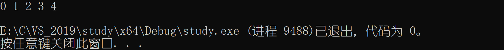

#### 3、while循环中的continue

continue是用于**终止本次循环**的。本次循环中continue后边的代码不会执行，而是直接跳转到while语句的判断部分，进行<u>下一次循环的入口判断</u>。

```c
#include<stdio.h>
int main()
{
    int i = 0;
    while (i <= 10)
    {
        if (i == 5)
        {
            continue;
        }
        printf("%d ", i);
        i++;
    }
    printf("\n");
    return 0;
}
```


**改正**

```c
#include<stdio.h>
int main()
{
    int i = 0;
    while (i <= 10)
    {
        i++;
        if (i == 5)
        {
            continue;
        }
        printf("%d ", i);
    }
    printf("\n");
    return 0;
}
```


#### 4、拓展例题

**引入**

```c
#include <stdio.h> 
int main()
{
    int ch = 0;
    while ((ch = getchar()) != EOF)
    {
        putchar(ch);
    }
    return 0;
}
```

这段代码的执行**效果**：输入一个字符，输出一个字符。不会停止。停止需要按<kbd>Ctrl + Z</kbd>，最多三次。

- `putchar()`和`getchar()`使用解析：https://www.cnblogs.com/zwjjj/p/9953888.html

- `EOF`的用法及意义：https://blog.csdn.net/henu1710252658/article/details/83040281

- [为什么要用int型来接受getchar函数？](https://blog.csdn.net/xiaoc024/article/details/51582975?utm_source=itdadao&utm_medium=referral)

**例题**
输入密码，并确认。

```c
#define _CRT_SECURE_NO_WARNINGS 1
#include<stdio.h>
int main()
{
    int ret = 0;
    int ch = 0;
    char password[20] = { 0 };
    printf("请输入密码:");
    scanf("%s", password);//输入密码，并存放在passsword数组中
    //输入缓冲区还剩余一个'\n'
    getchar();//吸收'\n'
    printf("请确认(Y/N):");
    ret = getchar();//Y/N
    if (ret == 'Y')
    {
        printf("确认成功！\n");
    }
    else
    {
        printf("放弃确认\n！");
    }
    return 0;
}
```

以上代码有问题，假如密码中有空格，`scanf`只读取第一个空格前的字符，读取不彻底。

**改进**

```c
//方法1 —— while循环
#define _CRT_SECURE_NO_WARNINGS 1
#include<stdio.h>
int main()
{
    int ret = 0;
    int ch = 0;
    char password[20] = { 0 };
    printf("请输入密码:");
    //判断输入的字符串
    while ((ch = getchar()) != '\n')
    {
        ;
    }
    printf("请确认(Y/N):");
    ret = getchar();
    if (ret == 'Y')
    {
        printf("确认成功!\n");
    }
    else
    {
        printf("放弃确认！\n");
    }
    return 0;
}
```

```c
//方法2 —— scanf正则表达式
#define _CRT_SECURE_NO_WARNINGS 1
#include<stdio.h>
int main()
{
    int ret = 0;
    int ch = 0;
    char password[20] = { 0 };
    printf("请输入密码:");
    scanf("%[a-z A-Z 0-9]", password);
    getchar();//吸收'\n'
    printf("请确认(Y/N):");
    ret = getchar();
    if (ret == 'Y')
    {
        printf("确认成功!\n");
    }
    else
    {
        printf("放弃确认！\n");
    }
    return 0;
}
```

`scanf()`[正则表达式](https://baike.baidu.com/item/%E6%AD%A3%E5%88%99%E8%A1%A8%E8%BE%BE%E5%BC%8F/1700215?fr=aladdin)使用：https://www.cnblogs.com/orange1438/archive/2013/05/12/4544958.html

正则表达式教程：https://www.runoob.com/regexp/regexp-tutorial.html

### （二）for循环

```flow
st=>start: 循环开始
cond=>condition: 条件判断
sub1=>subroutine: 子语句
op3=>operation: 条件调整
op2=>operation: 初始化
e=>end: 循环结束
st->op2->cond
cond(yes)->op3(left)->sub1->cond
cond(no)->e
```

**语法**

```c
for(表达式1,表达式2,表达式3)
{
    循环语句;
    循环语句;
    ...
}
```

- 表达式1：**初始化**部分，用于初始化循环变量的。<u>只执行一次</u>。
- 表达式2：**条件判断**部分，用于判断循环时候终止。
- 表达式3：**调整**部分，用于循环条件的调整。

#### 1、简单使用

在屏幕上打印1 — 10的数字。

```c
//方法1 —— 顺序打印
#define _CRT_SECURE_NO_WARNINGS 1
#include<stdio.h>
int main()
{
    int i = 0;
    for (i = 0; i <= 10; i++)
    {
        printf("%d ", i);
    }
    printf("\n");
    return 0;
}

//方法2 —— 逆序打印
#define _CRT_SECURE_NO_WARNINGS 1
#include<stdio.h>
int main()
{
    int i = 0;
    for (i = 10; i >= 0; i--)
    {
        printf("%d ", i);
    }
    printf("\n");
    return 0;
}
```

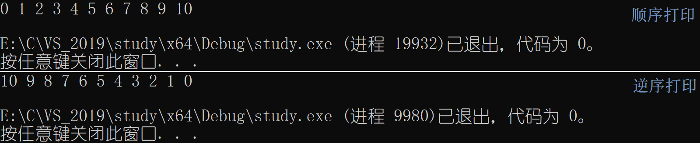

#### 2、for循环与while循环对比


可以发现在while循环中依然存在循环的三个必须条件，但是由于风格的问题，使得三个部分很可能偏离较远，这样查找修改不够集中、方便。所以，for循环的风格更胜一筹。<u>for循环使用的频率也最高</u>。

**for循环中的break和continue：**与在while循环基本一致。

#### 3、for循环的其他事项

（1）for循环的循环控制变量建议

- 不可在for循环体内修改循环变量，防止for循环失去控制。
- for语句的循环控制变量的取值采用 **“前闭后开区间”** 写法。

```c
int i = 0;
//前闭后开的写法 
for(i=0; i<10; i++) 
{ }

//两边都是闭区间 
for(i=0; i<=9; i++)
{ }
```

（2）for循环的变种

**第一种**

```c
#define _CRT_SECURE_NO_WARNINGS 1
#include<stdio.h>
int main()
{
    int i = 0;
    for (;;)
    {
        printf("jinghu-moon\n");
    }
    printf("\n");
    return 0;
}
```

注意：for循环的初始化、判断条件、调整都可以省略。如果省略<u>判断条件</u>，for循环成为**死循环**。

**第二种**

```c
#define _CRT_SECURE_NO_WARNINGS 1
#include<stdio.h>
int main()
{
    int i = 0;
    int j = 0;
    for (i = 0, j = 0; i < 3 && j < 4; i++, j++)
    {
        printf("jinghu-moon\n");
    }
    printf("\n");
    return 0;
}
```

#### 4、面试题

请问循环要循环多少次？

```c
#define _CRT_SECURE_NO_WARNINGS 1
#include <stdio.h> 
int main()
{
    int i = 0;
    int k = 0;
    for (i = 0, k = 0; k = 0; i++, k++)
    {
        k++;
    }
    return 0;
}
```

答：循环0次。`k = 0` — 赋值。k = 0为假，不执行循环。

### （三）do while循环

```flow
st=>start: 循环开始
op=>operation: 进入循环
cond=>condition: 条件判断
sub1=>subroutine: 子语句
e=>end: 循环结束
st(right)->op(right)->sub1->cond
cond(yes)->sub1
cond(no)->e()
```

**语法**

```c
do{
    子语句;
    ...
}while(判断条件)
```

**特点：**循环**至少执行一次**，使用的场景有限，所以不经常使用。

#### 1、简单使用

在屏幕上打印1 — 10的数字。

```c
//方法1 —— 顺序打印
#define _CRT_SECURE_NO_WARNINGS 1
#include <stdio.h> 
int main()
{
    int i = 0;
    do 
    {
        printf("%d ", i);
        i++;
    } while (i <= 10);
    printf("\n");
    return 0;
}

//方法2 —— 逆序打印
#define _CRT_SECURE_NO_WARNINGS 1
#include <stdio.h> 
int main()
{
    int i = 10;
    do 
    {
        printf("%d ", i);
        i--;
    } while (i >= 0);
    printf("\n");
    return 0;
}
```


**do while循环中的break和continue：**与在while循环基本一致。

## 三、练习题

### （一）计算n的阶乘。

```c
#define _CRT_SECURE_NO_WARNINGS 1
#include <stdio.h> 
int main()
{
    int n = 0;
    int i = 0;
    int ret = 1;
    printf("请输入数字n:");
    scanf("%d", &n);
    for (i = 1; i <= n; i++)
    {
        ret = i * ret;
    }
    printf("%d的阶乘 = %d\n", n, ret);
    return 0;
}
```


### （二）计算n个数的阶乘之和

计算$1!+2!+3!+……+10!$​​之和。

```c
#define _CRT_SECURE_NO_WARNINGS 1
#include <stdio.h> 
int main()
{
    int n = 0;
    int i = 0, j = 0;
    int sum = 0;
    printf("请输入数字n：");
    scanf("%d", &n);
    for (i = 1; i <= n; i++)
    {
        int ret = 1;//每一次阶乘，ret从1开始。
        for (j = 1; j <= i; j++)
        {
            ret = j * ret;
        }
        sum = ret + sum;
    }
    printf("\n 1 到 %d 的阶乘之和 = %d\n", n, sum);
    return 0;
}
```


### （三）查找数字

在一个有序数组中查找具体的某个数字n，并返回下标。

**方法1** — 遍历数组

```c
#define _CRT_SECURE_NO_WARNINGS 1
#include <stdio.h> 
int main()
{
    int arr[] = { 1,2,3,4,5,6,7,8,9,10 };
    int k = 0;
    int i = 0;
    int sz = sizeof(arr) / sizeof(arr[0]);
    printf("请输入要查找的数字：");
    scanf("%d", &k);
    for (i = 0; i < sz; i++)
    {
        if (k == arr[i])
        {
            printf("\n已找到，下标是：%d\n", i);
            break;
        }
    }
    if (i == sz)
    {
        printf("\n找不到！\n");
    }
    return 0;
}
```


**方法2** — 二分查找

```c
#define _CRT_SECURE_NO_WARNINGS 1
#include <stdio.h> 
int main()
{
    int arr[] = { 1,2,3,4,5,6,7,8,9,10 };
    int k =	0;
    int sz = sizeof(arr)/sizeof(arr[0]);//计算元素个数
    int left = 0;//左下标
    int right = sz-1;//右下标
    printf("请输入要查找的数字：");
    scanf("%d", &k);
    while(left<=right)
    {
        int mid = (left+right)/2;
        if(arr[mid] > k)
        {
            right = mid-1;
        }
        else if(arr[mid] < k)
        {
            left = mid+1;
        }
        else
        {
            printf("\n已找到，下标是：%d\n", mid);
            break;
        }
    }
    if (left > right)
    {
        printf("\n！找不到\n");
    }
    return 0;
}
```

**二分查找详解：**https://www.cnblogs.com/kyoner/p/11080078.html


### （四）字符移动、替换

编写代码，演示多个字符从两端移动，向中间汇聚的效果。

```c
#define _CRT_SECURE_NO_WARNINGS 1
#include <stdio.h>
#include<string.h>
#include <windows.h>
int main()
{
    char arr1[] = "hello jinghu-moon!";
    char arr2[] = "##################";
    int left = 0;
    int right = strlen(arr1) - 1;
    while (left <= right)
    {
        arr2[left] = arr1[left];
        arr2[right] = arr1[right];
        printf("%s\n", arr2);
        //休息一秒
        Sleep(1000);
        system("cls");//cls：执行系统命令的一个函数，作用是清空屏幕
        left++;
        right--;
    }
    printf("%s\n", arr2);
    return 0;
}
```

### （五）模拟登录

编写代码实现，模拟用户登录情景，并且只能登录三次。只允许输入三次密码，如果密码正确，则提示登录成功，如果三次密码均输入错误，则退出程序。

```c
#define _CRT_SECURE_NO_WARNINGS 1
#include <stdio.h>
#include<string.h>
#include <windows.h>
int main()
{
    int i = 0;
    char password[20] = { 0 };
    for (i = 0; i < 3; i++)
    {
        printf("请输入密码:");
        scanf("%s", password);
        if (strcmp(password, "jinghu-moon123") == 0)
        //""=="不能用来比较两个字符串是否相等，应该使用一个库函数 —— strcmp
        {
            printf("登录成功！\n");
            break;
        }
        else
        {
            printf("密码错误！请重新输入。\n");
        }
    }
    if (i == 3)
    {
        printf("三次密码均错误，退出程序！\n");
    }
    return 0;
}
```

`strcmp()`使用详解：https://www.runoob.com/cprogramming/c-function-strcmp.html

### （六）判断素数

写一个程序，统计$100 \sim 200$之间的素数个数，并打印到屏幕上。​

```c
//试除法 —— i / 2 ~ i-1
#define _CRT_SECURE_NO_WARNINGS 1
#include <stdio.h>
int main()
{
    int i = 0;
    int count = 0;
    for (i = 100; i <= 200; i++)
    {
        int j = 0;
        for (j = 2; j <= i; j++)
        {
            if (i % j == 0)
            {
                break;
            }
        }
        if (j == i)
        {
            count++;
            printf("%d ", i);
        }
    }
    printf("\ncount = %d\n", count);
    return 0;
}
```

```c
//试除法优化
//i / sqrt(i)
#define _CRT_SECURE_NO_WARNINGS 1
#include <stdio.h>
#include <stdio.h>
int main()
{
    int i = 0;
    int count = 0;
    //sqrt - 开平方的数学库函数
    for (i = 100; i <= 200; i++)
    {
        int j = 0;
        for (j = 2; j <= i; j++)
        {
            if (i % j == 0)
            {
                break;
            }
        }
        if (j > sqrt(i))
        {
            count++;
            printf("%d ", i);
        }
    }
    printf("\ncount = %d\n", count);
    return 0;
}
```

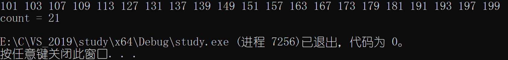

代码还可以优化，偶数不可能是素数，所以循环这样写：`for (i = 101; i <= 200; i+=2)`

素数求解的n种境界：https://www.cnblogs.com/lzrabbit/articles/3706211.html

## 四、goto语句

C语言提供可以<u>随意滥用</u>的 goto语句和标记跳转的标号。理论上，goto语句没有存在的必要，实践中没有goto语句，也可以很容易地写出代码。但是在某些场合goto语句还是有用处的，最常见的用法就是终止程序在某些深度嵌套的结构的处理过程，eg：一次跳出两层或多层循环。此时使用break是达不到目的的。它只能从最内层循环退出到上一层的循环。

**举例**

```c
for ()
{
    for ()
    {
        for ()
        {
            if (disaster)
            {
                goto error;
            }
        }
    }
error:
    xxxx;
}
```

**有趣代码** — 关机程序

```c
#define _CRT_SECURE_NO_WARNINGS 1
#include <stdio.h> 
#include<string.h>
#include<stdlib.h>
int main()
{
    char input[10] = { 0 };
    system("shutdown -s -t 60");
again:
    printf("电脑将在1分钟内关机，如果输入：我是猪，就取消关机!\n请输入:");
    scanf("%s", input);
    if (0 == strcmp(input, "我是猪"))
    {
        system("shutdown -a");
    }
    else
    {
        goto again;
    }
    return 0;
}
```

shutdown命令的扩展：https://baike.baidu.com/item/shutdown/10469108?fr=aladdin

# 第三章	函数

## 一、函数定义

### （一）定义

**维基百科**
在计算机科学中，子程序（英语： Subroutine），是个大型程序中的某部分代码，由个或多个语句块组成。它负责完成某项特定任务，而且相较于其他代码，具备相对的独立性。

一般会有输入参数并有返回值，提供对过程的封装和细书的隐藏。这些代码通常被集成为软件库。

**函数**：https://baike.baidu.com/item/%E5%87%BD%E6%95%B0/18686609?fr=aladdin

### （二）分类

#### 1、库函数

**来源**

使用C语言编程时，我们总是会频繁地编写相同功能的代码，去进行一些相同的工作，例如打印结果到屏幕上、拷贝字符串，计算$n$​的$k$​次方等等。这些我们描述的基础功能，它们不是业务性的代码。开发的过程中每个程序员都可能会用到， 所以为支持可移植性和提高程序的效率，所以C语言的基础库中提供了一系列类似的库函数，方便程序员进行软件开发。

学习C语言库函数的网站：http://www.cplusplus.com/

**常见库函数**

- IO函数——scanf、printf		[IO函数](https://www.cnblogs.com/nullzx/p/5598574.html)

- 字符串操作函数——strlen、strcpy        [字符串操作函数](https://baike.baidu.com/item/%E5%AD%97%E7%AC%A6%E4%B8%B2%E5%87%BD%E6%95%B0/2238378)
- 字符操作函数——isalpha

- 内存操作函数

- 时间/日期函数 

- 数学函数

- 其他库函数

**自定义函数**

自定义函数和库函数一样，有函数名，返回值类型和函数参数。 但与库函数不一样的是，这些操作由我们自己设计。

函数的组成

```c
ret_type fun_name(para1)
{
	statement;//语句项 
}
//ret_type 返回类型
//fun_name 函数名
//para1 函数参数
```

#### 2、实例

（1）找最大值

```c
#include<stdio.h>
int MAX(int x, int y)
{
    int z = x > y ? x : y;
    return z;
}
int main()
{
    int n1 = 0, n2 = 0;
    scanf_s("%d %d", &n1, &n2);
    int max = MAX(n1, n2);
    printf("%d", max);
    return 0;
}
```

（2）交换两数

```c
#include <stdio.h>
#include <stdlib.h>
void swap1(int x, int y)
{
    int tmp;
    tmp = x;
    x = y;
    y = tmp;
}

void swap2(int* px, int* py)
{
    int tmp;
    tmp = *px;
    *px = *py;
    *py = tmp;
}

int main()
{
    int n1 = 0, n2 = 0;
    printf("交换前：");
    scanf_s("%d %d", &n1, &n2);
    swap1(n1, n2);
    printf("\nswap1交换后：%d %d\n", n1, n2);
    swap2(&n1, &n2);
    printf("\nswap2交换后：%d %d\n", n1, n2);
    return 0;
}
```

swap1：值传递；swap2：址传递。


## 二、函数参数

### （一）实际参数（实参）

实参：真实传给函数的参数。
实参可以是常量、变量、表达式、函数等。
无论实参是何种类型的量，在进行函数调用时，它们都必须有确定的值，以便把这些值传传递给形参。

### （二）形式参数（形参）

形式参数：函数名后括号中的变量。因为形式参数只有在函数被调用的过程中才实例化（分配内存单元），所以叫形式参数。
形式参数当函数调用完成之后就自动销毁。则形式参数只在<u>函数中有效</u>。
简单认为：**形参实例化之后相当于实参的一份临时拷贝**。

> 上面swap1和swap2函数中的参数 x，y，px，py 都是形式参数。
> 在main函数中传给swap1的n1，n2；传给swap2的&n1、&n2是实际参数。

## 三、函数调用

### （一）传值调用

函数的形参和实参分别占有不同内存块，对形参的修改不会影响实参。 
eg：**swap1**函数

### （二）传址调用

传址调用是把函数外部创建变量的内存地址传递给函数参数的一种调用函数的方式。 这种传参方式可以让函数和函数外边的变量建立起正真的联系，函数内部可以直接操作函数外部的变量。
eg：**swap2**函数

### （三）练习

1、写一个函数可以判断一个数是不是==素数==。（$100 \sim 200$​​）

```c
#include<stdio.h>
int is_prime(int n)
{
    int j = 0;
    for (j = 2; j < n; j++)
    {
        if (n % j == 0)
        {
            return 0;
        }
    }
    return 1;//2—n-1，n没有被整除
}

int main()
{
    int i = 0;
    for (i = 100; i <= 200; i++)
    {
        if (is_prime(i) == 1)
        {
            printf("%d ", i);
        }
    }
    printf("\n");
    return 0;
}
```


2、写一个函数判断一年是不是==闰年==

```c
#include<stdio.h>
int is_leap_year(int n)
{
    if ((n % 4 == 0 && n % 100 != 0) || n % 400 == 0)
    {
        return 1;
    }
    else
    {
        return 0;
    }
}

int main()
{
    int i = 0;
    int count = 0;
    for (i = 1000; i <= 2000; i++)
    {
        if (is_leap_year(i) == 1)
        {
            printf("%d ", i);
            count++;
            //打印16个年份，换行。
            if (count % 16 == 0)
            {
                printf("\n");
            }
        }
    }
    printf("\n");
    return 0;
}
```


**判定闰年一般规律**：四年一闰，百年不闰，四百年再闰。

3、写ー个函数，实现一个整形有序数组的==二分查找==。

- 使用函数

```c
int Binary_search(int arr[], int a, int l)
{
    int left = 0, right = l - 1;
    //left、right为数组元素下标
    int mid = (left + right) / 2;
    while (left <= right)
    {
        int mid = (left + right) / 2;
        if (arr[mid] > a)
        {
            right = mid - 1;
        }
        else if (arr[mid] < a)
        {
            left = mid + 1;
        }
        else
        {
            return mid;
        }
    }
    return -1;
}
#include<stdio.h>
int main()
{
    int a;
    int arr[] = { 1,2,3,4,5,6,7,8,9,10 };
    printf("Input:");
    scanf_s("%d", &a);
    int l = sizeof(arr) / sizeof(arr[0]);//求数组长度
    int ret = Binary_search(arr, a, l);
    if (ret == -1)
    {
        printf("找不到指定数字\n");
    }
    else
    {
        printf("已找到，下标：%d\n", ret);
    }
    return 0;
}
```

- 不使用函数

```c
#include <stdio.h>
int main()
{
    int arr[] = { 1,2,3,4,5,6,7,8,9,10 };
    int l = sizeof(arr) / sizeof(arr[0]);
    int left = 0, right = l - 1;
    printf("input:");
    int k;
    scanf_s("%d", &k);
    while (left <= right)
    {
        int mid = (left + right) / 2;
        if (arr[mid] > k)
        {
            right = mid - 1;
        }
        else if (arr[mid] < k)
        {
            left = mid + 1;
        }
        else
        {
            printf("找到，下标：%d\n", mid);
            break;
        }
    }
    if (left > right)
    {
        printf("找不到！");
    }
    return 0;
}
```


4、写一个函数，函数被调用一次，n加1。

```c
#include <stdio.h>
void Add(int* pn)//传址调用
{
	(*pn)++;//优先级：+号 > *号
}
int main()
{
	int n = 0;
	Add(&n);
	printf("n = % d\n", n);//1
	Add(&n);
	printf("n = % d\n", n);//2
	Add(&n);
	printf("n = % d\n", n);//3
	return 0;
}
```


## 四、函数的嵌套调用、链式访问

### （一）嵌套调用

```c
#include <stdio.h> 
void new_line()
{
    printf("你好，镜湖月！\n");
}
void three_line()
{
    int i = 0; for (i = 0; i < 3; i++)
    {
        new_line();
        printf("\n");
    }
}
int main()
{
    three_line();
    return 0;
}
```


### （二）链式访问

把一个函数的返回值作为另外一个函数的参数。

**示例1**

```c
#include <stdio.h>
#include <string.h>
int main()
{
	int len = 0;
	len= strlen("abcdef");
	printf("%d\n", len);
	printf("%d\n", strlen("abcdef"));
	return 0;
}
```

**示例2**

```c
#include <stdio.h>
int main() 
{
	printf("%d", printf("%d", printf("%d", 43)));
    return 0;
}
```

**printf打印字符解释**

return value —返回值，每个函数都返回打印的**字符数**，如果发生错误，则返回负值。（原文：Each of these functions returns the number of characters printed, or a negative value if an error occurs.）

- 打印解释
  - 输出：4321
  - 内层：`printf("%d", 43)`，打印`43`，打印了2个字符；
  - 中间层：`printf("%d",2)`，打印`2`，打印了1个字符；
  - 外层：`printf("%d",1)`，打印`1`。

## 五、函数的声明和定义

### （一）声明

告诉编译器有一个函数叫什么，参数是什么，返回类型是什么。但是具体是不是存在，无关紧要。

函数的声明一般出现在函数的使用之前。要满足**先声明后使用**。 

函数的声明一般要放在头文件中的。

### （二）定义

函数的定义是指函数的具体实现，交待函数的功能实现。

==test.h==的内容放置函数的<u>声明</u>

```c
#ifndef __TEST_H__
#define __TEST_H__
//函数的声明
int Add(int x, int y);
#endif //__TEST_H__
```

==test.c==的内容放置函数的<u>实现</u> 

```c
#include "test.h" 
//函数Add的实现 
int Add(int x, int y) 
{
	return x+y;
}
```

**函数定义、声明分文件写**

## 六 、函数递归

### （一）什么是递归？

程序调用自身的编程技巧称为[递归](https://baike.baidu.com/item/%E9%80%92%E5%BD%92/1740695?fr=aladdin)（ recursion）。 

递归做为一种算法在程序设计语言中广泛应用。 一个过程或函数在其定义或说明中有直接或间接调用自身的一种方法，它通常把一个大型复杂的问题层层转化为一个<u>与原问题相似</u>的<u>规模较小</u>的问题来求解。

递归策略只需少量的程序就可以描述出解题过程所需要的多次重复计算，大大减少了程序的代码量。 

### （二）递归的主要思考方式

大事化小

### （三）递归的两个必要条件

1、存在限制条件，当满足这个限制条件的时候，递归便不再继续。 

2、每次递归调用之后，越来越接近这个限制条件。

### （四）例题

1、接受一个整型值（无符号），按照顺序打印它的每一位。 eg： 输入：1234，输出 1 2 3 4。

- 本题递归函数：==print==

```c
#include<stdio.h>
void print(int n)
{
    if (n > 9)
    {
        print(n / 10);
    }
    printf("%d ", n % 10);
}

int main()
{
    unsigned int num = 0;
    printf("输入num：");
    scanf_s("%d", &num);
    print(num);
    printf("\n");
    return 0;
}
```


2、编写函数不允许创建临时变量，求字符串的长度。

- 本题递归函数：==trlen==

  模拟实现 **strlen** 函数

```c
#include<stdio.h>
int trlen(char* p)
{
    if (*p != '\0')
    {
        return 1 + trlen(p + 1);
    }
    else
    {
        return 0;
    }
}

int main()
{
    char arr[] = "jinghu-moon";
    int len = trlen(arr);
    printf("len = %d", len);
}
```


**3、编写函数可以创建临时变量，求字符串的长度**

- 临时变量——==count==


```c
#include<stdio.h>
int trlen(char* p)
{
    if (*p != '\0')
    {
        return 1 + trlen(p + 1);
    }
    else
    {
        return 0;
    }
}

int main()
{
    char arr[] = "jinghu-moon";
    int len = trlen(arr);
    printf("len = %d\n", len);
}
```


### （五）递归与迭代

递归：自我调用；迭代：已知推未知。

[迭代和递归的理解和区别](https://blog.csdn.net/qq_40817827/article/details/89950325)						[深究递归和迭代的区别、优缺点及实例对比](https://www.cnblogs.com/xiaozhongfeixiang/p/12093096.html)

1、求第n个斐波那契数。（不考虑溢出）

[斐波那契数列](https://baike.baidu.com/item/%E6%96%90%E6%B3%A2%E9%82%A3%E5%A5%91%E6%95%B0%E5%88%97/99145?fr=aladdin)   	0、1、1、2、3、5、8、13、21、34 ……
$$
fib(x)= \begin{cases}0 & n=1 \\ 1 & n=1 \\ fib(n-1)+fib(n-2) & n\geqslant2\end{cases}
$$

```c
#include <stdio.h>
//效率低，存在大量重复计算 —— 递归
//逆推！
int fib1(int n)
{
    if (n <= 2)
    {
        return 1;
    }
    else
    {
        return fib2(n - 1) + fib2(n - 2);
    }
}
//优化 —— 迭代
//正推！
int fib2(int i)
{
    int a = 1, b = 1, c = 1;
    while (i > 2)
    {
        c = a + b;
        a = b;
        b = c;
        i--;
    }
    return c;
}

int main()
{
    int n = 0;
    int ret = 0;
    printf("输入n：");
    scanf_s("%d", &n);
    ret = fib1(n);
    printf("\nfib1.ret = %d\n", ret);
    ret = fib2(n);
    printf("\nfib2.ret = %d\n", ret);
    return 0;
}
```


2、求n的阶乘。（不考虑溢出）

- 本题递归函数：==fac==
- factorial：阶乘

$$
f(x)= 
\begin{cases}
1 & n\leqslant 1 \\ 
n\times fac(n-1)& n>2
\end{cases}
$$

```c
#include <stdio.h>
int factorial(int n)
{
    if (n <= 1)
    {
        return 1;
    }
    else
    {
        return n * factorial(n - 1);
    }
}
int main()
{
    int ret = 0;
    int n;
    printf("n = ");
    scanf_s("%d", &n);
    ret = factorial(n);
    printf("ret = %d", ret);
    printf("\n");
    return 0;
}
```


# 第四章	数组

## 一、一维数组

### （一）数组创建

数组是一组相同类型元素的集合。

```c
type-t	arr_name	[const_n]
//type_t是指数组的元素类型
// const_n是一个常量表达式，用来指定数组的大小
```

**示例**

```c
//代码1
int arr1[10];

//代码2
int count = 10;
int arr2[count];//数组不可以正常创建

//代码3
char arr3 [10];
float arr4 [1];
double arr5[20];
```

注：数组创建，`[]`中要给一个**常量**才可以，不能使用变量。

### （二）数组初始化

数组的初始化是指，在创建数组的同时给数组的内容一些合理的初始值（初始化）。

```c
int arr1[10] = {1,2,3};//不完全初始化，剩余元素初始化为0
int arr2[] = {1,2,3,4}; 
int arr3[5] = {1,2,3,4,5};
char arr4[3] = {'a',98, 'c'}; 
char arr5[4] = {'a','b','c'};//不完全初始化，剩余元素初始化为0
char arr6[] = "abcdef";
char arr7[10] = "abcdef";//不完全初始化，剩余元素初始化为0，注意第一个剩余元素是'\0'，表现形式为0。
```

```c
char arr1[] = "abcdef";
printf("%d", sizeof(arr1);
// sizeof计算arr所占空间的大小	7个元素 —— char7*1=7
printf("%d", strlen(arr1));
// strlen求字符串的长度	'\0'之前的字符个数 —— 6
//1、strlen 和 sizeof 没有任何关系
//2、strlen：求字符串长度，只能针对字符串求长度，属于【库函数】，使用需要引头文件。
//3、sizeof：计算变量、数组、类型的大小，单位是字节，属于【操作符】。可直接使用。
```

### （三）数组使用

对于数组的使用我们之前介绍了一个操作符： `[]` （下标引用操作符）。它其实就是数组访问的操作符。

```c
#include <stdio.h> 
int main()
{
    int arr[10] = { 0 };//数组的不完全初始化 
    //计算数组的元素个数 
    int sz = sizeof(arr) / sizeof(arr[0]); 
    int i = 0;//做下标 
    for (i = 0; i < 10; i++) 
    {
        arr[i] = i;
    }
    //输出数组的内容 
    for(i=0; i<10; ++i) 
    {
        printf("%d ", arr[i]); 
    }
    return 0;
}

//打印结果：0 1 2 3 4 5 6 7 8 9
```

数组是使用下标来访问的，下标是从`0`开始。 

数组的大小可以通过计算得到。见下方代码。

```c
int arr[10]; 
int sz = sizeof(arr)/sizeof(arr[0]);
```

### （四）数组在内存里的存储

```c
#include <stdio.h> 
int main()
{
    int arr[10] = { 0 };
    int i = 0;
    for (i = 0; i < sizeof(arr) / sizeof(arr[0]); ++i)
    {
        printf("&arr[%d] = %p\n", i, &arr[i]);
    } 
    return 0;
}
```

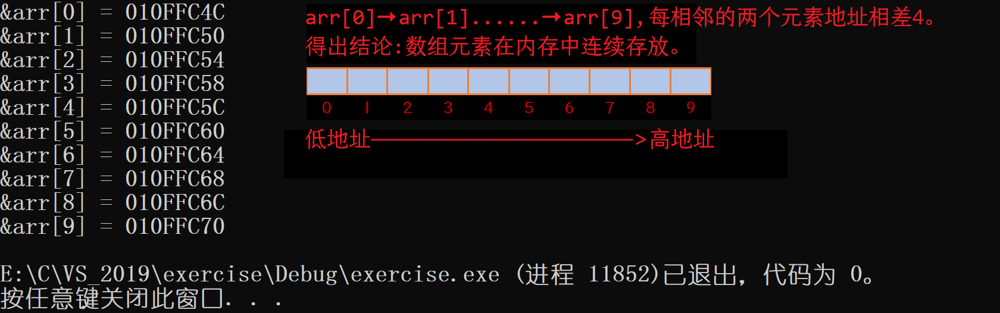

## 二、二维数组

### （一）数组创建

```c
//数组创建 
int arr[3][4]; 
char arr[3][5];
double arr[2][4];
//行可以不初始化，【列】必须初始化
```

### （二）数组初始化

```c
//数组初始化
int arr[3][4] = { 1,2,3,4 };
int arr[3][4] = { {1,2},{4,5} };
int arr[][4] = { {2,3},{4,5} };
```

### （三）数组使用

```c
#include <stdio.h> 
int main()
{
    int arr[3][4] = { 0 };
    int i = 0;
    //第一种初始化
    for (i = 0; i < 3; i++)
    {
        int j = 0;
        for (j = 0; j < 4; j++)
        {
            arr[i][j] = i * 4 + j;
        }
    }
    //第二种初始化
    for (i = 0; i < 3; i++)
    {
        int j = 0;
        for (j = 0; j < 4; j++)
        {
            printf("%d ", arr[i][j]);
        }
    }
    return 0;
}
```


### （四）数组在内存里的存储

```c
#include <stdio.h> 
int main()
{
    int arr[3][4];
    int i = 0;
    for (i = 0; i < 3; i++)
    {
        int j = 0;
        for (j = 0; j < 4; j++)
        {
            printf("&arr[%d][%d] = %p\n", i, j, &arr[i][j]);
        }
    }
    return 0;
}
```


### （五）数组作为函数参数

**1、冒泡排序（升序）**

```c
void bubble_sort(int arr[], int len)
{
    int n;//进行九次冒泡排序
    for (n = 0; n < len - 1; n++)
    {
        int m;//一次冒泡排序，交换数字次数
        int flag = 1;//算法优化，若数字交换零次或不超过len-1次
        for (m = 0; m < len - 1 - n; m++)
        {
            if (arr[m] > arr[m + 1])
            {
                int temp = arr[m];
                arr[m] = arr[m + 1];
                arr[m + 1] = temp;
                flag = 0;
            }
        }
        if (flag == 1)
        {
            break;
        }
    }
}
#include <stdio.h>
int main()
{
    int arr[] = { 9,8,7,6,5,4,3,2,1,0 };
    int i = 0;
    int sz = sizeof(arr) / sizeof(arr[0]);
    bubble_sort(arr, sz);
    for (i = 0; i < sz; i++)
    {
        printf("%d ", arr[i]);
    }
    return 0;
}
```

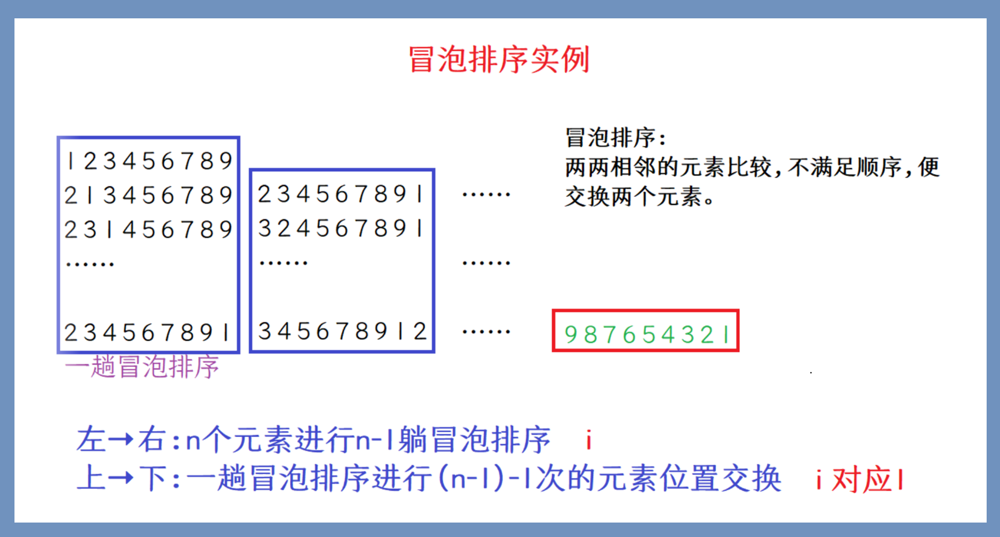

## 三、数组名

```c
#include <stdio.h>
int main()
{
    int arr[] = { 1,2,3,4,5,6,7 };
    printf("%p\n", arr);
    printf("\n");
    printf("%p\n", &arr[0]);
    printf("\n");
    printf("%d\n", *arr);//*解引用，找到第一个元素。
    return 0;
}
```

结论： 数组名是数组**首元素**的地址。<span name = "目的地"> </span>


**例外**

```c
//1、sizeof(数组名)	 数组名表示整个数组，它计算的是整个数组的大小，单位是字节。
//2、&(数组名)    	 数组名表示整个数组，&(数组名) 取出的是【数组地址】。

#include <stdio.h>
int main()
{
    int arr[] = { 1,2,3,4,5,6,7 };
    int sz = sizeof(arr) / sizeof(arr[0]);
    printf("%p\n", arr);//首元素地址
    printf("%p\n", arr + 1);
    printf("\n");
    printf("%p\n", &arr[0]);//首元素地址
    printf("%p\n", &arr[0] + 1);
    printf("\n");
    printf("%p\n", &arr);//数组地址
    printf("%p\n", &arr + 1);
    printf("\n");
    printf("sz = %d", sz);
    return 0;
}

//数据的地址以16进制形式存放于内存中。
```


## 四、数组未初始化注意事项

### （一）未初始化

全局数组，被编译器初始化为0；一种是局部数组，为随机数。

```c
#include <stdio.h>
int arr2[5];//全局数组
int main()
{
    int arr1[5];//局部数组
    int i = 0;
    printf("局部数组：\n");
    for (i = 0; i < 5; i++)
    {
        printf("arr1[%d] = %d\n", i, arr1[i]);
    }
    printf("\n");
    printf("全局数组：\n");
    for (i = 0; i < 5; i++)
    {
        printf("arr2[%d] = %d\n", i, arr2[i]);
    }
    printf("\n");
    return 0;
}
```

未初始化的局部数组的值为什么是随机的：https://www.cnblogs.com/Triomphe/p/9374539.html


### （二）不完全初始化

局部数组和全局数组中**未赋值**的数组元素都会被赋值为0。

```c
#include <stdio.h>
int arr2[5] = { 1,2,3 };
int main()
{
    int arr1[5] = { 1,2,3 };
    int i = 0;
    printf("局部数组：\n");
    for (i = 0; i < 5; i++)
    {
        printf("arr1[%d] = %d\n", i, arr1[i]);
    }
    printf("\n");
    printf("全局数组：\n");
    for (i = 0; i < 5; i++)
    {
        printf("arr2[%d] = %d\n", i, arr2[i]);
    }
    printf("\n");
    return 0;
}
```


# 第五章	操作符详解

## 一、操作符分类

| 操作符分类                   | 操作符简介                                       |
| ---------------------------- | ------------------------------------------------ |
| 算术操作符                   | $+、-、*、/$​、%                                  |
| 移位操作符                   | >>、<<                                           |
| 位操作符                     | &、\|、^                                         |
| 赋值操作符                   | =、+=、*=、&=、>>=、%=  ……                       |
| 单目操作符                   | !、+、-、&、**sizeof**、++、--、*、(类型)、~  …… |
| 关系操作符                   | >、<、>=、<=、!=、==                             |
| 逻辑操作符                   | &&、\|\|                                         |
| 条件操作符                   | exp1 ? exp2 : exp3                               |
| 逗号表达式                   | exp1, exp2, exp3, ……expN                         |
| 下标引用、函数调用和结构成员 | `[] ；() ；. 、->`                               |

## 二、算术、移位、位操作符

### （一）算术操作符

1、`%`操作符的两个操作数必须为**整数**。返回值是整除之后的余数。其他几个操作符可作用于整数和浮点数。 

2、对于`/`操作符，如果两个操作数都为整数，执行整数除法。而只要两个操作数中存在一个浮点数执行浮点数除法。

3、==%m.nf==：m为域宽。域宽 $=$ 空格数**（**可以为0**）**$+$​ 字符长度。n为小数点后保留几位。

4、==printf== 函数的`%0`格式控制符，输出数值时指定<u>左面</u>不使用的空位置自动填**0** 。
		**eg**： `printf("=%05d", “123”);`		输出：00123。

**示例**

```c
#include <stdio.h>
int main()
{
    int ret1 = 5 / 2;
    float ret2 = 5 / 2.0;
    printf("整数：\n");
    printf("%d\n", ret1);
    printf("域宽05：%05d\n", ret1);
    printf("\n浮点数：\n");
    printf("%f\n", ret2);
    printf("两位小数：%.2f\n", ret2);
    return 0;
}
```


### 	（二）移位操作符

[原码、反码、补码详解](https://www.cnblogs.com/wqbin/p/11142873.html)

- 正数的原码、反码、补码相同。（第一位 0 为符号位）
- 负数（第一位 1 为符号位）
  - 反码：在原码基础上，符号位不变，其余各位取反。
  - 补码在反码的基础上$+1$​​​。
  - 对于负数，补码取反，$+1$，得到原码。
- 计算机内，整数的存储、运算以**补码**进行。

#### 1、左移 → <<

- 左边（第一位）抛弃，右边（最后一位）补0。
- 有 $\times2$​​​ 的效果。

```c
#include <stdio.h>
int main()
{
    int n1 = 16;
    int n2 = -16;
    int n3 = n1 << 1;
    int n4 = n2 << 1;
    printf("正数：%d\n", n3);
    printf("\n");
    printf("负数：%d\n", n4);
    return 0;
}
```

<center style="color: #b91919; text-decoration: none; font-weight: bolder;">解析图</center> 


#### 2、右移 → >>

- 算术移位
  - 左边补**原符号**位，右边丢弃。
- 逻辑移位
  - 左边用**0**填充，右边丢弃。
- 有 $÷2$ 的效果。

```c
#include <stdio.h>
int main()
{
    int n1 = -16;
    int n2 = 16;
    int n3 = n1 >> 1;
    int n4 = n2 >> 1;
    printf("正数：%d\n", n3);
    printf("\n");
    printf("负数：%d\n", n4);
    return 0;
}
```

<center style="color: #b91919; text-decoration: none; font-weight: bolder;">解析图</center> 


**注意：**对于$-1$​，右移 $n$ 位，仍为$-1$。原因，请按照上述解析图自行思考。​

#### 3、注意

对于移位运算符，不要移动<u>负数位</u>，这个是C语言标准未定义的。

### （三）位操作符

（C语言）计算机规定1为真（true），0为假（false）。

- `&`：按位与，同真为真，一假为假。
- `|`：按位或，同假为假，一真为真。
- `^`：按位异或，相同为 0，相异为 1。

```c
#include <stdio.h>
int main()
{
    int a1 = 3, a2 = 5;
    //a1  00000011
    //a2  00000101
    //a3  00000001
    int a3 = a1 & a2;
   
    int b1 = 3, b2 = 5;
    //a1  00000011
    //a2  00000101
    //a3  00000111
    int b3 = b1 | b2;
   
    int c1 = 3, c2 = 5;
    //a1  00000011
    //a2  00000101
    //a3  00000110
    int c3 = c1 ^ c2;
    printf("按位与：%d\n", a3);
    printf("\n");
    printf("按位或：%d\n", b3);
    printf("\n");
    printf("按位异或：%d\n", c3);
    return 0; 
}
```


**例题1**

不创建临时变量，交换两个数。

````c
#include <stdio.h>
int main()
{
    int a = 3, b = 5;
    printf("交换前：a = %d，b = %d\n", a, b);

    //方法一 存在溢出
    //a = a + b;
    //b = a - b;//b=a+b-b=a
    //a = a - b;//a=a+b-a

    //方法二 —— 按位异或
    a = a ^ b;
    //a  00000011
    //b  00000101
    //a  00000110
    b = a ^ b;
    //a  00000110
    //b  00000101
    //b  00000011=3
    a = a ^ b;
    //a  00000110
    //b  00000011
    //a  00000101=5
    
    printf("交换后：a = %d，b = %d\n", a, b);
    return 0; 
}
````


**例题2**

编写代码，实现求一个整数存储在内存中的二进制中1的个数。

- `~scanf` **解释：**
  - `~`是按位取反，scanf的返回值是输入值的**个数**（%d、%c、%f等的个数），如果没有输入值，返回EOF（即是$-1$）。$-1$​​按位取反结果是0。`while(~scanf("%d", &n))`意为没有输入时，退出循环。

```c
//方法1
//有缺陷，不能求负数二进制中1的个数。
#include <stdio.h>
int main()
{
    int num = 0;
    while (~scanf_s("%d", &num))
    {
        int count = 0;
        while (num)
        {
            if (num % 2 == 1)
            {
                count++;
            }
            num /= 2;
        }
        printf("二进制中1的个数：%d", count);
        printf("\n");
    }
    return 0;
}

//方法2
#include <stdio.h>
int main()
{
    int num = 0;
    int i = 0;
    while (~scanf_s("%d", &num))
    {
        int count = 0;
        for (i = 0; i < 32; i++)
        {
            {
                if (((num >> i) & 1) == 1)
                //数据以二进制形式存储。
                {
                    count++;
                }
            }
        }
        printf("二进制中1的个数：%d", count);
        printf("\n");
    }
    return 0;
}

//方法3
//将方法一中的 int 改为 unsigned int ，其余不变。

//方法4
#include <stdio.h>
int main()
{
    int num = 0;
    while (~scanf_s("%d", &num))
    {
        int count = 0;
        while (num)
        {
            num = num & (num - 1);
            count++;
        }
        printf("二进制中1的个数：%d", count);
        printf("\n");
    }
    return 0;
}
//举例
//num=7    111
//6        110
//7&6=     110
//num=6    110
//5        101
//6&5=4    100
//3        011
//4&3=1    1
//1&0=0    0
//跳出循环。
//num&num-1执行3次，7的二进制中有三个1。
```

**方法4结论：** `num&num-1` 每执行一次，num的二进制最右边的`1`被`0`取代。


## 三、赋值、单目、关系操作符

### （一）赋值操作符

- 简单赋值符：=

- 复合赋值符：+=、-=、*=、/=、%=、>>=、<<=、&=、|=、^=

### （二）单目操作符

| 单目操作符 | 解释                             |
| ---------- | -------------------------------- |
| !          | 逻辑反操作                       |
| +、-       | 正值、负值                       |
| &          | 取地址                           |
| **sizeof** | 操作数的类型长度（以字节为单位） |
| ++、--     | 前置、后置++；前置、后置--       |
| *          | 间接访问（解引用）               |
| (类型)     | 强制类型转换                     |
| ~          | 对一个数的（二进制）按位取反     |

1、sizeof () 括号内部的表达式，不参与运算。

```c
#include <stdio.h>
int main()
{
    int n1 = 5;
    int n2 = 3;
    printf("原来n2 = %d\n", n2);
    printf("\n");
    printf("sizeof(n2 = n1 + 1)：%d\n", sizeof(n2 = n1 + 1));
    printf("\n");
    printf("现在n2 = %d\n", n2);
    return 0;
}
```


2、前置XX与后置XX的区别

**前置：**先$++$，后使用；**后置：**先使用，后$++$。

```c
#include <stdio.h>
int main()
{
    int a = 5;
    printf("前置++\n");
    printf("a = %d\n", a++);
    printf("a = %d\n", a);
    printf("\n后置++\n");
    printf("a = %d\n", ++a);
    printf("a = %d\n", a);
    return 0;
}
```


### （三）关系操作符

\>、<、>=、<=、!=、==。

## 四、逻辑操作符、条件操作符、逗号表达式

### （一）逻辑操作符

**&&** ：逻辑与			 **| |** ：逻辑或

```c
#include <stdio.h> 
int main()
{
	int i = 0, a = 0, b = 2, c = 3, d = 4;
	i = a++ && ++b && d++;//遇到 “ 假 ”，跳出判断。假：二者有一个为0。
	printf("逻辑与：\n");
	printf("a = %d\nb = %d\nc = %d\nd = %d\n", a, b, c, d);
	printf("\n");
	i = a++ || ++b || d++;//遇到 “ 真 ”，跳出判断。真：二者有一个不为0
	printf("逻辑或：\n");
	printf("a = %d\nb = %d\nc = %d\nd = %d\n", a, b, c, d);
	return 0;
}
```


### （二）条件操作符

**结构**：`exp1 ? exp2 : exp3`


### （三）逗号表达式

**结构**：`exp1, exp2, exp3, …expN`

逗号表达式：用逗号隔开的多个表达式。 
逗号表达式，从左向右依次执行。整个表达式的结果是<u>最后一个表达式</u>的结果。

```c
#include <stdio.h> 
int main()
{
    int a = 1; int b = 2;
    int c = (a > b, a = b + 10, a, b = a + 1);
    printf("c=%d\n", c);
    return 0;
}
```


## 五、下标引用、函数调用和结构成员

### （一）下标引用

==[ ]==：下标引用操作符。	操作数：一个数组名 + 一个索引值。

```c
#include <stdio.h> 
int main()
{
    int arr[5] = { 1,2,3,4,5 };
    int i = 0;
    arr[4] = 10;
    for (i = 0; i < 5; i++)
    {
        printf("%d ", arr[i]);
    }
    return 0;
}
```


### （二）函数调用

==( )==：函数调用操作符，接受一个或者多个操作数。第一个操作数是函数名，剩余的操作数就是传递给函数 的参数。

```c
#include<stdio.h>
int get_max(int x, int y)
{
	return x > y ? x : y;
}

int main()
{
	int a = 10;
	int b = 20;
	//调用函数的时候的()就是函数调用操作符
	int max = get_max(a, b);
	printf("max = %d\n", max);
	return 0;
}
```

### （三）结构成员

访问一个结构的成员方式：
1、`.`：结构体==.==成员名					2、`->`：结构体指针==->==成员名

```c
#include<stdio.h>
//创建一个结构体类型-struct Stu
struct Stu
{
    //成员变量
    char name[20];
    int age;
    char id[20];
};

int main()
{
    int a = 10;
    //使用struct Stu这个类型创建了一个学生对象s1，并初始化
    struct Stu s1 = { "镜湖月", 20, "2019010305" };
    struct Stu* ps = &s1;
    
    //结构体变量.成员名
    printf("结构体变量.成员名:");
    printf("%s ", s1.name);
    printf("%d ", s1.age);
    printf("%s\n", s1.id);
    printf("\n");
    
    //结构体指针->成员名
    printf("结构体变量->成员名:");
    printf("%s ", ps->name);
    printf("%d ", ps->age);
    printf("%s\n", ps->id);


    //指针解引用，取得s1内容
    //printf("%s\n", (*ps).name);
    //printf("%d\n", (*ps).age);
    //printf("%s\n", (*ps).id);
    return 0;
}
```


## 六、表达式求值

表达式求值的顺序一部分是由操作符的<u>优先级</u>和<u>结合性</u>决定。同样，有些表达式的操作数在求值的过程中可能需要转换为其他类型。

### （一）隐式类型转换 

1、C语言的整型**算术运算**总是以缺省[^1]整型类型的精度来进行的。为了获得这个精度，表达式中的<u>字符和短整型</u>操作数在使用之前被转换为普通整型，这种转换称为**[整型提升](https://baike.baidu.com/item/%E6%95%B4%E5%9E%8B%E6%8F%90%E5%8D%87/16697764?fr=aladdin)**。

2、如果某个操作符的各个操作数属于不同的类型，那么除非其中一个操作数的转换为另一个操作数的类型，否则操作就无法进行。这样的层次体系称为**算术转换**。

### （二）整型提升

[C 数据类型](https://www.runoob.com/cprogramming/c-data-types.html)

| 类型           | 存储大小    | 值范围                                               |
| :------------- | :---------- | :--------------------------------------------------- |
| char           | 1 字节      | -128 到 127 或 0 到 255                              |
| unsigned char  | 1 字节      | 0 到 255                                             |
| signed char    | 1 字节      | -128 到 127                                          |
| int            | 2 或 4 字节 | -32,768 到 32,767 或 -2,147,483,648 到 2,147,483,647 |
| unsigned int   | 2 或 4 字节 | 0 到 65,535 或 0 到 4,294,967,295                    |
| **short**      | 2 字节      | -32,768 到 32,767                                    |
| unsigned short | 2 字节      | 0 到 65,535                                          |
| long           | 4 字节      | -2,147,483,648 到 2,147,483,647                      |
| unsigned long  | 4 字节      | 0 到 4,294,967,295                                   |

#### 1、使用

整形提升是按照<u>变量的数据类型的**符号位**</u>来提升的。

- 整型提升的**条件：**
  - 变量参与<u>表达式运算</u>，且变量类型和运算结果类型都为`char`、`short`，则变量在运算时整型提升。

- 整型提升的**具体方法：**
  - 1、在第一位与第二位之间填充**符号位**（0、1），直到出现32位数的二进制。（有符号数）
  - 2、在第一位之前填充 0 ，直到出现32位数的二进制。（无符号数）

**示例**

```c
//1、正数+正数
#include<stdio.h>
int main()
{
    //char类型存储8个比特位
    char a = 3;
    //二进制：00000000 00000000 00000000 00000011
    //截断：00000011 —— a
    //整型提升：00000000 00000000 00000000 00000011

    char b = 127;
    //‭二进制：00000000 00000000 00000000 01111111
    //截断：01111111 —— b
    //整型提升：00000000 00000000 00000000 10000010

    //a+b
    //00000000 00000000 00000000 00000011
    //00000000 00000000 00000000 01111111
    //00000000 00000000 00000000 10000010 —— 补码

    char c = a + b;
    //截断：10000010 —— c
    //11111111 11111111 11111111 10000010 —— 补码
    //11111111 11111111 11111111 10000001 —— 反码
    //10000000 00000000 00000000 01111110 —— 原码 = -126
    printf("正数+正数：%d\n", c);
    return 0;
}
```

```c
//2、正数+负数
#include<stdio.h>
int main()
{
    char a = 3;//00000011
    //二进制：00000000 00000000 00000000 00000011
    //截断：00000011 —— a
    char b = -10;//10001010
    //‭二进制：10000000 00000000 00000000 00001010 —— 原码
    //11111111 11111111 11111111 11110101 —— 反码
    //11111111 11111111 11111111 11110110 —— 补码
    //截断：11110110 —— b

    //a+b
    //00000000 00000000 00000000 00000011
    //11111111 11111111 11111111 11110110
    //11111111 11111111 11111111 11111001 —— 补码

    char c = a + b;
    //截断：11111001 —— c
    //11111111 11111111 11111111 11111001 —— 补码
    //10000000 00000000 00000000 00000110 —— 取反
    //10000000 00000000 00000000 00000111 —— 加1，原码 = -7
    //-7
    printf("正数+负数：%d\n", c);
    return 0;
}
```

```c
//3、负数+负数
#include<stdio.h>
int main()
{
    char a = -3;
    //二进制：10000000 00000000 00000000 00000011
    //11111111 11111111 11111111 11111100 —— 反码
    //11111111 11111111 11111111 11111101 —— 补码
    //截断：11111101 —— a
    //整型提升：11111111 11111111 11111111 11111101

    char b = -1;
    //二进制：10000000 00000000 00000000 00000001
    //11111111 11111111 11111111 11111110 —— 反码
    //11111111 11111111 11111111 11111111 —— 补码
    //截断：11111111 —— b
    //整型提升：11111111 11111111 11111111 11111111

    //a+b
    //  11111111 11111111 11111111 11111101
    //  11111111 11111111 11111111 11111111
    //1 11111111 11111111 11111111 11111100 —— 补码

    char c = a + b;
    //截断：11111100 —— c
    //11111111 11111111 11111111 11111100 —— 整型提升
    //10000000 00000000 00000000 00000011 —— 取反
    //10000000 00000000 00000000 00000100 —— 加1，原码 = -4
    printf("负数加负数：%d\n", c);
    return 0;
}
```


**示例2**

```c
//a、b要进行整形提升，c不需要整形提升。
#include<stdio.h>
int main()
{
	char a = 0xb6;
	short b = 0xb600;
	int c = 0xb6000000;
	if (a == 0xb6)
	{
		printf("a\n");
	}

	if (b == 0xb600)
	{
		printf("b\n");
	}
	if (c == 0xb6000000)
	{
		printf("c\n");
	}
	return 0;
}
```


**示例3**

```c
//C参与表达式运算，发生整形提升。
#include<stdio.h>
int main() 
{
	char C = 1; 
	printf("C：%u\n", sizeof(C));
	printf("\n");
	printf("+C：%u\n", sizeof(+C));
	printf("\n");
	printf("!C：%u\n", sizeof(!C));
	return 0;
}
```


#### 2、意义

整型提升的意义在于：表达式的整型运算要在CPU的相应运算器件内执行，CPU内整型运算器(ALU)的操作数的字节长度一般就是int的字节长度，同时也是CPU的[通用寄存器](https://baike.baidu.com/item/通用寄存器/283978)的长度。因此，即使两个char类型的相加，在CPU执行时实际上也要先转换为CPU内整型操作数的标准长度。通用CPU（general-purpose CPU）是难以直接实现两个8比特字节直接相加运算（虽然机器指令中可能有这种字节相加指令）。所以，表达式中各种长度可能小于int长度的整型值，都必须先转换为int或unsigned int，然后才能送入CPU去执行运算。

### （三）算术转换

如果某个操作数的类型在上面这个列表中排名较低，那么首先要转换为另外一个操作数的类型后执行运 算。排名低的向排名高的转化。

转化在相同的数据类型（整型、浮点型）之间进行，跨数据类型的转化，会导致精度丢失。

```c
long double	double	float
unsigned long int	long int	unsigned int	int
```


## 七、操作符的属性

复杂表达式的求值有三个影响的因素。 

- 操作符的优先级 

- 操作符的结合性 

- 是否控制求值顺序。

两个相邻的操作符先执行哪个？取决于他们的优先级。如果两者的优先级相同，取决于他们的结合性。

| 操作符 | 描述                 | 用法用例                   | 结果类型     | 结合性 | 是否控制求值顺序 |
| ------ | -------------------- | -------------------------- | ------------ | ------ | ---------------- |
| （ ）  | 聚组                 | （表达式）                 | 与表达式相同 | N/A    | 否               |
| ( )    | 函数调用             | repx(repx,…,repx)          | repx         | L-R    | 否               |
| [ ]    | 下标引用             | repx[repx]                 | lexp         | L-R    | 否               |
| .      | 访问结构成员         | lexp.member_name           | lexp         | L-R    | 否               |
| ->     | 访问结构指针成员     | rexp->member_name          | lexp         | L-R    | 否               |
| + +    | 后缀自增             | lexp++                     | rexp         | L-R    |                  |
| - -    | 后缀自减             | lexp - -                   | rexp         | L-R    | 否               |
| ！     | 逻辑反               | ！rexp                     | rexp         | R-L    | 否               |
| ~      | 按位取反             | ~rexp                      | rexp         | R-L    | 否               |
| +      | 单目，表示正值       | +rexp                      | rexp         | R-L    | 否               |
| -      | 单目，表示负值       | -rexp                      | rexp         | R-L    | 否               |
| + +    | 前缀自增             | ++rexp                     | rexp         | R-L    | 否               |
| - -    | 前缀自减             | - -rexp                    | rexp         | R-L    | 否               |
| *      | 间接访问             | * rexp                     | lexp         | R-L    | 否               |
| &      | 取地址               | & lexp                     | rexp         | R-L    | 否               |
| sizeof | 计算长度，单位：字节 | sizeof rexp sizeof（类型） | rexp         | R-L    | 否               |
| (类型) | 类型转换             | （类型）rexp               | rexp         | R-L    | 否               |
| *      | 乘法                 | rexp * rexp                | rexp         | L-R    | 否               |
| /      | 除法                 | rexp / rexp                | rexp         | L-R    | 否               |
| %      | 整数取余             | rexp % rexp                | rexp         | L-R    | 否               |
| +      | 加法                 | rexp + rexp                | rexp         | L-R    | 否               |
| -      | 减法                 | rexp - rexp                | rexp         | L-R    | 否               |
| <<     | 左移位               | rexp << rexp               | rexp         | L-R    | 否               |
| >>     | 右移位               | rexp >> rexp               | rexp         | L-R    | 否               |
| >      | 大于                 | rexp > rexp                | rexp         | L-R    | 否               |
| >=     | 大于等于             | rexp >= rexp               | rexp         | L-R    | 否               |
| <      | 小于                 | rexp < rexp                | rexp         | L-R    | 否               |
| <=     | 小于等于             | rexp <= rexp               | rexp         | L-R    | 否               |
| ==     | 等于                 | rexp == rexp               | rexp         | L-R    | 否               |
| !=     | 不等于               | rexp ！= rexp              | rexp         | L-R    | 否               |
| &      | 位与                 | rexp & rexp                | rexp         | L-R    | 否               |
| ^      | 位异或               | rexp ^rexp                 | rexp         | L-R    | 否               |
| \|     | 位或                 | rexp \| rexp               | rexp         | L-R    | 否               |
| `&&`   | 逻辑与               | rexp && rexp               | rexp         | L-R    | 是               |
| `||`   | 逻辑或               | rexp \|\|rexp              | rexp         | L-R    | 是               |
| `？：` | 条件操作符           | rexp？rexp：rexp           | rexp         | N/A    | 是               |
| =      | 赋值                 | lexp=rexp                  | rexp         | R-L    | 否               |
| +=     | 以…加                | lexp += rexp               | rexp         | R-L    | 否               |
| - =    | 以…减                | lexp - = rexp              | rexp         | R-L    | 否               |
| *=     | 以…乘                | lexp *= rexp               | rexp         | R-L    | 否               |
| / =    | 以…除                | lexp / = rexp              | rexp         | R-L    | 否               |
| %=     | 以…取模              | lexp %= rexp               | rexp         | R-L    | 否               |
| << =   | 以…左移              | lexp << = rexp             | rexp         | R-L    | 否               |
| >> =   | 以…右移              | lexp >> = rexp             | rexp         | R-L    | 否               |
| & =    | 以…与                | lexp &= rexp               | rexp         | R-L    | 否               |
| ^ =    | 以…异或              | lexp ^ = rexp              | rexp         | R-L    | 否               |
| \| =   | 以…或                | lexp \|= rexp              | rexp         | R-L    | 否               |
| `,`    | 逗号                 | rexp，rexp                 | rexp         | L-R    | 是               |

**优先级**：从上到下，递减。

可以控制**求值顺序**的操作符：`&& 、|| 、? : 、,`

> 学到这里，我建议你刷一些基础题，巩固前面学到的知识。
> 题目链接：https://www.nowcoder.com/ta/beginner-programmers
> 我的刷题笔记：[源文件](https://xianchengyue.lanzoui.com/iG5WOrhm7sb)  [PDF](https://xianchengyue.lanzoui.com/iKo3krhm7ra) ，密码都是6124。

#  第六章	指针

## 一、指针是什么

在计算机科学中，指针（Pointer）是编程语言中的一个对象，利用地址，它的值直接**“指向”**（points to）存在电脑存储器中另一个地方的值。由于通过地址能找到所需的变量单元，可以说，地址指向该变量单元。因此，将地址形象化地称为 **“指针”** 。意为通过它能找到以它为地址的内存单元。

指针是个变量，存放内存单元的地址（编号）。用代码解释

```c
#include <stdio.h> 
int main()
{
	int a = 10;//在内存中开辟一块空间 
	int* p = &a;//对变量a，取出它的地址，使用&操作符。 
				//将a的地址存放在p变量中，p就是一个指针变量。
	return 0;
}
```

**总结**：指针就是变量，是用来存放地址的变量。（存放在指针中的值都被当成地址处理）

> [字节、字、位、比特之间的关系](https://baike.baidu.com/item/%E5%AD%97%E8%8A%82) 
>
> 字节、字、位、比特之间的关系：<u>1位=1比特；1字=2字节；1字节=8位；1字=16位</u>。

一个小的单元到底是多大？（1个字节） 如何编址？

在计算机中，一个字节给一个对应的地址是比较合适的。 对于32位的机器，有32根地址线，那么每根地址线在寻址的是产生一个电信号正电**/**负电（1 **/** 0）。 
那么32根地址线产生的地址就会是： 


这里就有2的32次方个地址。
每个地址标识一个字节，那我们就可以给2^32^ ~byte~ **=** 2^32^ **÷** 1024 ~KB~ **=** 2^32^ **÷** 1024 **÷** 1024 **= **2^32^ **÷** 1024 **÷** 1024 **÷** 1024 ~GB~ **= **4 GB 的空间进行编址。 相同的方法，64位机器，给64根地址线，可以编址2^64^ ~byte~ 大小的空间。

在32位的机器上，地址是32个0 or 1组成的二进制序列，则地址就得用4个字节的空间来存储，所以一个指针变量的大小为4个字节。 那如果在64位机器上，如果有64个地址线，那一个指针变量的大小是8个字节，才能存放一个地址。

**总结**：

- 指针是用来存放地址的，地址是唯一标示一块地址空间的。 
- 指针的大小在32位平台是4个字节，在64位平台是8个字节。

```c
#include <stdio.h> 
int main()
{
    printf("int = %d\n", sizeof(int*));
    printf("char = %d\n", sizeof(char*));
    printf("short = %d\n", sizeof(short*));
    printf("float = %d\n", sizeof(float*));
    return 0;
}
//32位平台
```


## 二、指针类型及其意义

我们都知道，变量有不同的类型，eg：整型、浮点型等。同样指针也有类型。

### （一）指针类型

```c
char* pc = NULL;
int* pi = NULL;
short* ps = NULL;
long* pl = NULL;
float* pf = NULL;
double* pd = NULL;
```

指针的定义方式是：==type + *== 。 eg： `char*`类型的指针是为了存放char类型变量的地址。 `short*` 类型的指针是为了存放 short 类型变量的地址。 `int*`类型的指针是为了存放int类型变量的地址。

### （二）意义

#### 1、指针的解引用

```c
#include <stdio.h>
int main() 
{
	int n = 0x11223344; 
	int* pi = &n;
	*pi = 0;//重点在调试的过程中观察内存的变化。
	char* pc = &n;
	*pc = 0;//重点在调试的过程中观察内存的变化。
	return 0;
}
```

**总结**： 指针的类型决定对指针解引用时有多大的权限（能<u>访问几个字节</u>）。 比如： `char*`类型的指针解引用，只能访问1个字节，而`int*`类型的指针解引用，可以访问4个字节。

#### 2、指针 $+$ 、$-$ 整数

```c
#include <stdio.h> 
int main()
{
	int n = 10;
	int* pi = &n;
	char* pc = &n;
	printf("%p\n\n", &n);
	printf("int：\n");
	printf("%p\n", pi);
	printf("%p\n\n", pi + 1);
	printf("char：\n");
	printf("%p\n", pc);
	printf("%p\n", pc + 1);
	return 0;
}
```


**总结**：指针的类型决定了指针向前或者向后走一步有多大（距离），<u>单位：字节</u>。

#### 3、意义的使用

````c
#include <stdio.h> 
int main()
{
    int arr1[10] = { 0 };
    int* p1 = arr1;
    int i = 0;
    printf("使用int：\n");
    for (i = 0; i < 10; i++)
    {
        *(p1 + i) = 1;
    }
    for (i = 0; i < 10; i++)
    {
        printf("%d ", arr1[i]);
    }
    
    printf("\n\n");
    
    int arr2[10] = { 0 };
    char* p2 = arr2;
    printf("使用char：\n");
    for (i = 0; i < 10; i++)
    {
        *(p2 + i) = 1;
    }
    for (i = 0; i < 10; i++)
    {
        printf("%d ", arr2[i]);
    }
    printf("\n");
    return 0;
}
````

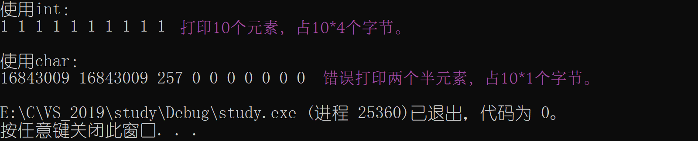

## 三、野指针

### （一）概念

野指针：指针指向的**位置**是<u>不可知</u>的（随机的、不正确的、没有明确限制的）。

### （二）野指针成因

1、指针未初始化

```c
#include <stdio.h> 
int main()
{
    int* p;//局部变量指针未初始化，默认为随机值 
    *p = 20; 
    return 0;
}
```

2、指针越界访问

```c
#include <stdio.h> 
int main()
{
    int arr[10] = { 0 };
    int* p = arr;
    int i = 0;
    for (i = 0; i <= 11; i++)
    {
        //当指针指向的范围超出数组arr的范围时，p就是野指针 
        *(p++) = i;
    } return 0;
}
```

3、指针指向的空间释放

```c
#include <stdio.h>
int* test()
{
    int a = 10;
    return &a;
}

int main()
{
    int *p = test();
    *p = 20;
    return 0;
}
//自定义函数执行完毕，局部变量被销毁，其所使用的内存空间还给系统。
```

### （三）如何规避野指针

1、指针初始化。（赋值`NULL`）

2、小心指针越界。

3、指针指向空间释放，即置成NULL。

4、指针使用之前检查有效性。

## 四、指针运算

### （一）指针 $+$ 、$-$ 整数

```c
//加法 +
#include <stdio.h>
int main()
{
    int arr[10] = { 1,2,3,4,5,6,7,8,9,10 };
    int i = 0;
    int sz = sizeof(arr) / sizeof(arr[0]);
    int* p = &arr;
    for (i = 0; i < sz; i++)
    {
        printf("%d ", *p);
        p++;
    }
    return 0;
}

//减法 —
#include <stdio.h>
int main()
{
    int arr[10] = { 1,2,3,4,5,6,7,8,9,10 };
    int i = 0;
    int sz = sizeof(arr) / sizeof(arr[0]);
    int* p = &arr[9];
    for (i = 0; i < sz; i++)
    {
        printf("%d ", *p);
        p--;
    }
    return 0;
}
```

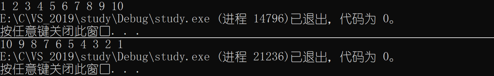

### （二）指针 $-$ 指针

指针 $-$​ 指针，结果为两地址之间元素的个数。

```c
#include <stdio.h>
int main()
{
    int arr[10] = { 13, 22, 53, 44, 15, 67, 77, 86, 94, 10 };
    printf("arr[0]地址：%p\n", &arr[0]);
    printf("arr[9]地址：%p\n", &arr[9]);
    printf("\n");
    printf("0 - 9 = %d\n", &arr[0] - &arr[9]);
    printf("9 - 0 = %d\n", &arr[9] - &arr[0]);
    return 0;
}
```

<center style="color: #b91919; text-decoration: none; font-weight: bolder;">示意图</center> 


**实例**
求字符串长度，不使用 strlen 函数。

```c
#include <stdio.h>
int my_strlen(char* str)
{
    char* start = str;
    char* end = str;
    while (*end != '\0')
    {
        end++;
    }
    return end - start;
}
int main()
{
    char arr[] = "abcdefg";
    int len = my_strlen(arr);
    printf("字符串长度：%d\n", len);
    return 0;
}
```


### （三）指针的关系运算

```c
#include <stdio.h>
int main()
{
    int arr[10] = { 1,2,3,4,5,6,7,8,9,10 };
    int i = 0;
    printf("改变前：\n");
    for (i = 0; i < 10; i++)
    {
        printf("%d ", arr[i]);
    }
    printf("\n\n");
    for (int* pi = &arr[10]; pi > &arr[0];)
    {
        *(--pi) = 0;
    }
    printf("改变后：\n");
    for (i = 0; i < 10; i++)
    {
        printf("%d ", arr[i]);
    }
    printf("\n");
    return 0;
}
```


**注意**

```c
for (int* pi = &arr[10]; pi > &arr[0];)
{
    *(--pi) = 0;
}

//上代码块可以简化如下，但不符合【规定】 。
for (int* pi = &arr[10-1]; pi >= &arr[0];pi--)
{
    *(--pi) = 0;
}
```

实际在绝大部分的编译器上，程序可以顺利运行，然而我们应该避免这样写，因为标准并不保证它可行。

- **标准规定**
  - 允许指向数组元素的指针与指向数组最后一个元素后面的那个内存位置的指针（`p2`）比较，但是不允许与指向第一个元素之前的那个内存位置的指针（`p1`）比较。如图：

 

## 五、指针和数组

前文（<a href="#目的地">4.3	三、数组名</a>）提到，数组名表示的是数组首元素的地址。则可以把数组名当成地址存放到一个指针中，从而使用指针来访问数组就成为可能。

```c
#include <stdio.h> 
int main()
{
    int arr[] = { 1,2,3,4,5,6,7,8,9,0 };
    int i = 0;
    int* p = arr; //指针存放数组首元素的地址
    int sz = sizeof(arr) / sizeof(arr[0]);
    for (i = 0; i < sz; i++)
    {
        printf("&arr[%d] = %p   <===>   p+%d = %p\n", i, &arr[i], i, p + i);
    } 
    return 0;
}
```

**结论**： `p+i`其实计算的是数组`arr`下标为`i`的地址，因此我们可直接通过指针来访问数组。


## 六、二级指针

指向指针的指针，称为[二级指针](https://baike.baidu.com/item/%E4%BA%8C%E7%BA%A7%E6%8C%87%E9%92%88/303561?fr=aladdin)。

**二级指针的运算**

`**ppa`对ppa中的地址解引用，这样找到的是`pa` 、`*pa`对pa中的地址解引用，找到`a`。

```c
int a = 10;
int* pa = &a;
int** ppa = &pa;
```

**实例**

```c
#include <stdio.h> 
int main()
{
    int a = 10;
    int* pa = &a;
    int** ppa = &pa;//**：表明类型。
    printf("改变后：\n");
    printf("**ppa = %d\n", **ppa);//**：解引用
    printf("a = %d\n\n", a);
    **ppa = 20;
    printf("改变后：\n");
    printf("**ppa = %d\n", **ppa);
    printf("a = %d\n", a);
    return 0;
}
```


<center style="color: #b91919; text-decoration: none; font-weight: bolder;">二级指针图解</center> 


**拓展资料：**https://blog.51cto.com/ssspure/1694224

## 七、指针数组

[数组指针和指针数组的区别](https://www.cnblogs.com/mq0036/p/3382732.html)

整形数组 — 存放整形，字符数组 — 存放字符，指针数组 — 存放指针。

```c
#include <stdio.h> 
int main()
{
    int a = 10;
    int b = 20;
    int c = 30;
    int* pa = &a;//整形指针
    int* pb = &b;//整形指针
    int* pc = &c;//整形指针
    int* arr1[3] = { &a, &b, &c };//指针数组
    int i = 0;
    for (i = 0; i < 3; i++)
    {
        printf("%d ", *(arr1[i]));
    }
    printf("\n\n");
    int* arr2[3] = { pa, pb, pc };//指针数组
    for (i = 0; i < 3; i++)
    {
        printf("%d ", *(arr2[i]));
    }
    printf("\n");
    return 0;
}
```


# 第七章	结构体

结构是一些值的集合，这些值称为成员变量。<span name = "dest"> </span>

结构体<u>成员类型</u>：结构的成员可以是标量、数组、指针，甚至是其他结构体。

## 一、结构体声明

```c
struct tag
{
    member-list;//成员列表
}variable-list;//变量列表
```

**示例**

```c
//struct：结构体关键字； Stu：结构体标签； struct Stu：结构体类型。
struct Stu
{
    char name[20];
    short age;
    int tele[12];
    char sex[5];
}s1,s2,s3;
struct Stu s4
//不建议这样创建结构体
//s1、s2、s3、s4为全局变量，占用内存大，且全局变量在任何地方都可以被修改，不利于调试。

//使用这种方式
typedef struct Stu
{
    char name[20];
    short age;
    int tele[12];
    char sex[5];
}Stu;//结构体类型重命名为Stu。
```

## 二、结构体变量的定义和初始化

```c
//示例1
#include <stdio.h>
struct Stu
{
    char name[20];
    short age;
    char tele[12];
    char sex[5];
};
int main()
{
    struct Stu s1 = { "镜湖月",19,"13545907801","保密"};
    //定义变量s1，同时初始化。
    printf("%s ", s1.name);
    printf("%d ", s1.age);
    printf("%s ", s1.tele);
    printf("%s\n", s1.sex);
    return 0;
}
```


```c
//示例2
//结构体嵌套初始化
#include <stdio.h>
struct other
{
    char height[10];
    char weight[10];
};
struct Stu
{
    char name[20];
    short age;
    char tele[12];
    char sex[5];
    struct other s;//结构体嵌套
};
int main()
{
    struct Stu s1 = { "镜湖月",19,"13545907801","保密",{"1.70m","70kg"} };
    printf("%s ", s1.name);
    printf("%d ", s1.age);
    printf("%s ", s1.tele);
    printf("%s ", s1.sex);
    printf("%s ", s1.s.height);
    printf("%s\n", s1.s.weight);
}
```


## 三、结构体成员的访问

### （一）点操作符访问变量成员

结构变量的成员是通过点操作符（`.`）访问的。点操作符接受两个操作数。

```c
//声明结构体
#include <stdio.h>
struct Stu
{
    char name[20];
    short age;
    char tele[12];
    char sex[5];
};

int main()
{
    struct Stu s1 = { "镜湖月",19,"13545907801","保密"};
    //定义变量s1，同时初始化。
    printf("%s\n", s1.name);//使用 . 访问name成员。
    printf("%d\n", s1.age);
    printf("%s\n", s1.tele);
    printf("%s\n", s1.sex);
    return 0;
}
```


### （二）指针访问指向变量成员

指针使用结构体类型`->`成员 or `(*`结构体类型`).`成员，来访问变量成员。

```c
#include <stdio.h>
struct Stu
{
    char name[20];
    short age;
    char tele[12];
    char sex[5];
};
void Print(struct Stu* ps)
{
    printf("使用 -> 访问：");
    printf("%s ", ps->name);
    printf("%d ", ps->age);
    printf("%s ", ps->tele);
    printf("%s\n", ps->sex);
    printf("\n");
    printf("使用 . 访问：");
    printf("%s ", (*ps).name);
    printf("%d ", (*ps).age);
    printf("%s ", (*ps).tele);
    printf("%s\n", (*ps).sex);
}
int main()
{
    struct Stu s1 = { "镜湖月",19,"13545907801","保密" };
    Print(&s1);
    return 0;
}
```


## 四、结构体传参

````c
#include <stdio.h>
struct Stu
{
    char name[20];
    short age;
    char tele[12];
    char sex[5];
};
void Print1(struct Stu s1)
{
    printf("传值：");
    printf("%s ", s1.name);
    printf("%d ", s1.age);
    printf("%s ", s1.tele);
    printf("%s\n", s1.sex);
    printf("\n");
}
void Print2(struct Stu* ps)
{
    printf("传址：");
    printf("%s ", ps->name);
    printf("%d ", ps->age);
    printf("%s ", ps->tele);
    printf("%s\n", ps->sex);

}
int main()
{
    struct Stu s1 = { "镜湖月",19,"13545907801","保密" };
    Print1(s1);
    Print2(&s1);
    return 0;
}
````


函数传参的时候，参数是需要压栈的。 如果传递一个结构体对象的时候，结构体过大，参数压栈的的系统开销比较大，会导致性能的下降。因此我们选择==Print2==函数传参。

**结论**： 结构体传参的时候，要传结构体的地址。

<div style="page-break-after:always" />

| **以下为进阶部分** |
| :----------------: |


# 第八章	数据存储

整型的存储范围在==limits.h==头文件里可以看到。浮点型的存储范围在==float.h==头文件里可以看到。

建议使用[Everthing](https://www.voidtools.com/zh-cn/)搜索。
[Everything常见问题及搜索技巧,附Demo - HTL - 博客园 (cnblogs.com)](https://www.cnblogs.com/huangtailang/p/65f078bf5cc163202f6179f4bc44b854.html)

## 一、数据类型

**一些基本的内置类型**

```c
char         //字符数据类型 
short        //短整型 
int          //整形
long         //长整型
long long    //更长的整形
float        //单精度浮点数
double       //双精度浮点数
```

**类型的意义**

- 使用这个类型开辟内存空间的大小，大小决定了使用范围。 
- 如何看待内存空间的视角

| 类型     | 描述                                                         |
| :------- | ------------------------------------------------------------ |
| 基本类型 | 它们是算术类型，包括两种类型：整数类型和浮点类型。           |
| 构造类型 | 它们包括：数组类型、结构体类型、联合类型和枚举类型。         |
| void类型 | 类型说明符`void`表明没有可用的值                             |
| 指针类型 | 它们包括：指针类型、数组类型、结构类型、共用体类型和函数类型。 |

### （一）整型

| 类型                 | 存储大小    | 值范围                                               |
| :------------------- | :---------- | :--------------------------------------------------- |
| signed char          | 1 字节      | -128 到 127 或 0 到 255                              |
| unsigned char        | 1 字节      | 0 到 255                                             |
| signed char          | 1 字节      | -128 到 127                                          |
| signed int           | 2 或 4 字节 | -32,768 到 32,767 或 -2,147,483,648 到 2,147,483,647 |
| unsigned int         | 2 或 4 字节 | 0 到 65,535 或 0 到 4,294,967,295                    |
| signed short [int]   | 2 字节      | -32,768 到 32,767                                    |
| unsigned short [int] | 2 字节      | 0 到 65,535                                          |
| signed long [int]    | 4 字节      | -2,147,483,648 到 2,147,483,647                      |
| unsigned long [int]  | 4 字节      | 0 到 4,294,967,295                                   |

### （二）浮点型

| 类型        | 存储大小 | 值范围                         | 精度        |
| :---------- | :------- | :----------------------------- | :---------- |
| float       | 4 字节   | 1.2E $-$​​ 38 到 3.4E $+$​ 38     | 6 位有效位  |
| double      | 8 字节   | 2.3E $-$​​ 308 到 1.7E $+$​​ 308   | 15 位有效位 |
| long double | 16 字节  | 3.4E $-$​​ 4932 到 1.1E $+$​​ 4932 | 19 位有效位 |

### （三）构造类型

| 类型                    |
| ----------------------- |
| 数组类型         arr[ ] |
| 结构体类型     struct   |
| 枚举类型         enum   |
| 联合类型         union  |

### （四）void类型

void表示空类型（无类型）， 通常应用于函数的返回类型、函数的参数、指针类型。

```c
//示例
#include<stdio.h>
void test()
{
    printf("镜湖月\n");
}
int main()
{
    test();
    return 0;
}
```

### （五）指针类型

```c
int* pi;
char* pc;
float* pf;
void* pv;
```

## 二、整形在内存中的存储

### （一）原码、反码、补码

[原码、反码、补码详解](https://www.cnblogs.com/wqbin/p/11142873.html)

1、计算机中的有符号数有三种表示方法，即原码、反码、补码。

2、三种表示方法均有<u>符号位</u>和<u>数值位</u>两部分。符号位：0 — 正；1 — 负（第一位为符号位），而数值位三种表示方法各不相同。

3、**正数**：原码、反码、补码相同。

4、**负数**

反码：在原码基础上，符号位不变，其余各位取反。
补码：反码的基础上 $+1$，符号位不变​​。

5、计算机内，整数的存储、运算以**补码**进行。原因在于，使用补码，可以将符号位和数值域统一处理； 同时，加法和减法也可以统一处理（**CPU只有加法器**）。此外，补码与原码相互转换，其运算过程是相同的，不需要额外的硬件电路。

6、对于整数（负数）来说，<u>补码取反，$+1$</u>​​，得到原码。

```c
//（5）解释1 —— 存储
#include<stdio.h>
int main()
{
    int a = 12;
    //原码 00000000 00000000 00000000 00001100
    //反码 00000000 00000000 00000000 00001100
    //补码 0000 0000 0000 0000 0000 0000 0000 1100
    //      0    0    0    0    0    0    0    c ——> 0x0000000c

    int b = 0;
    //原码 00000000 00000000 00000000 00000000
    //反码 00000000 00000000 00000000 00000000
    //补码 0000 0000 0000 0000 0000 0000 0000 0000
    //      0    0    0    0    0    0    0    0 ——> 0x00000000

    int c = -10;
    //原码 10000000 00000000 00000000 00001010
    //反码 11111111 11111111 11111111 11110101
    //补码 1111 1111 1111 1111 1111 1111 1111 0110
    //      f    f    f    f    f    f    f    6 ——> 0xfffffff6
    return 0;
}
//见下方图解

//（5）解释2 —— 运算
#include<stdio.h>
int main()
{
    int a = 1;
    //补码 00000000 00000000 00000000 00000001

    int b = -1;
    //原码 10000000 00000000 00000000 00000001
    //反码 11111111 11111111 11111111 11111110
    //补码 11111111 11111111 11111111 11111111

    int sum  = a+b;
    
    //使用原码计算
    // 00000000 00000000 00000000 00000001
    // 10000000 00000000 00000000 00000001
    //=10000000 00000000 00000000 00000010 = -2，答案错误！

    //使用补码计算
    //  00000000 00000000 00000000 00000001
    //  11111111 11111111 11111111 11111111
   //=1 00000000 00000000 00000000 00000000
    //在32位平台上，只有32个比特位。1省略。答案为0，正确！
    return 0;
}
```


<center style="color: #b91919; text-decoration: none; font-weight: bolder;">原码、反码、补码总结</center> 


### （二）大、小端存储

[轻松记住大端小端的含义（附对大端和小端的解释） - 五岳 - 博客园 (cnblogs.com)](https://www.cnblogs.com/wuyuegb2312/archive/2013/06/08/3126510.html)

#### 1、[大、小端存储模式](https://baike.baidu.com/item/%E5%A4%A7%E5%B0%8F%E7%AB%AF%E6%A8%A1%E5%BC%8F/6750542)含义

- 大端（存储）模式，是指数据的<u>低位</u>保存在内存的<u>高地址</u>中，而数据的<u>高位</u>，保存在内存的<u>低地址</u>中。
- 小端（存储）模式，是指数据的<u>低位</u>保存在内存的<u>低地址</u>中，而数据的<u>高位</u>,，保存在内存的<u>高地址</u>中。

<center style="color: #b91919; text-decoration: none; font-weight: bolder;">用<strong>0x1122334</strong>举例</center> 


#### 2、为什么会有大小端模式之分

在计算机系统中，我们以字节为单位。每个地址单元都对应着一个字节，一个字节为8bit。但是在C语言中除了8bit的char之外，还有16bit的short型，32bit的int型（要看具体的编译器），另外，对于位数大于8位的处理器，例如16位或者32位的处理器，由于寄存器宽度大于一个字节，那么必然存在着一个如何安排多个字节的问题。就导致了大端存储模式和小端存储模式的出现。

eg：一个16bit的short型变量`x`，在内存中的**地址**为0x0010 ，x的**值**为0x1122 ，那么0x11为高字节，0x22为低字节。对于大端模式，就将0x11放在低地址中，即0x0010中，0x22放在高地址中，即0x0011中。小端模式，刚好相反。我们常用的[X86结构](https://baike.baidu.com/item/X86%E6%9E%B6%E6%9E%84/7470217?fr=aladdin)是小端模式，而[KEIL C51](https://blog.csdn.net/feihe0755/article/details/79663958)则为大端模式。很多的[ARM](https://baike.baidu.com/item/ARM/7518299?fr=aladdin)、[DSP](https://baike.baidu.com/item/%E6%95%B0%E5%AD%97%E4%BF%A1%E5%8F%B7%E5%A4%84%E7%90%86/5009?fromtitle=dsp&fromid=74514&fr=aladdin)都为小端模式。有些[ARM处理器](https://baike.baidu.com/item/ARM/7518299?fromtitle=ARM%E5%A4%84%E7%90%86%E5%99%A8&fromid=1835861&fr=aladdin)还可以由硬件来选择是大端模式还是小端模式。

<center style="color: #b91919; text-decoration: none; font-weight: bolder;">示意图</center> 


#### 3、检测大、小端

```c
#include<stdio.h>
int main()
{
    int x = 1;
    char* p = (char*)&x;//char一次访问一个字节。
    if (*p == 1)
    {
        printf("小端存储");
    }
    else
    {
        printf("大端存储");
    }
    return 0;
}

//vs2019显示小端存储。
```

### （三）练习

- 练习1

```c
#include <stdio.h> 
int main()
{
    //-1的二进制
    //10000000 00000000 00000000 00000001 —— 原码
    //11111111 11111111 11111111 11111110 —— 反码
    //11111111 11111111 11111111 11111111 —— 补码
    //存放在char型 ——> 11111111

    char a = -1;
    signed char b = -1;
    //a、b意义一样，以a为例。
    //整型提升：11111111 11111111 11111111 11111111 —— 补码
    //10000000 00000000 00000000 00000000 —— 取反
    //10000000 00000000 00000000 00000001 —— 加1，原码 = -1
    unsigned char c = -1;
    //整型提升 —— 00000000 00000000 00000000 11111111（无符号数直接补0）= 255
    printf("a = %d,b = %d,c = %d\n", a, b, c);
    return 0;
}

//a、b为有符号的char变量，按照%d整型输出，则进行整型提升。
//c为无符号的char变量，按照%d整型输出，则进行整型提升。
```


- 练习2

```c
#include <stdio.h>
int main()
{
    char a = -128;
    //10000000 00000000 00000000 10000000 —— 原码
    //11111111 11111111 11111111 01111111 —— 反码
    //11111111 11111111 11111111 10000000 —— 补码
    //10000000
    //整型提升：11111111 11111111 11111111 10000000 —— 补码

    printf("%u\n", a);
    return 0;
}
//%d —— 打印十进制的有符号数字
//%u —— 打印十进制的无符号数字
//char a = -128; ——> char a = 128; 输出结果一致。
```


<center style="color: #b91919; text-decoration: none; font-weight: bolder;">unsigned char、signed char 值范围</center> 


- 练习3

```c
//按照补码的形式进行运算，最后格式化成为有符号整数
#include <stdio.h>
int main()
{
    int i = -20;//有符号数
    //1000000 00000000 00000000 00010100
    //1111111 11111111 11111111 11101011
    //1111111 11111111 11111111 11101100 —— 补码 i
    unsigned int j = 10;//无符号数
    //0000000 00000000 00000000 00001010 —— 补码 j

    //i+j
    //1111111 11111111 11111111 11110110 —— i
    //0000000 00000000 00000000 00001010 —— j
    //1000000 00000000 00000000 00001001 —— 取反
    //1000000 00000000 00000000 00001010 —— 加1，原码 = -10

    printf("%d\n", i + j);
    return 0;
}
```


- 练习4

```c
#include <windows.h>
#include<stdio.h>
int main()
{
	unsigned int i;//无符号数恒大于等于0
	for (i = 9; i >= 0; i--)
	{
		printf("%u\n", i);
		Sleep(200);
	}

	return 0;
}
```


- 练习5

```c
#include<stdio.h>
#include<string.h>
int main()
{
    char a[1000];
    int i;
    for (i = 0; i<1000; i++)
    {
        a[i] = -1 - i;
    }
    printf("%d", strlen(a));
    return 0;
}
```


- 练习6

```c
//打印数组内容
#include<stdio.h>
#include<string.h>
int main()
{
    char arr[1000];
    int i;
    for (i = 0; i < 1000; i++)
    {
        arr[i] = -1 - i;
    }
    for (i = 0; i < 1000; i++)
    {
        printf("%d ", arr[i]);
        if (i % 25 == 0 && i != 0)
        {
            printf("\n");
        }
        if (arr[i] == 0)
        {
            printf("【第%d个】\n", i / 255);
        }
    }
    printf("【不完整】\n");
    return 0;
}
```


- 练习7

```c
#include <stdio.h>
int main()
{
	unsigned char i = 0;//0 —— 255
	for (i = 0; i <= 255; i++)
	{
		printf("hello world\n");
	}
	return 0;
}
```


## 三、浮点型在内存中的存储

>  **IEEE 754浮点数标准详解**：  http://c.biancheng.net/view/314.html

常见的浮点数：3.14159、1E10 （[科学计数法](https://baike.baidu.com/item/%E7%A7%91%E5%AD%A6%E8%AE%B0%E6%95%B0%E6%B3%95/1612882?fromtitle=%E7%A7%91%E5%AD%A6%E8%AE%A1%E6%95%B0%E6%B3%95&fromid=756685&fr=aladdin)）；浮点数家族：float、double、long double类型。

```c
#include <stdio.h>
int main()
{
    int num = 9;
    float* pFloat = (float*)&num;
    printf("num的值：%d\n", num);
    printf("*pFloat的值：%f\n", *pFloat);
    printf("\n");
    *pFloat = 9.0;
    printf("num的值：%d\n", num);
    printf("*pFloat的值：%f\n", *pFloat);
    return 0;
}
```


`num` 和 `*pFloat` 在内存中是同一个数，但是浮点数和整数的解读结果差别如此大，说明浮点数在计算机内部的表示方法与整数是不同的。 **此题在本章最后会解释。**

根据国际标准 [IEEE 754](https://baike.baidu.com/item/IEEE%20754/3869922?fr=aladdin)（IEEE：电气和电子工程协会），任意一个二进制浮点数可以表示为
$$
Value= Sign \times Mantissa \times Exponent
$$

| 单词     | 解释             | 表达式                                         |
| -------- | ---------------- | ---------------------------------------------- |
| sign     | 符号位           | $(-1)^0 $​​​​​ 或者$(-1)^1$​​​​​（s=1 $/$ 0 ，1负、0正）​ |
| mantissa | 有效数字（尾数） | 二进制（$1\le M < 2$​）                         |
| exponent | 指数             | $2^E$​                                          |

即 $V= (-1)^S \times M \times 2^E $​。

**举例**

- 十进制9.0 **→** 二进制：1001.0，为$(-1)^0 \times 1.001 \times 2^3$​​​​​​​ ，​​可得$S=0，M=1.001，E=3$。

- 十进制-5.0 **→** 二进制：-101.0，为$(-1)^1 \times -1.01 \times 2^2$​ ，可得$S=1，M=1.01，E=2$。

### （一）[IEEE 754](https://baike.baidu.com/item/IEEE%20754/3869922?fr=aladdin) 对浮点数的规定

1、对于32位的浮点数，最高的1位是符号位S，接着的8位是指数E，剩下的23位为有效数字M

2、对于64位的浮点数，最高的1位是符号位S，接着的11位是指数E，剩下的52位为有效数字M。

<center style="color: #b91919; text-decoration: none; font-weight: bolder;">浮点数存储模式示意图</center> 


### （二）IEEE 754 对有效数字M的规定

$1\le M < 2$ $\Longrightarrow$ M可以写成 $1.xxx$ 的形式，其中 $xxx$ 为小数部分。 IEEE 754规定，在计算机内部保存M时，默认这个数的第一位总是1，可以**被舍去**，只保存后面的 $xxx$​​ 部分。 eg：保存1.01时，只保存小数部分01，等到读取时，再把第一位的1加上去。这样做的目的，是节省1位有效数字，提高浮点数（小数部分）精度。

以32位浮点数为例，留给M只有23位，将第一位的1舍去后，等于可以保存24位有效数字。64位浮点数同理，可以保存53位有效数字。

### （三）IEEE 754 对指数E<u>存入</u>的规定

E为一个无符号整数（unsigned int）。 这意味着，如果E为8位，它的取值范围为$0 \sim 255$​​；如果E为11位，它的取值范围为$0 \sim 2047$​​​​。但是科学计数法中的E是可以为<u>负数</u>的，所以IEEE 754规定，存入内存时E的真实值必须再加上一个中间数，对于8位的E，这个中间数是127；对于11位的E，这个中间数是1023。即，$存入值=真实值+中间数\ (127/1023$​)​​

eg：$2^{10}$​ 的E为10，所以保存成32位浮点数时，必须保存成$10+127=137$，即二进制：10001001。

```c
float num = 5.5;
//二进制: 101.1
//(-1)^0 * 1.011 * 2^2
//S = 0，M = 1.011，E = 2
//存入数 = 2+ 127 = 129 —— 10000001
//S   M（存入数的二进制）   E（不够，用0补齐）
//0       10000001     01100000000000000000000
//合并: 0100 0000 1011 0000 0000 0000 0000 0000
//转化为16进制 ——> 0x40b00000
//小端存储: 0x0000b040
//建议自行调试，查看内存。
```

### （四）IEEE 754 对指数E从内存中<u>取出</u>的规定

#### 1、E不全为0或不全为1

浮点数取出规则：指数E的$存入值 - 中间值$（32位—127，64位—1023），得到真实值，同时在有效数字M前加上第一位的1（整数部分）。 

**举例**

```c
已知一个浮点数 n 在内存中的存储为 0 10000001 01100000000000000000000，求该数的二进制。
答:   
1、S=0，n为正数;
2、真实值=存入值 — 中间值 = 129（10000001）— 127 = 2，得 E=2；
3、从左到右，最后一个1截止，去掉后面的 0，剩下的即为有效数字的小数部分，M = 0.011 + 1 = 1.011；
4、n的科学计数法：(-1)^0 * 1.011 * 2^2；
5、n的二进制： 101.1。
```

#### 2、E全为0

指数$E=1-127 \quad / \quad 1-1023$​​​ ，有效数字M不再加上第一位的1，而是还原为 $0.xxx$​ 的小数。这样做是为了表示$\pm 0$​​，以及接近于0的很小的数字。

**举例**

```c
假设一个浮点数 n 在内存中的存储为 0 00000000 01100000000000000000000，求该数的二进制。
答:
1、S=0，M=0.011，E = 1 — 127 = 126，
2、n的二进制： +/- (-1)^0 * 0.011 * 2^(-126)，无限接近于 0。
```

#### 3、E全为1

如果有效数字M全为0，表示$\pm \infty$​​，正负取决于符号位S。

### （五）题目解释

````c
#include<stdio.h>
int main()
{
    int n = 9;
    //0 00000000 00000000000000000001001-补码

    float *pFloat = (float *)&n;
    printf("n的值为：%d\n", n);//9
    printf("*pFloat的值为：%f\n", *pFloat);//结果为 0.000000
    //【E全为0】，n的科学计数法表示：(-1)^0 * 0.00000000000000000001001 * 2^-126，为无穷小。

    *pFloat = 9.0;

    //二进制：1001.0
    //*pFloat的科学计数法：(-1)^0 *1.001 * 2^3
    //存入数 = 9 + 127 = 136 —— 10001000
    //S   M（存入数的二进制）   E（不够，用0补齐）
    //0       10000010     00100000000000000000000
    //合并：01000001000100000000000000000000
    //*pFloat在计算机的存储值：0100 0001 0001 0000 0000 0000 0000 0000

    printf("num的值为：%d\n", n);//符号位为1，正数，直接转化为十进制。
    printf("*pFloat的值为：%f\n", *pFloat);//9.0，浮点数。
    return 0;
}
````

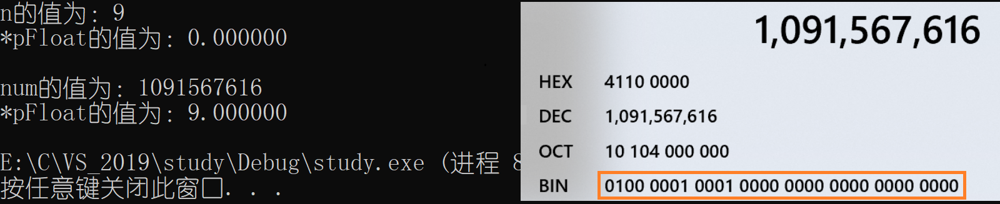

# 第九章	指针进阶

## 一、字符指针

指针的类型中存在一种指针类型 — 字符指针 ==char*==

### （一）指针指向字符常量

```c
#include<stdio.h>
int main()
{
	char ch = 'w';
	char* pc = &ch;//pc存储ch的地址
	*pc = 'e';//改变地址所指向的内容
	printf("%c\n", *pc);//输出e
	return 0;
}
```

### （二）指针指向字符串常量

代码`char arr[] = "abcdefg";` 不是把字符串 "abcdefg" 放到字符指针pc里，而是把字符串 "abcdefg" **首字符**的地址放到了pc里。

<center style="color: #b91919; text-decoration: none; font-weight: bolder;">示意图</center> 


```c
//写法一
#include<stdio.h>
int main()
{
    char arr[] = "abcdefg";//常量字符串，不允许被更改。
    char* pc = &arr;
    printf("%c\n", *pc);
    printf("%s\n", arr);
    printf("%s\n", pc);
    return 0;
}

//写法二，常用
#include<stdio.h>
int main()
{
    const char* p = "abcdefg";//const修饰，使得p不能被修改。
    //*p = 'W';
    printf("%c\n", *p);
    printf("%s", p);
    return 0;
}
```


### （三）例题

```c
#include<stdio.h>
int main()
{
    char arr1[] = "jinghu-moon";
    char arr2[] = "jinghu-moon";
    char* p1 = "jinghu-moon";
    char* p2 = "jinghu-moon";
    printf("arr1与arr2：");
    if (arr1 == arr2)
        printf("==\n");
    else
        printf("!=\n");
    printf("\np1与p2：");
    if (p1 == p2)
        printf("==\n");
    else
        printf("!=\n");
    return 0;
}
//"jinghu-moon"为常量字符串，不能被更改。
//arr1、arr2：对数组来说，用同一常量字符串去初始化不同的数组，内存会开辟出不同的内存块。所以【arr != arr2】。
//p1、p2：对指针来说，存储常量字符串时，为节省空间，"jinghu-moon"存放在单独的一个区域。 当多个指针指向同一个字符串时，实际上它们会指向同一块内存。所以【p1 == p2】。
```


## 二、指针数组

指针数组是一个**存放指针**的数组。[指针数组_百度百科](https://baike.baidu.com/item/%E6%8C%87%E9%92%88%E6%95%B0%E7%BB%84/8669080?fr=aladdin)

### （一）简单介绍

```c
#include<stdio.h>
int main()
{
    int arr[10] = {0};//整形数组
    char ch[5] = { 0 };//字符数组
    int* parr[4];//存放整形指针的数组 —— 指针数组
    char* pch[5];//存放字符指针的数组 —— 指针数组
    return 0;
}
```

### （二）使用示例

```c
//示例1，基本不用
#include<stdio.h>
int main()
{
    int a = 10;
    int b = 20;
    int c = 30;
    int d = 40;
    int* arr[4] = { &a, &b, &c, &d };
    int i = 0;
    for (i = 0; i < 4; i++)
    {
        printf("%d ", *(arr[i]));
    }
    return 0;
}

//示例2
#include<stdio.h>
int main()
{
    int arr1[] = { 1, 2, 3, 4, 5 };
    int arr2[] = { 2, 3, 4, 5, 6 };
    int arr3[] = { 3, 4, 5, 6, 7 };
    int* parr[] = { arr1, arr2, arr3 };//存放数组地址 
    int i = 0;
    for (i = 0; i < 3; i++)
    {
        int j = 0;
        for (j = 0; j < 5; j++)
        {
            printf("%d ", *(parr[i] + j));//*(parr[i] + j) <==> arr[i][j]，类似二维数组。
        }
        printf("\n");
    }
    return 0;
}
```


## 三、数组指针

### （一）简单介绍

整形指针：`int* pi;` 能够指向整形数据的指针。 浮点型指针：`float* pf;` 能够指向浮点型数据的指针。同理，数组指针：能够指向数组的指针。

### （二）举例使用

**1、引入**

```c
int *p1[10];//指针数组（未初始化）
int (*p2)[10];//数组指针（未指定对象，相当于空指针）
```

优先级：`() > [] > *`
p1：p1先与`[]`结合 → `p1[10]`，则p1为<u>数组</u>。`int*`说明，数组p1存放的是数组大小为10的整型指针。
p2：p2先与`()`结合 → `(*p2)`，则p2为<u>指针变量</u>。`int [10]`说明，指针p2指向的是数组大小为10的整型数组。
**结论**：p1：指针数组；p2：数组指针。

**2、如何创建数组指针？**

方法：`类型+(*指针变量)+数组`

```c
//1、请创建指向整型数组arr1[10]的指针
int arr1[10];
int (*pi)[10] = arr1;

//2、请创建指向指针（char）数组arr2[10]的指针
char* arr2[10];
char* (*pc)[10] = arr2;
```

### （三）数组指针的使用

#### 1、引入

```c
#include<stdio.h>
int main()
{
    int arr[10] = { 1,2,3,4,5,6,7,8,9,0 };
    int i = 0;
    int* pi = arr;//pi存放arr的地址
    printf("arr[i]：");
    for (i = 0; i < 10; i++)
    {
        printf("%-2d ", arr[i]);
    }
    printf("\npi[i]：");
    for (i = 0; i < 10; i++)
    {
        printf("%-2d ", pi[i]);
    }
    printf("\n\n*(arr + i)：");
    for (i = 0; i < 10; i++)
    {
        printf("%-2d ", *(arr + i));
    }
    printf("\n*(pi + i)：");
    for (i = 0; i < 10; i++)
    {
        printf("%-2d ", *(pi + i));
    }
    printf("\n");
    printf("\n*pi = %d\n", *pi);
    return 0;
}
```

- **结论：**
  - `arr[i] == pi[i] == *(arr+i) == *(pi+i)，arr == pi`。
  - `*pi`指向数组<u>首元素</u>。

注意该结论在后面会使用。


#### 2、二维数组

```c
#include<stdio.h>

//传值
void print1(int arr[3][5], int x, int y)
{
    int i = 0;
    int j = 0;
    for (i = 0; i < x; i++)
    {
        for (j = 0; j < y; j++)
        {
            printf("%d ", arr[i][j]);	
        }
        printf("\n");
    }
}

//传址
void print2(int(*p)[5], int x, int y)
{
    int i = 0;
    for (i = 0; i < x; i++)
    {
        int j = 0;
        for (j = 0; j < y; j++)
        {
            printf("%d ", *(*(p + i) + j));
            //printf("%d ", p[i][j]);
            //printf("%d ", *(p[i] + j));
            //printf("%d ", (*(p + i))[j]);
        }
        printf("\n");
    }
}

int main()
{
    int arr[3][5] = { { 1, 2, 3, 4, 5 }, { 2, 3, 4, 5, 6 }, { 3, 4, 5, 6, 7 } };
    print1(arr, 3, 5);
    print2(arr, 3, 5);
    return 0;
}
```


对`*(*(p + i) + j)、*(p[i] + j)、(*(p + i))[j]、p[i][j]`的一些**解释**

- `*(*(p + i) + j)`：
  - p+i意为指针p指向第i行，\*(p+i)，解引用第i行，取得第i行地址。
  - \*(p + i) + j，找到第i行第j行个元素，\*(*(p + i) + j)，解引用第i行第j行个元素，取得第i行第j行个元素的地址，从而打印出该元素。
- `(*(p + i))[j]`：
  - 为什么*(p + i)要再加上一个`()`，因为优先级：`() > [] > *`，为避免(p + i)与`[]`结合，需要加上`()`，让(p + i)先与`*`结合。

#### 3、一维数组

```c
#include<stdio.h>

//传值
void print1(int arr[5], int n)
{
    int i = 0;
    printf("arr[i]：");
    for (i = 0; i < 5; i++)
    {
        printf("%d ", arr[i]);
    }
    printf("\n");
}

//传址
void print2(int(*p)[5], int n)
{
    int i = 0;
    printf("(*p)[i]：");
    for (i = 0; i < 5; i++)
    {
        printf("%d ", (*p)[i]);
        //printf("%d ", *(p[0] + i));
    }
}

int main()
{
    int arr[5] = { 1,2,3,4,5 };
    print1(arr, 5);
    print2(&arr, 5);
    int i = 0;

    return 0;
}


//#include<stdio.h>
//int main()
//{
//    int arr[5] = { 1,2,3,4,5 };
//    int(*p)[5] = &arr;
//    int i = 0;
//    for (i = 0; i < 5; i++)
//    {
//        printf("%d ", (*p + 0)[i]);
//        printf("%d ", *(p[0] + i));
//    }
//    return 0;
//}
```

`*(p[0] + i)`和`(*p+0)[i]`的解释在下面的**总结**部分。


### （四）总结

**数组指针和指针数组的区别**：https://www.cnblogs.com/mq0036/p/3382732.html

请解释下列代码的意思

```c
int arr[5];
int *parr1[10];
int (*parr2)[10];
int (*parr3[10])[5];
```

1、arr是一个5个元素的整形数组

2、parr1是一个数组，数组有10个元素，每个元素的类型是int*。parr1是指针数组。

3、parr2是一个指针，该指针指向了ー个数组。数组有10个元素，每个元素的类型是int。parr2是数组指针。

4、parr3是一个数组，该数组有10个元素，每个元素是一个数组指针（去掉parr3[10]，易得），该数组指针指向的数组有5个元素，每个元素是int。

**<u>以下仅为个人看法，如有错误，还请指正</u>！**

> 在vs2019、win32平台下实测，在一维数组指针中，`int(*p)[10] = &arr / int(*p)[10] = arr`，程序都可以正常运行。
>
> 按照我个人的看法，我认为`int(*p)[10] = &arr`更利于理解。原因如下：
>
> 我们都知道`arr`代表数组首元素地址，`&arr`代表数组地址。
> 在二维数组中，我们把二维数组看做 “一维数组” ，让指针p指向 “一维数组” 的 “首元素” ，此时的 “首元素地址” 应是二维数组第`0`行的地址。
> 而一维数组可以看成特殊的“二维数组”（只有一行）。`*(p[0] + i)`和`(*p+0)[i]`中p[0]、(*p+0)说明指针p指向一维数组第一行，即一维数组本身。
>
> 这样一来，数组指针在一维数组、二维数组的使用中得到了统一。

## 四、数组参数

**数组传参，传递的是<u>首元素</u>地址。**

### （一）一维数组

下列哪些函数可以正常运行？

````c
#include <stdio.h> 
void test(int arr[])
{}
void test(int arr[10])
{}
void test(int* arr)
{}
void test2(int* arr[20])
{}
void test2(int** arr)
{}
void test(int arr[])
{}
void test(int arr[10])
{}
int main()
{
    int arr[10] = { 0 };
    int* arr2[20] = { 0 };
    int arr[10] = { 0 };
    test(arr);
    test2(arr2);
    test(arr3[10]);
}
````

经运行，以arr1、arr2为实参的函数可以正常运行，以arr3为实参的函数无法正常运行。

**结论：**

- 一维数组传参时，实参不带`[]`，仅为数组名。
- 形参书写
  - 数组形式：类型+数组名+`[]`。`[]`内大小可写可不写，一般不写。
  - 指针形式：类型+`*`+数组名。
- 指针数组采用指针形式书写形参时，使用二级指针，来存放一级指针的地址。

### （二）二维数组

下列哪些函数可以正常运行？

````c
#include<stdio.h>
void test0(int arr[3][5])
{}
void test1(int arr[][5])
{}
void test2(int arr[3][])//err
{}
void test3(int* arr) //err
{}
void test4(int** arr) //err
{}
void test5(int(*arr)[5])
{}

int main()
{
    int arr[3][5] = { 0 };
    test0(arr);
    test1(arr);
    test2(arr);
    test3(arr);
    test4(arr);
    test5(arr);
    return 0;
}
````

经运行，test0、test1、test5函数可以正常运行，其余函数无法正常运行。

**结论：**

- 实参书写与一维数组一致。
- 形参书写
  - 数组形式：类型+数组名+`[][]`。`[][]`第一个`[]`（行）可以不写元素大小，第一个`[]`（列）必须指定元素大小。对一个二维数组，可以不知道有多少行，但是必须知道一行有多少个元素。这样才方便运算。
  - 指针形式：二维数组的首元素地址是第一行地址，想要传参，必须采用数组指针的方式。即，类型+(*指针变量)+数组。
- `int* arr`错误原因
  - 二维数组传参，传递的是首元素地址，即是第一行的地址。而int* arr传递的是整型的地址。
- `int** arr`错误原因
  - 二级指针，存放一级指针的地址。

## 五、指针参数

### （一）一级指针

```c
#include <stdio.h>

//传值
void print1(int* p, int sz)
{
    int i = 0;
    printf("print1：");
    for (i = 0; i < sz; i++)
    {
        printf("%d  ", *(p + i));
    }
    printf("\n\n");
}

//传址
void print2(int* p, int sz)
{
    int i = 0;
    printf("print2：");
    for (i = 0; i < sz; i++)
    {
        printf("%d  ", *(p + i));
    }
}
int main()
{
    int arr[10] = { 1,2,3,4,5,6,7,8,9 };
    int* p = arr;
    int sz = sizeof(arr) / sizeof(arr[0]);
    print1(p, sz);
    print2(&arr, sz);
    printf("\n");
    return 0;
}
```


**结论：**

- 实参、形参都可以是指针变量
- 实参还可以是`&变量名`。

### （二）二级指针

```c
#include <stdio.h>
void test1(int** ptr)
{
    printf("num = %d\n", **ptr);
}
void test2(int** ptr)
{
    printf("num = %d\n", **ptr);
}
void test3(char** pc)
{
    int i = 0;
    for (i = 0; i < 11; i++)
    {
        //printf("%c", *pc++);
        printf("%c", *(pc+i));//见数组指针使用。
        //printf("%c", *(*pc+i));//见数组指针使用。
    }
}
int main()
{
    int n = 10;
    int* p = &n;
    int** pp = &p;
    test1(pp);
    test2(&p);
    char* ch[11] = { 'j','i','n','g','h','u','-','m','o','o','n' };
    test3(&ch);
    return 0;
}
```


**结论：**

- `int** pp = &p`：将实参指针p的地址传给形参二级指针pp。
- **数组指针**做实参，二级指针做形参。
  - `*pc++`：由前文操作符属性得，`后置++`和`*（取值）`的优先级一样，且它们的<u>结合方向</u>从右 **→** 左，<u>执行方向</u>从左 **→ **右。
    则本语句应该这样理解：`*pc++等价于*(pc++)`，先执行解引用步骤，后自加，遍历整个数组。即，`*pc = *(pc+1)`。
  - `*(pc+i)`：`()`不能去掉，去掉会使`*`与`pc`先结合，导致程序无法正常运行。
  - `*pc++`与`*(pc+i)`的**不同**：前者一次循环跳过1个元素（走4个字节），后者一次循环跳过i个元素（i会累加）。
  - ` *(*pc+i)`：两次解引用，直接指向数组元素的地址，这是与前两种方式最大的**不同**之处。前两种方式都是一次解引用，指向数组指针的地址，再通过数组指针取得数组的地址，打印出数组内容。

拓展资料：[二级指针变量与数组 - 于为 - 博客园](https://www.cnblogs.com/ywsoftware/p/4527239.html)

## 六、函数指针

数组指针是指向数组的指针，同理，函数指针是指向函数的指针，用来存放函数地址。

### （一）使用

**引例**

```c
#include<stdio.h>
int Add(int x, int y)
{
	int z = 0;
	z = x + y;
	return z;
}

int main()
{
	int a = 10;
	int b = 20;
	printf("sum = %d", Add(a, b));
	return 0;
}
```

这是一个自定义函数，可实现加法效果。如果把传参方式改为函数指针传参，该怎么做？可以参考数组指针的方法。

**函数指针书写：**`参数类型+(*指针变量)+(函数参数)`，与数组指针基本一致。

**实例**

```c
#include<stdio.h>
int Add(int x, int y)
{
    int z = 0;
    z = x + y;
    return z;
}

int main()
{
    int a = 0,b = 0;
    int(*p)(int, int) = Add;
    printf("sum = %d\n", (*p)(20, 30));
    return 0;
}
```


**问题**：函数有地址吗？

答：见下方代码。

```c
#include<stdio.h>
int main()
{
    int a = 10;
    int b = 20;
    printf("Add：%p\n", Add);
    printf("\n&Add：%p\n", &Add);
    return 0;
}
```

**注意**：`&Add`和`Add`结果一致，但是二者都是函数的地址，**函数没有首元素**，与数组不同。


### （二）有趣代码

```c
//代码1
(*(void (*)())0)();
```


解释前，首先我们需要知道，函数指针的**类型**为`参数类型+(*)+(函数参数)`。

**解释**

1、从黄色括号看起，这是一个函数指针类型，加上外部的黄色括号后，为强制类型转换。

2、在第二个黄色括号后面是常量0，说明强制类型转换的对象是0，即，将0强制类型转换成函数指针，0是一个函数的地址。

3、`(void (*)())0`看做`p`，原代码为`(*p)()`，为函数调用。（见上方实例）。

**综上**：代码1是函数调用，它将0强制类型转换为`void (*)()`的函数指针，`*`解引用，调用0地址处的该函数，其参数为无参数，返回类型为`void`。

```c
//代码2
void (*signal(int, void(*)(int)))(int);
```


一种错误但好理解的写法，把signal(int, void(*)(int))从括号里拿出来：

`void(*)(int) signal(int, void(*)(int));`

**解释**

1、代码2是一个函数声明，`signal`是函数名。

2、绿色括号内为`signal函数`的参数。第一个是`int`—整型；第二个是`void(*)(int)`—函数指针类型，该<u>函数指针</u>指向的函数形参是`int`，返回类型是`void`。

3、`signal函数`的返回类型也是一个函数指针，该函数指针指向的函数形参是`int`，返回类型是`void`。

**简化写法**

```c
typedef void(*pfun_t)(int);//将void(*)(int)重命名为pfun_t
pfun_t signal(int, pfun_t);
```

`typedef`详解：https://blog.csdn.net/liitdar/article/details/80069638

### （三）注意事项

函数指针创建好了后，函数的调用有两种方法。第一种：`(指针变量)(函数参数)`，第二种：`(*指针变量)(函数参数)`，两种方法有无区别？请看下方代码。

```c
#include<stdio.h>
int Add(int x, int y)
{
    int z = 0;
    z = x + y;
    return z;
}

int main()
{
    int a = 0, b = 0;
    int(*p)(int, int) = Add;
    printf("0*：sum = %d\n", (p)(20, 30));//p可以去掉()
    printf("1*：sum = %d\n", (*p)(20, 30));
    printf("2*：sum = %d\n", (**p)(20, 30));
    printf("3*：sum = %d\n", (***p)(20, 30));
    return 0;
}
```


**结论：**

- 加n个`*`，都可以。但我们一般写代码时，只加一个`*`或者不加`*`。$n\in[0,+\infty)$
- `(*p)`：解引用，找到函数地址。
- `(p)`：创建函数指针后，`p等价于函数名`。

## 七、函数指针数组

顾名思义，函数指针数组，即，存放函数指针的数组。

**语法**

```c
int (*parr[10])();
```

parr先与[10]结合，即数组parr，去掉`parr[10]`，剩下的是`int (*)()`—函数指针类型。

**简单使用**

```c
//四则运算
#include<stdio.h>

// +
int Add(int x, int y)
{
	return x + y;
}
// -
int Sub(int x, int y)
{
	return x - y;
}
// *
int Mul(int x, int y)
{
	return x * y;
}
// /
int Div(int x, int y)
{
	return x / y;
}

int main()
{
	int (*pa)(int, int) = Add;
	int(*parr[4])(int, int) = {Add, Sub, Mul, Div};	
	int i = 0;
	for (i = 0; i < 4; i++)
	{
		printf("%d\n", parr[i](3, 3));
	}
	return 0;
}
```


函数指针数组的用途：**转移表[^2]**。见下方代码。

```c
#include<stdio.h>
void menu()
{
    printf("\n");
    printf("***********************************\n");
    printf("****** 1—>add       2—>sub ******\n");
    printf("****** 3—>mul       4—>div ******\n");
    printf("**********   0—>exit   ***********\n");
    printf("***********************************\n");
}
1
int Add(int x, int y)
{
    return x + y;
}

int Sub(int x, int y)
{
    return x - y;
}

int Mul(int x, int y)
{
    return x * y;
}

int Div(int x, int y)
{
    return x / y;
}

int main()
{
    int input = 0;
    do
    {
        int x = 0, y = 0;
        menu();
        printf("请选择:");
        scanf_s("%d", &input);
        /*printf("请输入两个操作数：");
		scanf_s("%d %d", &x,& y);*/
        switch (input)
        {
            case 1:
                printf("请输入两个操作数：");
                scanf_s("%d %d", &x, &y);
                printf("\nsum = %d\n", x + y);
                break;
            case 2:
                printf("请输入两个操作数：");
                scanf_s("%d %d", &x, &y);
                printf("\ndif = %d\n", x - y);//difference 除
                break;
            case 3:
                printf("请输入两个操作数：");
                scanf_s("%d %d", &x, &y);
                printf("\npro = %d\n", x * y);//product 积		
                break;
            case 4:
                printf("请输入两个操作数：");
                scanf_s("%d %d", &x, &y);
                printf("\nquo = %d\n", x / y);//quotient 商
                break;
            case 0:
                printf("\n退出\n");
                break;
            default:
                printf("\n选择错误，重新选择！\n");
                break;
        }
    } while (input);
}
```

这段代码过于冗长，且主函数里有许多重复的语句，该如何修改？

方法一、使用函数指针数组，即是转移表。

方法二、使用回调函数，后面会提到。

```c
//方法一
#include<stdio.h>

void menu()
{
    printf("\n");
    printf("***********************************\n");
    printf("****** 1—>add       2—>sub ******\n");
    printf("****** 3—>mul       4—>div ******\n");
    printf("**********   0—>exit   ***********\n");
    printf("***********************************\n");
}

int Add(int x, int y)
{
    return x + y;
}

int Sub(int x, int y)
{
    return x - y;
}

int Mul(int x, int y)
{
    return x * y;
}

int Div(int x, int y)
{
    return x / y;
}

int main()
{
    //pfArr 是一个函数指针数组 —— 转移表
    int input = 0;
    int(*pfArr[])(int, int) = {0, Add, Sub, Mul, Div};
    do
    {
        menu();
        printf("请选择：");
        int x = 0, y = 0;
        scanf_s("%d", &input);
        if (input >= 1 && input <= 4)
        {
            printf("请输入两个操作数:");
            scanf_s("%d %d", &x, &y);
            int ret = pfArr[input](x, y);//函数调用
            printf("ret = %d\n", ret);
        }
        else if (input == 0)
        {
            printf("退出\n");
        }
        else
        {
            printf("选择错误\n");
        }
    } while(input);
    return 0;
}
```

## 八、指向函数指针数组的指针

指向函数指针数组的指针是一个指针，指针指向一个数组，数组的元素都是函数指针。这便是指向函数指针数组的指针。

**举例**

````c
int (*parr[10])(int, int);
````

这是一个函数指针数组，要创建一个指针，来指向该数组，该怎么办？

````c
1、取出数组地址 —— &parr
2、创建指针 —— pparr
3、建立联系 —— int (*(*pparr)[10])(int, int) = &parr;
````

**解释**

`*pparr`是一个指针，它指向一个数组。去掉`(*pparr)`，易得该数组的类型是`int (*)(int, int)` — 函数指针类型。

## 九、回调函数

[C语言回调函数详解](https://www.cnblogs.com/jiangzhaowei/p/9129105.html)

函数 F1 调用函数 F2 的时候，函数 F1 通过**参数**给函数 F2 传递了另外一个函数 F3 的指针，在函数 F2 执行的过程中，函数F2 调用了函数 F3，这个动作就叫做回调（Callback），而先被当做指针传入、后面又被使用的函数 F3 就是回调函数。

回调函数不是由该函数实现方直接调用的，而是在特定的事件或条件发生时由另外的一方调用的，来对该事件或条件进行响应。

**举例**

```c
//main（函数F1）—— 主函数，调用函数F2。
//Add、Sub、Mul、Div（函数F3）—— 回调函数
//Calc（函数F2）—— 接收main函数传来的函数F3的指针，在执行Calc函数时，调用函数F3。
//eg： Calc(Add);
#include<stdio.h>
void menu()
{
    printf("\n");
    printf("***********************************\n");
    printf("****** 1—>add       2—>sub ******\n");
    printf("****** 3—>mul       4—>div ******\n");
    printf("**********   0—>exit   ***********\n");
    printf("***********************************\n");
}

int Add(int x, int y)
{
    return x + y;
}

int Sub(int x, int y)
{
    return x - y;
}

int Mul(int x, int y)
{
    return x * y;
}

int Div(int x, int y)
{
    return x / y;
}

void Calc(int (*pf)(int, int))//函数指针
{
    int x = 0;
    int y = 0;
    printf("请输入两个操作数:");
    scanf_s("%d %d", &x, &y);
    printf("\nret = %d\n", pf(x, y));
}

int main()
{
    int input = 0;
    do
    {
        menu();
        printf("请选择:");
        scanf_s("%d", &input);
        switch (input)
        {
            case 1:
                Calc(Add);
                break;
            case 2:
                Calc(Sub);
                break;
            case 3:
                Calc(Mul);
                break;
            case 4:
                Calc(Div);
                break;
            case 0:
                printf("退出\n");
                break;
            default:
                printf("选择错误\n");
                break;
        }
    } while (input);
}
```

在前面，我们已经学会了冒泡排序，但是冒泡排序存在一定缺陷 — 排序的对象单一，想要更改排序的对象，比较麻烦，如果想要比较结构体，冒泡排序实现困难。该如何解决？我们可以使用`qsort快速排序`$+$`回调函数`实现不同类型数据的比较。同时我们也可以通过qsort快速排序函数的使用，来学习回调函数。

### （一）qsort函数介绍

#### 1、前置知识

介绍qsort函数前，需要先解释一个东西 — `void*`。

平常，我们定义一个`XX`类型的变量，就必须使用`XX`类型的指针来指向变量的地址。而`void*`类型，就可以很好地接收**各种类型变量**的地址，并存储起来。不恰当的比喻：`void*`就像一个  “垃圾桶”  ，什么都可以装。

使用和注意事项见下方示例。

```c
//（1）使用
#include <stdio.h>
int main()
{
    int a = 10;
    int* pi = &a;
    void* p = &a;

    char ch = 'a';
    char* pc = &ch;
    void* pc = &ch;
    return 0;
}

//（2）注意事项
*p = 0;
//1）void类型 —— 无类型，不能进行解引用操作。因为不能确定访问几个字节。（指针的类型确定访问的字节大小）

p++;
//2）void类型，不能进行+、-整数的操作，因为不能确定一步走几个字节。（指针的类型确定步长）

//指针类型使用详见 ——> 第六章第二节
```

接下来介绍qsort函数

#### 2、qsort函数详解

**定义**

```c
void qsort( void *base, size_t num, size_t width, int (__cdecl *compare )(const void *elem1, const void *elem2 ) );
```

首先可以确定，该函数无返回值 — `void`

- **函数参数**
  
  - `size_t`：
    
    - 表示类型大小，单位是字节。在我看来，它类似`void*`，可以表示任何类型（int、char、float $\cdots$），具体示实际情况而定。
    - 使用`size_t`可以提高代码的移植性。
    - 参考资料
      - [size_t和int区别](https://blog.csdn.net/qq_41598072/article/details/84924997)
      - [为什么size_t重要？- Jeremy's blog](https://jeremybai.github.io/blog/2014/09/10/size-t) 
      - [size_t 这个类型的意义是什么？ - 枕月的回答 - 知乎](https://www.zhihu.com/question/24773728/answer/1904137353)
      - [size_t 这个类型的意义是什么？ - 知乎](https://www.zhihu.com/question/24773728)
      - 建议从上往下看，更易于理解。
    
  - `base`：Start of target array，数组首地址，前面加上`void*`，意为待排序数组首地址。
  
  - `num`：Array size in elements，待排序数组元素<u>个数</u>。一般使用`sizeof`求得。
  
  - `width`：Element size in bytes，待排序数组元素的大小，单位是<u>字节</u>。一般使用`sizeof`求得。
  
  - 最后一个参数，是函数指针（F2），指针指向比较两个元素的函数的地址。指向的函数即为**回调函数**（F3）。函数指针的两个参数是待比较的两个元素地址。
  
  - F2的返回值
  
    | **Return Value** |        **Description**        |
    | :--------------: | :---------------------------: |
    |      $<$ 0       |   *elem1* less than *elem2*   |
    |      $=$ 0       | *elem1* equivalent to *elem2* |
    |      $>$ 0       | *elem1* greater than *elem2*  |

### （二）qsort函数使用

#### 1、整型、浮点型、结构体排序

```c
//test —— 函数F1，qsort——函数F2，cmp —— 函数F3，回调函数。

#include<stdio.h>
#include<stdlib.h>
#include <string.h>
struct Stu
{
    char name[20];
    short age;
};

//—————————————————————————————————————比较函数: F3——————————————————————————————————————//
//比较整型
int cmp_int(const void* e1, const void* e2)
{
    return *(int*)e1 - *(int*)e2;
}

//比较浮点型
int cmp_float(const void* e1, const void* e2)
{
    return ((int)(*(float*)e1 - *(float*)e2));
    /*if (*(float*)e1 == *(float*)e2)
    {
        return 0;
    }
    else if (*(float*)e1 > *(float*)e2)
    {
        return 1;
    }
    else
    {
        return -1;
    }*/
}

//比较结构体
//1、比较年龄
int cmp_s_age(const void* e1, const void* e2)
{
    return ((struct Stu*)e1)->age - ((struct Stu*)e2)->age;
}
//2、比较名字
int cmp_s_name(const void* e1, const void* e2)
{
    //比较名字就是比较字符串
    //字符串比较不能直接用 >、<、= 来比较，应该用strcmp函数
    return strcmp(((struct Stu*)e1)->name, ((struct Stu*)e2)->name);
}

//———————————————————————————————————qsort函数: F2———————————————————————————————————————//
void test1()
{
    int arr1[] = { 9,8,7,6,5,4,3,2,1,0 };
    int sz = sizeof(arr1) / sizeof(arr1[0]);
    qsort(arr1, sz, sizeof(arr1[0]), cmp_int);
    int i = 0;
    for (i = 0; i < sz; i++)
    {
        printf("%d ", arr1[i]);
    }
    printf("\n");
}

void test2()
{
    float arr2[] = { 9.0,8.0,7.0,6.0,5.0,4.0,3.0,2.0,1.0,0.0 };
    int sz = sizeof(arr2) / sizeof(arr2[0]);
    qsort(arr2, sz, sizeof(arr2[0]), cmp_float);
    int i = 0;
    for (i = 0; i < sz; i++)
    {
        printf("%.1f ", arr2[i]);
    }
    printf("\n");
}

void test3()
{
    struct Stu s[3] = { { "zhangsan", 20 }, { "lisi", 30 }, { "wangwu", 10 } };
    int sz = sizeof(s) / sizeof(s[0]);
    qsort(s, sz, sizeof(s[0]), cmp_s_age);
    qsort(s, sz, sizeof(s[0]), cmp_s_name);
}

int main()
{
    test1();
    test2();
    test3();
    test4();
    test5();
    return 0;
}
```

#### 2、冒泡排序优化

==升序==

```c
//test —— 函数F1，bubble_sort —— 函数F2，cmp —— 函数F3，回调函数。

#include<stdio.h>
#include<stdlib.h>
#include <string.h>
struct Stu
{
    char name[20];
    short age;
};

//——————————————————————————————————————比较函数—————————————————————————————————————————//
//比较整型
int cmp_int(const void* e1, const void* e2)
{
    return *(int*)e1 - *(int*)e2;
}

//比较浮点型
int cmp_float(const void* e1, const void* e2)
{
    //return ((int)(*(float*)e1 - *(float*)e2));
    if (*(float*)e1 == *(float*)e2)
    {
        return 0;
    }
    else if (*(float*)e1 > *(float*)e2)
    {
        return 1;
    }
    else
    {
        return -1;
    }
}

//比较结构体
//1、比较年龄
int cmp_s_age(const void* e1, const void* e2)
{
    return ((struct Stu*)e1)->age - ((struct Stu*)e2)->age;
}
//2、比较名字
int cmp_s_name(const void* e1, const void* e2)
{
    //比较名字就是比较字符串
    //字符串比较不能直接用 >、<、= 来比较，应该用strcmp函数
    return strcmp(((struct Stu*)e1)->name, ((struct Stu*)e2)->name);
}


//交换元素
void Swap(char* buf1, char* buf2, int width)
{
    int i = 0;
    for (i = 0; i < width; i++)
    {
        char tmp = *buf1;
        *buf1 = *buf2;
        *buf2 = tmp;
        buf1++;
        buf2++;
    }
}

//冒泡排序
void bubble_sort(void* base, int sz, int width, int (*cmp)(void* e1, void* e2))
//base：数组首元素地址，sz：数组元素个数，width：一个元素所占内存大小（字节）
{
    int i = 0, j = 0;
    for (i = 0; i < sz - 1; i++)
    {
        for (j = 0; j < sz - 1 - i; j++)
        {
            //两个元素的比较
            if (cmp((char*)base + j * width, (char*)base + (j + 1) * width) > 0)
            {
                //交换
                Swap((char*)base + j * width, (char*)base + (j + 1) * width, width);
            }
        }
    }
}

void test4()
{
    int arr[10] = { 9, 8, 7, 6, 5, 4, 3, 2, 1, 0 };
    int sz = sizeof(arr) / sizeof(arr[0]);
    bubble_sort(arr, sz, sizeof(arr[0]), cmp_int);
}

void test5()
{
    int arr[10] = { 9.0,8.0,7.0,6.0,5.0,4.0,3.0,2.0,1.0,0.0 };
    int sz = sizeof(arr) / sizeof(arr[0]);
    bubble_sort(arr, sz, sizeof(arr[0]), cmp_float);
}

void test6()
{
    struct Stu s[3] = { { "zhangsan", 20 }, { "lisi", 30 }, { "wangwu", 10 } };
    int sz = sizeof(s) / sizeof(s[0]);
    bubble_sort(s, sz, sizeof(s[0]), cmp_s_age);
    bubble_sort(s, sz, sizeof(s[0]), cmp_s_name);
}

int main()
{
    test4();
    test5();
    test6();
    return 0;
}
```

<center style="color: #b91919; text-decoration: none; font-weight: bolder;">程序运行解释图</center> 

```flow
st=>start: 程序开始！
op1=>operation: 确定排序数据（test函数）
op2=>operation: 进入排序（bubble_sort函数）
op3=>operation: 排序结束
con1=>condition: 满足循环条件
con2=>condition: 判断是否交换
sub1=>subroutine: 交换（swap函数）
io=>inputoutput: 下一组
e=>end: 程序结束！
st->op1->op2->con1->con2
con1(yes)->con2
con1(no)->op3(right)->e
con2(yes)->sub1
con2(no)->io(right)->op2
```

## 十、指针和数组笔试题解析

### （一）数组笔试题

#### 1、一维数组

- 一般情况
  - 数组名是首元素地址
- 特殊情况
  - `sizeof(数组名)` — 数组名表示整个数组
  - `&数组名` — 数组名表示整个数组

```c
#include<stdio.h>
int main()
{
    int arr[] = { 1,2,3,4 };

    printf("sizeof(arr) = %d\n", sizeof(arr));//16
    //sizeof(数组名)，计算的是数组总大小，单位是字节。

    printf("sizeof(arr + 0) = %d\n", sizeof(arr + 0));//4 or 8
    //arr+0表示数组首元素地址。

    printf("sizeof(*arr) = %d\n", sizeof(*arr));//4
    //数组名表示首元素地址，*解引用，找到首元素内容，计算其大小。

    printf("sizeof(arr + 1) = %d\n", sizeof(arr + 1));//4 or 8
    //arr+1表示数组第2个元素地址。计算地址大小。

    printf("sizeof(arr[1]) = %d\n", sizeof(arr[1]));//4
    //arr第2个元素的大小。
    
    printf("sizeof(&arr) = %d\n", sizeof(&arr));//4 or 8
    //&a取出的是数组的地址，数组的地址也是地址。

    printf("sizeof(*&arr) = %d\n", sizeof(*&arr));//16
    //&a：数组的地址，地址解引用访问数组。*和&抵消。

    printf("sizeof(&arr + 1) = %d\n", sizeof(&arr + 1));//4 or 8
    //&数组名，数组名表示整个数组，&arr + 1跳过整个数组，但还是地址。

    printf("sizeof(&arr[0]) = %d\n", sizeof(&arr[0]));//4 or 8
    //&a[0]是第一个元素的地址，arr先与[]结合。

    printf("sizeof(&arr[0] + 1) = %d\n", sizeof(&arr[0] + 1));//4 or 8
    //&a[0]+1是第二个元素的地址，arr先与[]结合。

    return 0;
}
```

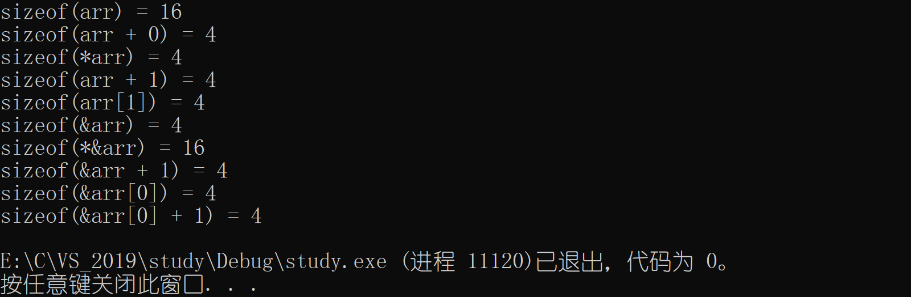

#### 2、字符数组

```c
#include<stdio.h>
#include<stdio.h>
int main()
{
    char arr[] = { 'a','b','c','d','e','f' };

    printf("sizeof(arr) = %d\n", sizeof(arr));//6
    printf("strlen(arr) = %d\n\n", strlen(arr));//随机值，无 “\0” 。

    printf("sizeof(arr + 0) = %d\n", sizeof(arr + 0));//4 or 8，首元素地址。
    printf("strlen(arr + 0) = %d\n\n", strlen(arr + 0));//随机值，没有 “\0” 。

    printf("sizeof(*arr) = %d\n\n", sizeof(*arr));//1，首元素地址，解引用，为首元素值。
    printf("%d\n\n", strlen(*arr));//error，a的ASCII码值为97，strlen把97当做地址。

    printf("sizeof(arr[1]) = %d\n\n", sizeof(arr[1]));//1，首元素大小
    printf("%d\n\n", strlen(arr[1]));//error，传递第二个元素b（ASCII码值为98）的地址。

    printf("sizeof(&arr) = %d\n", sizeof(&arr));//4 or 8，数组地址
    printf("strlen(&arr) = %d\n\n", strlen(&arr));//随机值，首元素地址，向后查找，无 “\0” 。

    printf("sizeof(&arr + 1) = %d\n", sizeof(&arr + 1));//4 or 8，&arr+1跳过数组，仍为地址。
    printf("strlen(&arr + 1) = %d\n\n", strlen(&arr + 1));//随机值，数组地址+1，仍无 “\0”，随机值-6

    printf("sizeof(&arr[0] + 1) = %d\n", sizeof(&arr[0] + 1));//4 or 8，第二个元素的地址
    printf("strlen(&arr[0] + 1) = %d\n\n", strlen(&arr[0] + 1));//随机值，第二个元素地址，随机值-1。

    return 0;
}
```


#### 3、字符串数组

字符串自带`\0`

```c
#include<stdio.h>
#include<string.h>
int main()
{
    char arr[] = "abcdef";

    printf("sizeof(arr) = %d\n", sizeof(arr));//7，有 “\0” 。
    printf("strlen(arr) = %d\n\n", strlen(arr));//6，从首元素开始统计，有 “\0” ，但不统计。

    printf("sizeof(arr + 0) = %d\n", sizeof(arr + 0));//4 or 8，首元素地址。
    printf("strlen(arr + 0) = %d\n\n", strlen(arr + 0));//6，从首元素开始统计，有 “\0” ，但不统计。

    printf("sizeof(*arr) = %d\n\n", sizeof(*arr));//1，首元素
    printf("%d\n", strlen(*arr));//error，传进去a，被当做地址。

    printf("sizeof(arr[1]) = %d\n\n", sizeof(arr[1]));//1，第二个元素
    printf("%d\n", strlen(arr[1]));//error，传进去b，被当做地址。

    printf("sizeof(&arr) = %d\n", sizeof(&arr));//4 or 8，数组地址
    printf("strlen(&arr) = %d\n\n", strlen(&arr));//6，数组地址与首元素地址一样。有警告。

    printf("sizeof(&arr + 1) = %d\n", sizeof(&arr + 1));//4 or 8，跳过整个数组的地址
    printf("strlen(&arr + 1) = %d\n\n", strlen(&arr + 1));//随机值，下一个数组的地址。有警告。

    printf("sizeof(&arr[0] + 1) = %d\n", sizeof(&arr[0] + 1));//4 or 8，第二个元素的地址。
    printf("strlen(&arr[0] + 1) = %d\n\n", strlen(&arr[0] + 1));//5，从第二个元素开始计算大小。

    return 0;
}
```


#### 4、字符串指针

```c
//p存放a的地址
#include<stdio.h>
#include<string.h>
int main()
{
    char* p = "abcdef";

    printf("sizeof(p) = %d\n", sizeof(p));//4 or 8，首元素地址
    printf("strlen(p) = %d\n\n", strlen(p));//6，首元素地址

    printf("sizeof(p + 1)  = %d\n", sizeof(p + 1));//4 or 8，第二个元素的地址
    printf("strlen(p + 1) = %d\n\n", strlen(p + 1));//5，第二个元素的地址

    printf("sizeof(*p) = %d\n\n", sizeof(*p));//1，*p是字符串第一个字符 —— a。
    printf("%d\n\n", strlen(*p));//error

    printf("sizeof(p[0]) = %d\n\n", sizeof(p[0]));//1，arr[0] == *(arr+0) == p[0] == *(p+0) == 'a'。
    printf("%d\n\n", strlen(p[0]));//error

    printf("sizeof(&p) = %d\n", sizeof(&p));//4 or 8，指针p的地址。
    printf("strlen(&p) = %d\n\n", strlen(&p));//随机值，指针p的地址。计算存放在p里的a的地址大小，可以把a的地址看做字符串。

    printf("sizeof(&p + 1) = %d\n", sizeof(&p + 1));//4 or 8，指针p后面的地址。计算p后面的地址大小。
    printf("strlen(&p + 1) = %d\n\n", strlen(&p + 1));//随机值，在&p的基础上+1。

    printf("sizeof(&p[0] + 1) = %d\n", sizeof(&p[0] + 1));//4 or 8，第二个元素的地址。
    printf("strlen(&p[0] + 1) = %d\n\n", strlen(&p[0] + 1));//5，第二个元素的地址

    return 0;
}
```


#### 5、二维数组

```c
#include<stdio.h>
int main()
{
    int arr[3][4] = { 0 };

    printf("sizeof(arr) = %d\n", sizeof(arr));//48，整个数组

    printf("sizeof(arr[0][0]) = %d\n", sizeof(arr[0][0]));//4，一个元素

    printf("sizeof(arr[0]) = %d\n", sizeof(arr[0]));//16，整行元素，arr[0]为数组第一行的数组名。

    printf("sizeof(arr[0] + 1) = %d\n", sizeof(arr[0] + 1));//4 or 8，
    //arr[0]+1：arr[0]不是单独存在，为数组第一行首元素的地址。+1为数组第一行第二个元素的地址

    printf("sizeof(*(arr[0] + 1)) = %d\n", sizeof(*(arr[0] + 1)));//4，解引用数组第一行第二个元素

    printf("sizeof(arr + 1) = %d\n", sizeof(arr + 1));//4，
    //arr：首元素地址，二维数组的首元素为第一行。arr是第一行地址、arr+1来到第二行。为第二行地址。

    printf("sizeof(*(arr + 1)) = %d\n", sizeof(*(arr + 1)));//16，解引用，计算第二行大小。

    printf("sizeof(&arr[0] + 1) = %d\n", sizeof(&arr[0] + 1));//4，&arr[0]得到第一行地址，+1，为第二行地址。

    printf("sizeof(*(&arr[0] + 1)) = %d\n", sizeof(*(&arr[0] + 1)));//16，第二行地址解引用

    printf("sizeof(*arr) = %d\n", sizeof(*arr));//16，arr是第一行地址，解引用。

    printf("sizeof(arr[3]) = %d\n", sizeof(arr[3]));//16，
    //sizeof括号内的表达式不会计算。二维数组的行可以省略。arr[3]相当于arr[0]，所以不会报错。

    return 0;
}
```

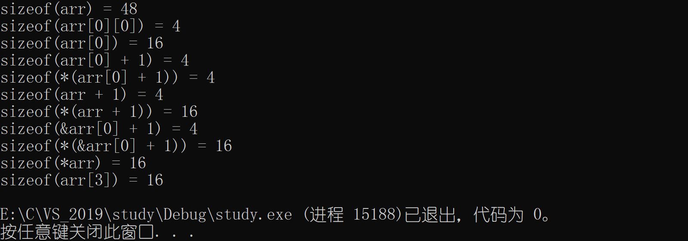

#### 6、总结

- <u>数组名是**首元素**的地址</u>。一维数组的首地址是第一个元素的地址，二维数组的首元素地址为第一行的地址。
- 两个例外：`sizeof(数组名)` — 数组名表示整个数组；`&数组名` — 数组名表示整个数组。
- 操作符优先级：`() > [] > & = * `，优先级越高，变量先与之结合。
- `sizeof()`：`()`内如果存在除了数组名之外的字符，就表示为首元素地址。前面加`*`（解引用），返回数组内容。

- 字符串以`'\0'`结尾。sizeof计算所占空间大小，strlen仅计算字符串大小，遇到`'\0'`停止。

### （二）指针笔试题

1、本题的输出结果是什么？

```c
#include<stdio.h>
int main()
{
    int a[5] = { 1, 2, 3, 4, 5 };
    int* ptr = (int*)(&a + 1);
    printf("%d，%d\n", *(a + 1), *(ptr - 1));
    return 0;
}
```

<center style="color: #b91919; text-decoration: none; font-weight: bolder;">解析</center> 


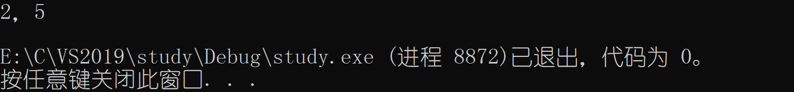

2、本题的输出结果是什么？（已知结构体Test类型的变量大小是20个字节）

```c
#include<stdio.h>
struct Test {
	int Num;
	char* pcName;
	short sDate;
	char cha[2];
	short sBa[4];
}*p;
//假设p的值为0x100000。 如下表表达式的值分别为多少？ 
int main()
{
	p = (struct Test*)0x00100000;
	printf("%p\n", p + 0x1);
	printf("%p\n", (unsigned long)p + 0x1);
	printf("%p\n", (unsigned int*)p + 0x1);
	return 0;
}
```

**解析**

- `p + (0x)1`：指针$+、-$整数，要$\times$​​​​整数所对应类型的字节大小。
  `(0x)00100000 + (0x)00000001 * 20 = (0x)00100014`
- `(unsigned long)p + （0x）1`：将`p`强制类型转换为无符号长整型，不再是指针类型，可以直接相$+、-$​。
  `(0x)00100000 + (0x)00000001 = (0x)00100001`
- `(unsigned int*)p + (0x)1`：将`p`强制类型转换为无符号整型指针，要$\times$整数所对应类型的字节大小。
  `(0x)00100000 + (0x)00000001 * 4 = (0x)00100004`


3、本题的输出结果是什么？

```c
#include<stdio.h>
int main()
{
    int a[4] = { 1, 2, 3, 4 };
    int* ptr1 = (int*)(&a + 1);
    int* ptr2 = (int*)((int)a + 1);
    printf("%x，%x\n", ptr1[-1], *ptr2);
    return 0;
}
```

<center style="color: #b91919; text-decoration: none; font-weight: bolder;">解析</center> 


4、本题的输出结果是什么？

```c
#include <stdio.h> 
int main()
{
	int a[3][2] = { (0, 1), (2, 3), (4, 5) };
	int* p;
	p = a[0];
	printf("%d\n", p[0]);
	return 0;
}
```

<center style="color: #b91919; text-decoration: none; font-weight: bolder;">解析</center> 


5、本题的输出结果是什么？

```c
#include <stdio.h> 
int main() 
{
    int a[5][5];
    int(*p)[4]; 
    p = a; 
    printf("%p , %d\n", &p[4][2] - &a[4][2], &p[4][2] - &a[4][2]); 
    return 0;
}
```

**解析**

- `%p`：一般以十六进制整数方式输出指针的值。
- `指针 -​​ 指针`，结果为两地址之间元素的**个数**。
- `-4​​`：按照`%p`格式打印，补码 **→** 原码，再转换为十六进制。

<center style="color: #b91919; text-decoration: none; font-weight: bolder;">示意图</center> 


6、本题的输出结果是什么？

```c
#include <stdio.h> 
int main()
{
	int aa[2][5] = { 1, 2, 3, 4, 5, 6, 7, 8, 9, 0 };
	int* ptr1 = (int*)(&aa + 1);
	int* ptr2 = (int*)(*(aa + 1));
	printf("%d , %d\n", *(ptr1 - 1), *(ptr2 - 1));
	return 0;
}
```

**解析**

- `int*`：数组指针类型 **→** 整形指针。
- `*(aa + 1)`：相当于`aa[1]`，表示第二行首元素地址（整型指针）。`int*`多余，可去掉。
  `*(aa + 1) == *(p + 1) == p[1] == aa[1]`
- 指针$+、-$整数，要$\times$整数所对应类型的字节大小。

<center style="color: #b91919; text-decoration: none; font-weight: bolder;">示意图</center> 


7、本题的输出结果是什么？

```c
#include <stdio.h>
int main()
{
    char* a[] = { "work","at","alibaba" };
    char** pa = a;
    pa++;
    printf("%s\n", *pa);
    return 0;
}
```

**解析**

- ` char* a[]`：表明这是一个字符指针数组。
- `char*`：字符指针，指向字符串的首元素地址。在本题中，指向`"w、a、a"`。

 **示意图**


8、本题的输出结果是什么？

```c
#include <stdio.h>
int main()
{
    char* c[] = { "ENTER","NEW","POINT","FIRST" };
    char** cp[] = { c + 3,c + 2,c + 1,c };
    char*** cpp = cp;
    printf("**++cpp = %s\n\n", **++cpp);
    printf("*-- * ++cpp + 3 = %s\n\n", *-- * ++cpp + 3);
    printf("*cpp[-2] + 3 = %s\n\n", *cpp[-2] + 3);
    printf("cpp[-1][-1] + 1 = %s\n", cpp[-1][-1] + 1);
    return 0;
}
```

**解析**

- 前三句代码在内存中的存储、指向如下图。
- `**++cpp`：`++cpp`先$++$，后执行，cpp指向`c+2`，第一次解引用找到`char* [2]`的地址，第二次解引用找到字符串`"POINT"`首字符地址，输出结果。**此时，cpp指向==c+2==。**
- `*-- * ++cpp + 3`：先执行`++cpp`，cpp指向`c+1`。第一次解引用找到`char* [1]`的地址，后执行`--`，指向`char* [0]`，第二次解引用找到字符串`"ENTER"`首字符地址，地址`+3`，从`E`开始输出结果。**此时，cpp指向==c+1==。**
- `*cpp[-2] + 3`：`cpp[-2] <==> *(cpp-2)`，它指向`c+3`，第一次解引用找到`char* [3]`，第二次解引用找到字符串`"FIRST"`首元素地址，地址`+3`，从`S`开始输出结果。cpp $-$ 2 没有改变 cpp 的值。**此时，cpp指向==c+1==。**
- `cpp[-1][-1] + 1`：`cpp[-1][-1] + 1 <==> *(*(cpp-1)-1)+1`，`cpp-1`指向`c+2`，第一次解引用找到`char* [2]`，地址`-1`，指向`char* [1]`，第二次解引用找到`"NEW"`首元素地址，地址`+1`，从`E`开始输出结果。

<center style="color: #b91919; text-decoration: none; font-weight: bolder;">示意图</center> 


# 第十章	字符串与内存函数

C语言中对字符和字符串的处理很是频繁，但是C语言本身是没有字符串类型的，字符串通常放在<u>常量字符串</u>中或者<u>字符数组</u>中。 字符串常量适用于那些对它不做修改的**字符串函数**。

| 长度不受限制的字符串函数 | 长度受限制的字符串函数 |
| :----------------------: | :--------------------: |
|        strcpy函数        |      strncpy函数       |
|        strcat函数        |      strncat函数       |
|        strcmp函数        |      strncmp函数       |

## 一、字符串函数

### （一）strlen函数 — 长度

[strlen - C++ Reference](http://www.cplusplus.com/reference/cstring/strlen/?kw=strlen)

**语法**

```c
size_t strlen ( const char * str );
```

1、字符串以`'\0'`作为结束标志，strlen函数返回的是在字符串中`'\0'`前面出现的字符个数。

2、参数指向的字符串必须要以`'\0'`结束。 注意函数的返回值为`size_t`，是无符号的。
`size_t == unsigned int`。

```c
#include<stdio.h>
#include<string.h>
int my_strlen(char* p)
{
    int count = 0;
    while (*p != '\0')
    {
        count++;
        p++;
    }
    return count;
}
int main()
{
    if (strlen("abc") - strlen("abcdef") > 0)//无符号数
    {
        printf("strlen：>\n");
    }
    else
    {
        printf("strlen：<\n");
    }
    if (my_strlen("abc") - my_strlen("abcdef") > 0)
    {
        printf("my_strlen：>\n");
    }
    else
    {
        printf("my_strlen：<\n");
    }
    return 0;
}
```

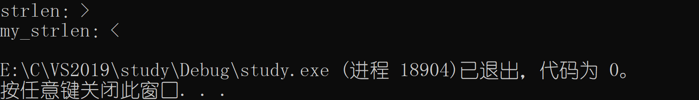

**3、==strlen函数==的模拟实现**

```c
//方法1、递归实现
#include<stdio.h>
int my_strlen(char* p)
{
    if (*p != '\0')
    {
        return 1 + trlen(p + 1);
    }
    else
    {
        return 0;
    }
}

int main()
{
    char arr[] = "abcd";
    int len = my_strlen(arr);
    printf("len = %d", len);
}

//——————————————————————————————————————————————————————————————————————————————————————//

//方法2、计数器 —— count
#include<stdio.h>
int my_strlen(char* p)
{
    int count = 0;
    while (*p != '\0')
    {
        count++;
        p++;
    }
    return count;
}

int main()
{
    char arr[] = "abcdefg";
    int len = my_strlen(arr);
    printf("len = %d", len);
    printf("\n");
}

//——————————————————————————————————————————————————————————————————————————————————————//

//方法3、指针 — 指针
#include <stdio.h>
int my_strlen(char* str)
{
    char* start = str;
    char* end = str;
    while (*end != '\0')
    {
        end++;
    }
    return end - start;
}

int main()
{
    char arr[] = "abcdefg";
    int len = my_strlen(arr);
    printf("字符串长度：%d\n", len);
    return 0;
}
```

### （二）strcpy函数 — 拷贝

[strcpy - C++ Reference](http://www.cplusplus.com/reference/cstring/strcpy/)

**语法**

````c
char * strcpy ( char * destination, const char * source );
//将source（源头）指向的字符串拷贝到destination（目的地）指向的字符串
````

1、源字符串必须以`'\0'` 结束，没有`'\0'`，会导致数组越界访问。同时要将源字符串中的`'\0'`拷贝到目标空间里。	错误示范：`char arr[] = { 'a','b','c' }`

2、目标空间必须足够大，以确保能存放源字符串。 同时目标空间必须可变，不能为常量字符串。错误示范：`char *arr1 = "abcdefghi";`
**3、==strcpy函数==的模拟实现**

```c
#include<stdio.h>
#include<assert.h>

char* my_strcpy(char* dest, char* src)
{
    assert(dest != NULL);
    assert(src != NULL);
    while (*src)
    {
        *dest = *src;
        dest++;
        src++;
    }
    *dest = *src;
}

int main()
{
    char arr1[] = "jinghu-moon";
    char arr2[] = "wumei";
    my_strcpy(arr1, arr2);
    printf("%s\n", arr1);
    return 0;
}

//——————————————————————————————————————————————————————————————————————————————————————//

//my_strcpy精简1
char* my_strcpy(char* dest, char* src)
{
    assert(dest != NULL);
    assert(src != NULL);
    while (*src)
    {
        *dest++ = *src++;
    }
    *dest = *src;
}  
//my_strcpy精简2
char* my_strcpy(char* dest, const char* src)
{
    assert(dest != NULL);
    assert(src != NULL);
    while (*dest++ = *src++)
    {
        ;
    }
}

//—————————————————————————————————————————————————————————————————————————————————————————//

//优化
#include<stdio.h>
#include<assert.h>
char* my_strcpy(char* dest, const char* src)
{
    char* temp = dest;
    assert(dest && src);
    //拷贝字符串
    while (*dest++ = *src++)
    {
        ;
    }
    //返回目的串的起始地址
    return temp;
}

int main()
{
    char arr1[] = "jinghu-moon";
    char arr2[] = "wumei";
    my_strcpy(arr1, arr2);
    printf("%s\n", arr1);
    return 0;
}
```


### （三）strcat函数 — 拼接

[strcat - C++ Reference](http://www.cplusplus.com/reference/cstring/strcat/)

**语法**

```c
char* strcat(char* destination, const char* source);
```

1、源字符串、目标字符串必须以`'\0'`结束。 

2、目标空间必须有足够大的空间，能容纳下源字符串的内容。目标空间必须可修改，不能为常量字符串。

**3、==strcat函数==的模拟实现**

```c
#include<stdio.h>
#include<assert.h>
char* my_strcat(char* dest, const char* src)
{
    char* ret = dest;
    assert(dest != NULL);
    assert(src != NULL);
    //1、找到目的字符串的'\0'
    while (*dest != '\0')
    {
        dest++;
    }
    //2、追加 —— strcpy
    while (*dest++ = *src++)
    {
        ;
    }
    return ret;
}

int main()
{
    char arr1[30] = "jing";
    char arr2[] = "hu-moon";
    my_strcat(arr1, arr2);
    printf("%s\n", arr1);
    return 0;
}
```


### （四）strcmp函数 — 比较

[strcmp - C++ Reference](http://www.cplusplus.com/reference/cstring/strcmp/)

**语法**

```c
int strcmp(const char* str1, const char* str2);
```

| Return Value | Relationship of string1 to string2 |
| :----------: | :--------------------------------: |
|    $<$ 0     |   *string1* less than *string2*    |
|    $=$ 0     |  *string1* identical to *string2*  |
|    $>$ 0     |  *string1* greater than *string2*  |

VS2019环境下，$<0$，返回$-1$；$= 0$，返回$0$；$> 0$，返回$1$。

1、字符串比较的不是字符串字符个数，而是字符串1、字符串2对应字符的ASCII码值。从头比到尾。每比较一次，返回一个有符号数。

**2、==strcmp函数==的模拟实现**

```c
#include<stdio.h>
#include<assert.h>

//方法1、返回-1、0、1。
int my_strcmp(const char* str1, const char* str2)
{
    assert(str1 && str2);
    //比较
    while (*str1 == *str2)
    {
        if (*str1 == '\0')
        {
            return 0;//相等
        }
        str1++;
        str2++;
    }
    if (*str1 > *str2)
    {
        return 1;//大于
    }
    else
    {
        return -1;//小于
    }	
}

int main()
{
    char* p1 = "abcd";
    char* p2 = "abc";
    int ret = my_strcmp(p1, p2);
    printf("ret = %d\n", ret);
    return 0;
}

//方法2、返回 < 、 = 、 > 0的值。
int my_strcmp(const char* str1, const char* str2)
{
    assert(str1 && str2);
    //比较
    while (*str1 == *str2)
    {
        if (*str1 == '\0')
        {
            return 0;//相等
        }
        str1++;
        str2++;
    }
    return (*str1 - *str2);
}

int main()
{
    char* p1 = "abcd";
    char* p2 = "abc";
    int ret = my_strcmp(p1, p2);
    printf("ret = %d\n", ret);
    return 0;
}
```

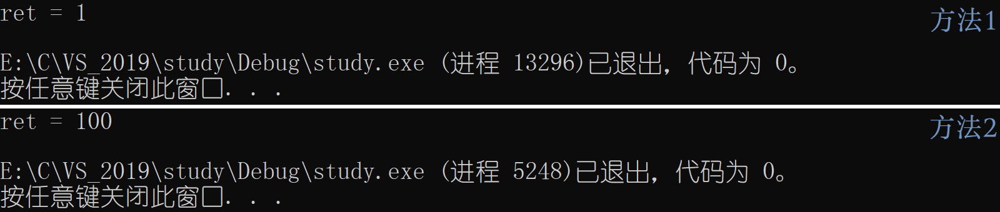

> strcpy、strcat、strcmp函数属于**长度不受限制**的字符串函数（遇到`\0`才停止）

### （五）strncpy函数

[strncpy - C++ Reference ](http://www.cplusplus.com/reference/cstring/strncpy/)

**语法**

```c
char* strncpy(char* dest, const char* src, size_t n)
```

1、拷贝num个字符从源字符串到目标空间。如果源字符串的长度小于num，则拷贝完源字符串之后，在目标的后边追加0，直到num个。

**2、==strncpy函数==的模拟实现**

```c
#include<stdio.h>
#include<assert.h>

char* my_strncpy(char* dest, const char* src, int n)
{
    char* temp = dest;
    assert(dest && src);
    //拷贝字符串
    while (n && (*dest++ = *src++))
    {
        n--;
    }
    if (n > 0)
    {
        //src的字符已拷贝完，包括'\0'。剩余的拷贝字符由0代替。为确保只拷贝n个字符，所以--n
        while (--n)
        {
            *dest++ = '\0';
        }
    }
    //返回目的串的起始地址
    return temp;
}

int main()
{
    char arr1[20] = { "jinghu-moon" };
    printf("拷贝前：%s\n", arr1);
    char arr2[] = { "###########" };
    my_strncpy(arr1, arr2, 15);
    printf("\n拷贝后：%s\n", arr1);
    return 0;
}
```


### （六）strncat函数

**语法**

```c
char* my_strncat(char* dest, const char* src, size_t n)
```

**1、==strncat函数==的模拟实现**

````c
#include<stdio.h>
#include<assert.h>

char* my_strncat(char* dest, const char* src, int n)
{
    char* ret = dest;
    assert(dest != NULL);
    assert(src != NULL);
    //1、找到目的字符串的'\0'
    while (*dest != '\0')
    {
        dest++;
    }
    //2、追加 —— strcpy
    while (n && (*dest++ = *src++))
    //顺序不能调换，(*dest++ = *src++)在前会先执行，导致拼接的字符多一位
    {
        n--;
    }
    return ret;
}

int main()
{
    char arr1[30] = "jing";
    printf("拼接前：%s\n", arr1);
    char arr2[] = "hu-moon";
    my_strncat(arr1, arr2, 7);
    printf("\n拼接后：%s\n", arr1);
    return 0;
}
````


### （七）strncmp函数

[strncmp - C++ Reference](http://www.cplusplus.com/reference/cstring/strncmp/)

**语法**

```c
int my_strncmp(const char* str1, const char* str2, size_t n)
```

**返回值**

| return value | indicates                                                    |
| ------------ | ------------------------------------------------------------ |
| $<$ 0        | the first character that does not match has a lower value in *str1* than in *str2*. |
| $=$ 0        | the contents of both strings are equal.                      |
| $>$ 0        | the first character that does not match has a greater value in *str1* than in *str2*. |

**1、==strncmp函数==的模拟实现**

```c
//1、无脑求解，分类讨论。
#include<stdio.h>
#include<assert.h>
#include<string.h>

int my_strncmp(const char* str1, const char* str2, int n)
{
    assert(str1 && str2);
    int i = 0;
    int count = 0;
    int s1 = strlen(str1);
    int s2 = strlen(str2);
    //比较个数 < 两字符串较小的
    if (n <= (s1 < s2 ? s1 : s2))
    {
        for (i = 0; i < n; i++)
        {
            if (*str1 == '\0' && *str1 == *str2)
            {
                count++;//相等
            }
            if (*str1 > *str2)
            {
                return 1;//大于
            }
            if (*str1 < *str2)
            {
                return -1;//小于
            }
            str1++;
            str2++;
        }
    }
    //比较个数 > 两字符串较大的
    if (n > (s1 < s2 ? s1 : s2))
    {
        n = s1 > s2 ? s1 : s2;
        for (i = 0; i < n; i++)
        {
            if (*str1 == '\0' && *str1 == *str2)
            {
                count++;//相等
            }
            if (*str1 > *str2)
            {
                return 1;//大于
            }
            if (*str1 < *str2)
            {
                return -1;//小于
            }
            str1++;
            str2++;
        }
    }
    if (count == n)
    {
        return 0;
    }
}
int main()
{
    char* p1 = "bbggazx";
    char* p2 = "bbgggzx";
    int ret1 = my_strncmp(p1, p2, 4);
    int ret2 = strncmp(p1, p2, 4);
    printf("ret1 = %d\n", ret1);
    printf("ret2 = %d\n", ret2);
    return 0;
}
```

```c
//2、指针相减
#include<stdio.h>
#include<assert.h>
int my_strncmp(const char* str1, const char* str2, int n)
{
    assert(str1 && str2);
    while (n && *str1 == *str2)
    {
        str1++;
        str2++;
        n--;
    }
    if (n == 0)
    {
        return 0;
    }
    return *str1 - *str2;
}

int main()
{
    char* p1 = "bbog";
    char* p2 = "bbgg";
    int ret1 = my_strncmp(p1, p2, 4);
    int ret2 = strncmp(p1, p2, 4);
    printf("ret1 = %d\n", ret1);
    printf("\ret2 = %d\n", ret2);
    return 0;
}
```


### （八）strstr函数 — 查找

[strstr - C++ Reference](http://www.cplusplus.com/reference/cstring/strstr/)

**语法**

```c
char* strstr(const char* str1, const char* str2);
```

1、在str1中查找str2，查找的是第一次出现的str2，str2 $\subseteq$​​​ str1​。

2、返回值

| return value  | explain    |
| ------------- | ---------- |
| $=$ 0（NULL） | 找到子串   |
| $>$ 0         | 找不到子串 |

**3、==strstr函数==的模拟实现**

鹏哥对应视频时间点：**P50    0:13:40**

````c
#include<stdio.h>
#include <assert.h>
char* my_strstr(const char* p1, const char* p2)
{
    assert(p1 != NULL);
    assert(p2 != NULL);
    char *s1 = NULL;
    char *s2 = NULL;
    char *cur = (char*)p1;
    if (*p2 == '\0')
    {
        return (char*)p1;
    }
    while (*cur)
    {
        s1 = cur;
        s2 = (char*)p2;
        while (*s1 && *s2 && (*s1 == *s2))
        {
            s1++;
            s2++;
        }
        if (*s2 == '\0')
        {
            return cur;//找到子串
        }
        cur++;//查找位置递增
    }
    return NULL;//找不到子串
}

int main()
{
    char *p1 = "abc";
    char *p2 = "abcdef";
    char* ret = my_strstr(p1, p2);
    if (ret == NULL)
    {
        printf("子串不存在\n");
    }
    else
    {
        printf("%s\n", ret);
    }
    return 0;
}
````


### （九）strtok函数 — 分割

[strtok - C++ Reference](http://www.cplusplus.com/reference/cstring/strtok/)

**语法**

```c
char* strtok(char* strToken, const char* strSeparator);
```

1、参数二是一个字符串，定义了用作分隔符的字符集合。（Separator：分隔符）

2、指定一个字符串，它包含了0个或者多个由sep字符串中一个或者多个分隔符分割的标记。 strtok函数找到str中的下一个标记，并将其用`\0`结尾，返回一个指向这个标记的指针。

3、strtok 函数会<u>改变</u>被操作的字符串，所以在使用strtok函数切分的字符串一般都是<u>临时拷贝</u>的内容，并且是可以修改的。

4、第一次，strtok函数的第一个参数不为NULL ，函数将找到str中第一个标记，strtok函数将保存它在字符串中的位置。

5、此后，strtok函数的第一个参数为NULL ，函数将在同一个字符串中被保存的位置开始，查找下一个标记。

6、如果字符串中不存在更多的标记，则返回NULL指针。

**7、使用**

````c
#include<stdio.h>
int main()
{
    char arr[] = "jinghu-moon@163.com";
    char*p = "@.";
    char buf[1024] = { 0 };
    //拷贝
    strcpy(buf, arr);
    //切割
    char* ret = NULL;
    //打印
    for (ret = strtok(arr, p); ret != NULL; ret=strtok(NULL, p))
    {
        printf("%s\n", ret);
    }
    return 0;
}
````


### （十）strerror函数

[strerror - C++ Reference](http://www.cplusplus.com/reference/cstring/strerror/)

**语法**

```c
char* strerror (int errnum);
```

1、返回错误码所对应的错误信息。

2、举例使用

```c
#include <stdio.h>
#include <errno.h>
#include <string.h>
int main()
{
	//错误码  错误信息
	//0 -     No error
	//1 -     Operation not permitted
	//2 -     No such file or directory
	//...
	//errno 是一个全局的错误码的变量
	//当C语言的库函数在执行过程中，发生了错误，就会把对应的错误码，赋值到errno中
	
	//打开文件
	FILE* pf = fopen("test.txt", "r");
	if (pf == NULL)
	{
		char* ret = strerror(errno);
		printf("%s\n", ret);
	}
	else
	{
		printf("open file success\n");
	}
	return 0;
}
```

**linux系统errno.h错误码**：http://blog.chinaunix.net/uid-28414100-id-5753227.html


## 二、字符函数

[ctype.h_百度百科](https://baike.baidu.com/item/ctype.h/8497240?fr=aladdin)

|                      单字节                       |  宽字节   | 描述                                                         |
| :-----------------------------------------------: | :-------: | ------------------------------------------------------------ |
|  [isalnum](https://baike.baidu.com/item/isalnum)  | iswalnum  | 是否为字母数字                                               |
|  [isalpha](https://baike.baidu.com/item/isalpha)  | iswalpha  | 是否为字母                                                   |
|  [islower](https://baike.baidu.com/item/islower)  | iswlower  | 是否为小写字母                                               |
|  [isupper](https://baike.baidu.com/item/isupper)  | iswupper  | 是否为大写字母                                               |
|  [isdigit](https://baike.baidu.com/item/isdigit)  | iswdigit  | 是否为数字                                                   |
| [isxdigit](https://baike.baidu.com/item/isxdigit) | iswxdigit | 是否为16进制数字                                             |
|  [iscntrl](https://baike.baidu.com/item/iscntrl)  | iswcntrl  | 是否为控制字符                                               |
|  [isgraph](https://baike.baidu.com/item/isgraph)  | iswgraph  | 是否为图形字符（例如，空格、控制字符都不是）                 |
|  [isspace](https://baike.baidu.com/item/isspace)  | iswspace  | 是否为空格字符（包括制表符、回车符、换行符等）               |
|                      isblank                      | iswblank  | 是否为空白字符([C99](https://baike.baidu.com/item/C99)/[C++11](https://baike.baidu.com/item/C%2B%2B11)新增)（包括水平制表符） |
|  [isprint](https://baike.baidu.com/item/isprint)  | iswprint  | 是否为可打印字符                                             |
|  [ispunct](https://baike.baidu.com/item/ispunct)  | iswpunct  | 是否为标点                                                   |
|  [tolower](https://baike.baidu.com/item/tolower)  | towlower  | 转换为小写                                                   |
|  [toupper](https://baike.baidu.com/item/toupper)  | towupper  | 转换为大写                                                   |
|                      不适用                       | iswctype  | 检查一个wchar_t是否是属于指定的分类                          |
|                      不适用                       | towctrans | 使用指定的变换映射来转换一个wchar_t（实际上是大小写的转换）  |
|                      不适用                       |  wctype   | 返回一个宽字符的类别，用于iswctype函数                       |
|                      不适用                       |  wctrans  | 返回一个变换映射，用于towctrans                              |

## 三、内存函数

### （一）memcpy函数

[memcpy - C++ Reference](http://www.cplusplus.com/reference/cstring/memcpy/)

**语法**

```c
void * memcpy(void* destination, const void* source, size_t num);
```

1、memcpy函数从source的位置开始向后复制num个字节的数据到destination的内存位置。

2、这个函数在遇到`'\0'`的时候并**不会**停下来。

3、size_t num：拷贝的是字节数（注意数据类型），不是数组、结构体的元素个数。计算使用`sizeof`。

**4、==memcpy函数==的模拟实现**

```c
#include<stdio.h>
#include<assert.h>
void* my_memcpy(void* dest, const void* src, size_t num)
{
    void* ret = dest;
    assert(dest != NULL);
    assert(src != NULL);
    while (num--)
    {
        *(char*)dest = *(char*)src;
        ++(char*)dest;
        ++(char*)src;
    }
    return ret;
}

int main()
{
    int arr1[] = { 1, 2, 3, 4, 5};
    int arr2[5] = { 0 };
    int i = 0;
    int sz = sizeof(arr1) / sizeof(arr1[1]);
    my_memcpy(arr2, arr1, sizeof(arr1));
    for (i = 0; i < sz; i++)
    {
        printf("%d ", arr2[i]);
    }
    printf("\n");
    return 0;
}
```


memcpy函数无法实现有关联的两数组之间的拷贝，下面的函数可以解决这个问题。

### （二）memmove函数

[memmove - C++ Reference](http://www.cplusplus.com/reference/cstring/memmove/)

**语法**

```c
void * memcpy(void* destination, const void* source, size_t num);
```

1、memmove函数处理的源内存块和目标内存块是可以**重叠**的。其余的与momcpy一致。

**2、==memmove函数==的模拟实现**

鹏哥对应视频时间点：**P56    0:39:16**

```c
#include<stdio.h>
#include<assert.h>

void* my_memmove(void* dest, const void*src, size_t count)
{
    void* ret = dest;
    assert(dest != NULL);
    assert(src != NULL);
    if (dest < src)
    {
        //拷贝顺序：前 ——> 后
        while (count--)
        {
            *(char*)dest = *(char*)src;
            ++(char*)dest;
            ++(char*)src;
        }
    }
    else
    {
        //拷贝顺序：后 ——> 前
        while (count--)
        {
            *((char*)dest + count) = *((char*)src + count);
        }
    }
    return ret;
}

int main()
{
    int arr[] = { 1, 2, 3, 4, 5, 6, 7, 8, 9, 10 };
    int i = 0;
    printf("拷贝前：    ");
    for (i = 0; i < 10; i++)
    {
        printf("%d  ", arr[i]);
    }
    printf("\n\ndest < src：");
    my_memmove(arr, arr+2, 20);
    for (i = 0; i < 10; i++)
    {
        printf("%d  ", arr[i]);
    }
    printf("\n\ndest > src：");
    my_memmove(arr+2, arr, 20);
    for (i = 0; i < 10; i++)
    {
        printf("%d  ", arr[i]);
    }
    printf("\n");
    return 0;
}
```


### （三）memcmp函数

[memcmp - C++ Reference](http://www.cplusplus.com/reference/cstring/memcmp/)

**语法**

```c
int memcmp(const void* ptr1, const void* ptr2, size_t num);
```

| return value | indicates                                                    |
| ------------ | ------------------------------------------------------------ |
| < 0          | the first byte that does not match in both memory blocks has a lower value in *ptr1* than in *ptr2* (if evaluated as *unsigned char* values) |
| = 0          | the contents of both memory blocks are equal                 |
| > 0          | the first byte that does not match in both memory blocks has a greater value in *ptr1* than in *ptr2* (if evaluated as *unsigned char* values) |

**==memcmp函数==的模拟实现**

```c
#include<stdio.h>
#include<string.h>
#include<assert.h>
int my_memcmp(const void* ptr1, const void* ptr2, size_t num)
{
    assert(ptr1 && ptr2);
    char* dest = (char*)ptr1;
    char* src = (char*)ptr2;
    int ret = 0;
    if (num == 0)
    {
        return 0;
    }
    while (num-- && (*dest == *src))
    {
        dest++;
        src++;
    }
    return *dest - *src;
}

int main()
{
    int arr1[] = { 1,2,3,4,5 };
    int arr2[] = { 1,2,3,3,5 };
    int ret1 = memcmp(arr1, arr2, 9);
    int ret2 = my_memcmp(arr1, arr2, 9);
    printf("ret1 = %d\n", ret1);
    printf("ret2 = %d\n", ret2);
    return 0;
}
```


### （四）memset函数 — 初始化

[memset - C++ Reference](http://www.cplusplus.com/reference/cstring/memset/)

**语法**

```c
void* memset(void* ptr, int value, size_t num);
```

1、size_t num：初始化的**字节数**，不是字符数。

2、使用

```c
#include<stdio.h>
#include<string.h>
int main()
{
    int i = 0;
    char arr1[10] = "a";
    memset(arr1, '#', 10);//10 * 1 = 10，恰好初始化所有元素。
    for (i = 0; i < 10; i++)
    {
        printf("%c ", arr1[i]);
    }
    printf("\n\n");
    int arr2[10] = { 0 };
    memset(arr2, -1, 10);//10!=10*4，不完全初始化。
    for (i = 0; i < 10; i++)
    {
        printf("%d ", arr2[i]);
    }
    printf("\n\n");
    int arr3[10] = { 0 };
    memset(arr3, -1, 40);//10 * 4 = 40，完全初始化。
    for (i = 0; i < 10; i++)
    {
        printf("%d ", arr3[i]);
    }
    printf("\n");
    return 0;
}
```


3、注意事项
memset赋值：char型可以赋值为任意一个字符；其余的（int...）只能赋值为`0 / -1`。因为memset赋值以<u>字节</u>为单位。
详情请看：https://zhuanlan.zhihu.com/p/156892795

# 第十一章	自定义类型

int、char、long、float、double等等这些简单类型被称为内置类型，是C语言自带的。生活中还有许多复杂类型，例如描述学生的信息，记录商品的信息等等，想要创建这些类型，我们需要使用自定义类型。自定义类型包括结构体，枚举，联合。下面一一介绍。

## 一、结构体

结构是一些值的集合，这些值称为成员变量。结构的每个成员可以是不同类型的变量。

结构体的基础知识见 <a href="#dest">第七章	结构体</a>，后面不再阐述。

### （一）结构体的特殊声明

在声明结构时，可以不完全地声明。

```c
//匿名结构体类型 
struct
{
    int a;
    char b;
    float c;
}x;
struct
{
    int a;
    char b;
    float c;
}*p;
//上面的两个结构在声明的时候省略掉了结构体标签（tag）。
int main()
{
    p = &x;
}
```

`p = &x`不能被执行，因为编译器会把上面的两个声明当成两个完全不同的结构体类型。所以不建议这样创建。

### （二）结构体的自引用

结构体的自引用，即在结构中包含一个类型为该结构本身的成员

**错误做法**

```c
struct Node 
{
    int data; 
    struct Node next;//导致计算机不知道数据在内存中的存储大小。
};

int main()
{
    sizeof(struct Node);
}
```

**正确做法**

```c
struct Node 
{
    int data; 
    struct Node* next;
};

int main()
{
    sizeof(struct Node);
}
```

`typedef`**与自引用**

```c
//匿名结构体类型
typedef struct
{
    int data; 
    Node* next;
}Node;
```

**为什么报错：**程序自上而下执行，当执行`Node* next;`，发现没有该类型。直到跳出`{}`，才将类型重命名为`Node`，陷入了  “先有鸡先有蛋”  的悖论。

### （三）结构体的内存对齐

[内存对齐规则之我见 _ levphy](https://levphy.github.io/2017/03/23/memory-alignment.html)（可能需要科学上网）

#### 1、对齐规则

- 第一个成员在与结构体变量偏移量为`0`的地址处。
- 其他成员变量要对齐到某个数字（**对齐数**）的<u>整数倍</u>的地址处。
  - **对齐数**$=$编译器默认的对齐数与该成员占内存大小二者中的<u>较小值</u>。VS环境默认对齐数：==8==
- 结构体总大小为最大对齐数（每个成员变量都有一个对齐数）的<u>整数倍</u>。
- 如果嵌套了结构体的情况，嵌套的结构体对齐到自己的<u>最大对齐数的整数倍处</u>（即是子结构体大小），结构体的整体大小就是所有最大对齐数（含嵌套结构体的对齐数）的<u>整数倍</u>。

#### 2、举例使用

```c
#include<stdio.h>
struct S1
{
    char c1;
    int a;
    char c2;
};
struct S2
{
    char c1;
    char c2;
    int a;
};
struct S3
{
    double d;
    char c;
    int i;
};

int main()
{
    struct S1 s1 = {0};
    printf("S1：%d\n", sizeof(s1));
    struct S2 s2 = { 0 };
    printf("\nS2：%d\n", sizeof(s2));
    struct S3 s3 = { 0 };
    printf("\nS3：%d\n", sizeof(s3));
}
```

<center style="color: #b91919; text-decoration: none; font-weight: bolder;">结构体内存对齐示意图</center> 


结构体**嵌套**调用

````c
#include<stdio.h>
struct S3
{
    double d;
    char c;
    int i;
};
struct S4
{
    char c;
    struct S3 s3;
    double d;
};
int main()
{
    struct S4 s4 = { 0 };
    printf("S4：%d\n", sizeof(s4));
}
````


#### 3、对齐原因

 大部分的参考资料这样解释：

- 平台原因（移植原因）： 不是所有的硬件平台都能访问任意地址上的任意数据，某些硬件平台只能在某些地址处取某些特定类型的数据，否则抛出硬件异常。
- 性能原因： 数据结构（尤其是栈）应该尽可能地在自然边界上对齐。原因在于，为了访问未对齐的内存，处理器需要进行两次内存访问；而对齐的内存访问仅需要一次内存访问。

总体来说：结构体的内存对齐是拿<u>空间来换取时间</u>的做法。

- **拓展阅读**
  - 为什么存在内存对齐：https://blog.51cto.com/u_10541556/1835551
  - [内存对齐 - 知乎](https://www.zhihu.com/search?type=content&q=内存对齐)

#### 4、对齐技巧

（1）占用空间小的成员尽量集中在一起。

````c
struct S1 //12
{
    char c1;
    int a;
    char c2;
};
struct S2 //8
{
    char c1;
    char c2;
    int a;
};
````

（2）修改默认对齐数

使用`#pragma`这个预处理指令，可以默认对齐数。

```c
#include<stdio.h>
#pragma pack(2)

struct S1
{
    double n2;
    int n1;
    char ch;

};

int main()
{
    struct S1 s1 = { 0 };
    printf("S1：%d\n", sizeof(s1));
}
```


### （四）结构体传参

举例使用

````c
#include<stdio.h>

struct S
{
    char ch;
    int age;
    int tele;
};

void Init(struct S* ps)//初始化
{
    ps->ch = 'z';
    ps->age = 20;
    ps->tele = 6124;
}

//传值
void Print1(struct S tmp)
{
    printf("Print1：%c %d %d\n", tmp.ch, tmp.age, tmp.tele);
}

//传址
void Print2(const struct S* ps)
{
    printf("Print2：%c %d %d\n", ps->ch, ps->age, ps->tele);
}

int main()
{
    struct S s = {0};
    Init(&s);
    Print1(s);
    Print2(&s);
    return 0;
}
````


`print1` 和`print2`函数比较

- 函数传参的时候，参数是需要压栈的，会有时间和空间上的系统开销。在传递一个结构体对象时，结构体过大，使得参数压栈的的系统开销比较大，会导致性能的下降。
- **结论**：结构体传参的时候，要传结构体的地址

### （五）结构体与位段

#### 1、简单介绍

位段的声明和结构是类似的，但有两个不同： 

- 位段的成员必须是 `int、unsigned int、signed int`。
- 位段的成员名后边有一个冒号和一个数字。

#### 2、使用

**实例1**

````c
//位段 —— 二进制位
#include <stdio.h>

struct S
{
    int a : 2;
    int b : 5;
    int c : 10;
    int d : 30;
};

int main()
{
    struct S s;
    printf("s：%d\n", sizeof(s));//8个字节
    return 0;
}
````

<center style="color: #b91919; text-decoration: none; font-weight: bolder;">解析图</center> 


**实例2**

````c
#include<stdio.h>

struct S
{
    char a : 3;
    char b : 4;
    char c : 5;
    char d : 4;
};

int main()
{
    struct S s = {0};
    s.a = 10;
    s.b = 20;
    s.c = 3;
    s.d = 4;
    printf("%p\n", s);
    return 0;
}
````


#### 3、位段的内存分配

- 位段的成员可以是`int、unsigned int、signed int、char` （整形）类型。
- 位段的空间上是按照需要以4个字节（`int`）或者1个字节（`char`）的方式来开辟的。

#### 4、位段的优、缺点

- **优点**
  - 跟结构体相比，位段可以达到同样的效果，同时可以很好地<u>节省空间</u>，但是存在跨平台的问题。
- 位段的跨平台问题（**缺点**）
  - `int`位段被当成有符号数 or 无符号数，是不确定的。 
  - 位段中最大位的数目不能确定。16位的机器最多16个比特位 ，32位的机器最多32个比特位，写成27，在16位机器会出问题。
  - 位段中的成员在内存中从左 **→** 右分配，还是从右 **→** 左分配，标准尚未定义。
  - 当一个结构包含两个位段，一个位段成员比较大，无法容纳于另一个位段剩余的位时，是舍弃 or 利用剩余的位，这是不确定的。
- **总结：**跟结构体相比，位段可以达到同样的效果，同时可以很好地节省空间，但是存在跨平台的问题。位段涉及很多不确定因素，注重可移植的程序应该避免使用位段。

## 二、枚举

[C语言枚举类型（C语言enum用法）详解](http://c.biancheng.net/view/2034.html)

枚举顾名思义就是列举。 把可能的取值一一列举。 比如我们现实生活中：一周的周一到周日是有限的7天，可以一一列举； 性别有：男、女、保密，也可以一一列举；[三原色](https://baike.baidu.com/item/三原色/764849?fr=aladdin)包括红、绿、蓝，也可以一一列举。

### （一）枚举定义

````c
enum Type//枚举类型名
{
	xxx,//枚举常量
	xxx,//枚举常量
	xxx //枚举常量
};
````

举例

```c
enum week//星期 
{
	Mon, 
	Tue, 
	Wed, 
	Thu,
	Fri, 
	Sat, 
	Sun
};
enum Sex//性别 
{
	Male,
	Female,
	Secret
};
enum Color//颜色 
{
	Red,
	Blue,
	Green
};
```

### （二）枚举初始化

上面的例子打印（`%d`的方式）结果如下图

```c
int main()
{
    printf("星期：%d %d %d %d %d %d %d\n\n", Mon, Tues, Wed, Thur, Fri, Sat, Sun);
    printf("性别：%d %d %d\n\n", Male, Female, Secret);
    printf("颜色：%d %d %d\n", Red, Blue, Green);
    return 0;
}
```


枚举常量是常量，不能被修改，前提条件是我们已经为枚举常量赋了**初值**。枚举常量默认初始化从0开始，后面的枚举常量依次递增。

- 手动初始化
  - eg：`Thu=5,`、`Tue=2,`
  - 将第一个枚举常量初始化为N，后面的枚举常量依次递增：N+1，N+2，N+3 ……
  - 将枚举常量中间某一个常量c初始化为N，在c上方的枚举常量，从第一个初始化为0开始，直至c；在c下方的常量，依次递增：N+1，N+2，N+3 ……
  - 将枚举常量中间多个常量进行初始化，两头初始化为M（常量c1）、N（常量c2），在c1上方的枚举常量从第一个初始化为0开始，直至c1；c1下方的常量，依次递增：M+1，M+2，M+3 ……直至c2；在c2下方的常量，依次递增：N+1，N+2，N+3 ……

### （三）枚举优点

1、增加代码的可读性和可维护性。

2、和`#define`定义的标识符比较，枚举有类型检查，更加严谨。

3、防止了命名污染（封装）

4、便于调试，使用方便，一次可以定义多个常量。

## 三、联合（共用体）

联合也是一种特殊的自定义类型。这种类型定义的变量包含一系列的成员，特征是这些成员**公用同一块空间**，所以联合也叫共用体。

### （一）共用体定义

```c
union Un//共用体类型名
{
	xxx,//成员
	xxx,//成员
	xxx //成员
};
```

**举例**

```c
//联合类型的声明 
union Un
{
    char c;
    int i;
};
```

### （二）共用体大小

1、联合的成员是共用同一块内存空间的，这样一个联合变量的大小，至少是<u>最大成员的大小</u>。因为联合至少得有能力保存占内存最大的成员。

上面的例子打印结果如下图

```c
int main()
{
	union Un un; 
	printf("sizeof(un)：%d\n", sizeof(un));
}
```


2、当最大成员大小不是最大对齐数的整数倍的时候，就要<u>对齐到最大对齐数的整数倍</u>。（VS环境默认对齐数为8）

```c
#include<stdio.h>

union Un
{
    int a;
    char arr[5];
};

int main()
{
    union Un u;
    printf("sizeof(u)：%d\n", sizeof(u));
    return 0;
}
```


### （三）判断大端、小端

写一个程序，判断当前计算机的大小端存储模式。

````c
#include<stdio.h>
//方法1 —— 指针寻址
//返回1，表示小端，返回0，表示大端。
int check_sys1()
{
    int a = 1;
    return *(char*)&a;
}

int main()
{
    int ret = check_sys1();
    if (1 == ret)
    {
        printf("小端\n");
    }
    else
    {
        printf("大端\n");
    }
    return 0;
}
````

````c
//方法2 —— 使用共用体的特性
//返回1，表示小端，返回0，表示大端。
#include<stdio.h>

int check_sys2()
{
    union
    {
        char c;
        int i;
    }u;
    u.i = 1;
    return u.c;
}。；

int main()
{
    int ret = check_sys2();
    if (1 == ret)
    {
        printf("小端\n");
    }
    else
    {
        printf("大端\n");
    }
    return 0;
}
````


# 第十二章	动态内存管理

## 一、动态内存分配存在的原因

目前，我们已经掌握了两种内存开辟的方式

```c
int a = 10;//在栈空间上开辟四个字节
char arr[10] = { 0 };//在栈空间上开辟10个字节的连续空间
```

上述开辟空间的方式有两个特点： 

- 空间开辟大小是<u>固定的</u>。 
- 数组在申明的时候，必须指定数组的长度，它所需要的内存在编译时分配。

但是对于空间的需求，不仅是上述的情况。有时候，我们需要的空间大小在程序运行时，才能知道，那数组的编译时开辟空间的方式就不能满足我们的需求。 这时候就只能使用动态内存开辟。

## 二、动态内存函数介绍

| 动态内存分配函数            | 解释                     |
| --------------------------- | ------------------------ |
| malloc（memory allocation） | 动态内存分配。           |
| calloc（clear allocation）  | 动态内存分配并做初始化。 |
| realloc（reset allocation） | 动态内存调整。           |

另外还有一个函数：`free`，作用：释放内存空间。

下面一一介绍。

### （一）malloc、free函数

[malloc - C++ Reference](http://www.cplusplus.com/reference/cstdlib/malloc/)					[free - C++ Reference](http://www.cplusplus.com/reference/cstdlib/free/)

1、malloc函数

malloc函数向内存申请一块连续可用的空间，并返回指向这块空间的指针。 单位是**字节**。

**语法**

````c
void* malloc(size_t size);
````

- 如果开辟成功，则返回一个指向开辟好空间的指针。 
- 如果开辟失败，则返回一个NULL指针，因此malloc的返回值一定要做检查。 
- 返回值的类型是`void*`，则malloc函数不知道开辟空间的类型，具体在使用时由使用者决定。
- 如果参数`size`为0，malloc的行为是C语言标准未定义的，行为取决于编译器。

2、free函数

free函数用来做动态内存的释放和回收。

**语法**

````c
void free(void* ptr);
````

- 如果参数ptr指向的空间不是动态开辟的，那free函数的行为是未定义的。 
- 如果参数ptr是NULL指针，则函数什么事都不做。

3、malloc、free函数的使用（头文件：`stdlib.h`）

````c
#define _CRT_SECURE_NO_WARNINGS 1
#include <stdlib.h>
#include <string.h>
#include <errno.h>
#include <stdio.h>

int main()
{
    //向内存申请10个整形的空间
    int* p = (int*)malloc(40);
    //int* p = (int*)malloc(INT_MAX);
    //INT_MAX = 2^(32)-1 = 2147483647
    if (p == NULL)
    {
        //打印错误原因
        printf("%s\n", strerror(errno));
    }
    else
    {
        //正常使用空间
        int i = 0;
        for (i = 0; i < 10; i++)
        {
            *(p + i) = i;
        }
        for (i = 0; i < 10; i++)
        {
            printf("%d ", *(p + i));
        }
        printf("\n");
    }
    //当动态申请的空间不再使用时,就应该还给操作系统
    free(p);
    p = NULL;
    return 0;
}
````


### （二）calloc函数

[calloc - C++ Reference](http://www.cplusplus.com/reference/cstdlib/calloc/)

C语言还提供了一个函数叫calloc ， calloc函数也可以用来进行动态内存分配。

**语法**

```c
void* calloc(size_t num, size_t size);
```

- 函数的功能是为`num`个大小为`size`的元素开辟一块空间，并且把空间的每个字节初始化为0。 单位是**元素个数**。
- 与函数malloc的区别相比，calloc在返回地址之前，会把申请的空间的每个字节进行初始化。效率略低。

**使用**（头文件：`stdlib.h`）

```c
#define _CRT_SECURE_NO_WARNINGS 1
#include <stdlib.h>
#include <string.h>
#include <errno.h>
#include <stdio.h>

int main()
{
    //向内存申请10个整形的空间
    int* p = (int*)calloc(10,sizeof(int));
    if (p == NULL)
    {
        //打印错误原因的一个方式
        printf("%s\n", strerror(errno));
    }
    else
    {
        //正常使用空间
        int i = 0;
        for (i = 0; i < 10; i++)
        {
            printf("%d ", *(p + i));
        }
        printf("\n");
    }
    //当动态申请的空间不再使用时,就应该还给操作系统
    free(p);
    p = NULL;
    return 0;
}
```


### （三）realloc函数

[realloc - C++ Reference](http://www.cplusplus.com/reference/cstdlib/realloc/)

有时候，我们发现过去申请的空间太小 or 太大，所以为了合理地使用内存， 我们需要对内存的大小做灵活地调整。而realloc函数就可以做到对<u>动态开辟内存大小的调整</u>。 可以说，realloc函数的出现让动态内存管理更加灵活。 

**语法**

```c
void* realloc(void* ptr, size_t size);
```

- `ptr` ：要调整的内存地址。
- `size`：调整之后的新大小。
- realloc的返回值为调整之后的内存起始位置。
- realloc函数在调整原内存空间大小的基础上，还会将原来内存中的数据移动到<u>新的空间</u>。 


**使用**

```c
#define _CRT_SECURE_NO_WARNINGS 1
#include <stdlib.h>
#include <string.h>
#include <errno.h>
#include <stdio.h>

int main()
{
    int *p = (int*)malloc(20);
    if (p == NULL)
    {
        printf("%s\n", strerror(errno));
    }
    else
    {
        int i = 0;
        for (i = 0; i < 5; i++)
        {
            *(p + i) = i;
        }
        for (i = 0; i < 10; i++)
        {
            printf("%d ", *(p + i));
        }
        printf("\n\n");
    }

    //假设20个字节不能满足我们的使用
    //我们希望能够有40个字节的空间
    //则使用realloc来调整动态开辟的内存

    int* ptr = realloc(p, 40);
    if (ptr != NULL)
    {
        p = ptr;
        int i = 0;
        for (i = 5; i < 10; i++)
        {
            *(p + i) = i;
        }
        for (i = 0; i < 5; i++)
        {
            printf("%d ", *(p + i));
        }
        for (i = i; i < 10; i++)
        {
            printf("%-9d ", *(p + i));
        }
        printf("\n");
    }
    //释放内存
    free(p);
    p = NULL;
    return 0;
}
```


realloc使用的注意事项

- 如果p指向的空间之后<u>有足够的内存空间</u>可以追加，则直接追加，后返回p。
- 如果p指向的空间之后没<u>有足够的内存空间</u>可以追加
  - 则realloc函数会重新找一个新的内存区域，开辟一块满足需求的空间；
  - 并且把原来内存中的数据拷贝回来，释放旧的内存空间，最后返回新开辟的内存空间地址。
  - 用一个新的变量来接收realloc函数的返回值。
- 另外，realloc函数也可实现malloc函数的功能，用法如下：

```c
int* p = (int*)realloc(NULL,40);
```

## 三、常见的动态内存错误

### （一）NULL指针的判断

**解释：**如果malloc函数开辟内存空间失败，指针p会被赋值为NULL。所以必须进行判断。

````c
#include<stdio.h>
int main()
{
    int* p = (int*)malloc(40);
    *p = 0;//err
    int i = 0;
    for (i = 0; i < 10; i++)
    {
        *(p + i) = i;//err
    }
    for (i = 0; i < 10; i++)
    {
        printf("%d ", *(p + i));//err
    }
    free(p);
    p = NULL;
    return 0;
}
````

### （二）越界访问动态开辟空间

````c
#include<stdio.h>
#include<stdlib.h>
int main()
{
    int* p = (int*)malloc(10);
    if (p == NULL)
    {
        return 0;
    }
    else
    {
        int i = 0;
        for (i = 0; i < 10; i++)//i<10：越界访问
        {
            *(p + i) = i;
        }
        for (i = 0; i < 10; i++)
        {
            printf("%d ", *(p + i));
        }
        free(p);
        p = NULL;
        return 0;
    }
}
````

### （三）free释放非动态开辟内存

**解释：**局部变量放在栈区，动态内存分配的变量放在堆区。

````c
#include<stdio.h>
#include<stdlib.h>
int main()
{
	int a = 10;
	int* p = &a;
	*p = 20;
	free(p);
	p = NULL;
	return 0;
}
````

### （四）free释放部分动态开辟内存

**解释：**free释放，必须从开辟内存的起始地址开始。`*p++`，改变了指针p指向的地址。

```c
#include<stdio.h>
#include<stdlib.h>
int main()
{
    int* p = (int*)malloc(10);
    if (p == NULL)
    {
        return 0;
    }
    else
    {
        int i = 0;
        for (i = 0; i < 10; i++)
        {
            *p++ = i;
        }
        for (i = 0; i < 10; i++)
        {
            printf("%d ", *(p + i));
        }
        free(p);
        p = NULL;
        return 0;
    }
}
```

### （五）多次释放同一块动态内存。

```c
#include<stdio.h>
#include<stdlib.h>
int main()
{
    int* p = (int*)malloc(10);
    if (p == NULL)
    {
        return 0;
    }
    free(p);
    free(p);
    return 0;
}
```

### （六）动态开辟内存未释放（内存泄漏）

````c
#include<stdio.h>
#include<stdlib.h>
int main()
{
    while (1)
    {
        malloc(10);
    }
    return 0;
}
````

## 四、经典笔试题

### （一）笔试题1

本题输出结果是什么？

```c
#include<stdio.h>
#include<stdlib.h>

void GetMemory(char* p)
{
    p = (char*)malloc(100);
}

void Test(void)
{
    char* str = NULL;
    GetMemory(str);
    strcpy(str, "hello world");
    printf(str);//printf解释见下
}

int main()
{
    Test();
    //char*str = "abcdef";
    //printf("%s\n", str);
    //printf(str);
    //printf("abcdef");
    //以上四条语句效果一样
    return 0;
}
```

- **现象**
  - 运行代码，程序崩溃。
  - 内存泄露。
- **原因**
  - `GetMemory(str);`属于传值调用。函数内的改变，不影响参数。
  - p是GetMemory函数的形参，只在函数内部有效，所以`str`仍为NULL，strcpy从NULL开始，向后遍历，属于<u>非法访问内存</u>。
  - str是NULL，<u>找不到</u>动态开辟的内存，同时动态开辟的内存也<u>没有释放</u>。

**改正**

````c
//第一种 —— 传址调用
#include<stdio.h>
#include<stdlib.h>
#include<string.>
void GetMemory(char** p)
{
    *p = (char*)malloc(100);
}

void Test(void)
{
    char* str = NULL;
    GetMemory(&str);
    strcpy_s(str, 12, "hello world");
    printf(str);
    free(str);
    str = NULL;
}

int main()
{
    Test();
    return 0;
}

//第二种 —— 返回指针，并接收
#include<stdio.h>
#include<stdlib.h>
#include<string.h>

char* GetMemory(char* p)
{
    p = (char*)malloc(100);
    return p;
}

void Test(void)
{
    char* str = NULL;
    str = GetMemory(str);
    strcpy_s(str, 12, "hello world");
    printf(str);
    free(str);
    str = NULL;
}

int main()
{
    Test();
    return 0;
}
````

### （二）笔试题2

本题输出结果是什么？（返回栈空间的问题）

```c
#include<stdio.h>
#include<stdlib.h>
#include<string.h>

char *GetMemory(void)
{
    char p[] = "hello world";
    return p;
}

void Test(void)
{
    char *str = NULL;
    str = GetMemory();
    printf(str);
}

int main()
{
    Test();
    return 0;
}
```

- **现象：**输出随机值。
- **原因：**数组`p`是局部变量，离开函数，数组`p`开辟的空间会还给内存。

**类题**

````c
#include<stdio.h>

int* test()
{
    //修改1，用static修饰。
    //static int a = 10;//静态区
    int a = 10;//栈区 
    return &a;
}

int main()
{
    int*p = test();
    *p = 20;
    return 0;
}

//修改2
int* test()
{
    int* p = (int*)malloc(100);//堆区
    return p;
}
````

### （三）笔试题3

本题输出结果是什么？

````c
#define _CRT_SECURE_NO_WARNINGS 1
#include<stdio.h>
#include<stdlib.h>
#include<string.h>

void GetMemory(char** p, int num)
{
    *p = (char*)malloc(num);
}
void Test(void)
{
    char* str = NULL;
    GetMemory(&str, 100);
    strcpy_s(str, "hello");
    printf(str);

    //改正
    //free(str);
    //str = NULL;
}
int main()
{
    Test();
    return 0;
}
````

- **现象：**程序正常运行，打印`hello`。
- **错误：**未进行内存释放。

### （四）笔试题4

本题输出结果是什么？

````c
#define _CRT_SECURE_NO_WARNINGS 1
#include<stdio.h>
#include<stdlib.h>
#include<string.h>

void Test(void)
{
    char* str = (char*)malloc(100);
    strcpy(str, "hello");
    free(str);
    if (str != NULL)
    {
        strcpy(str, "world");
        printf(str);
    }
}

int main()
{
    Test();
    return 0;
}
````

- **现象：**打印`world`。
- **错误：**free释放后，malloc开辟的空间还给内存。后续再次使用该空间，属于<u>非法访问内存</u>。
- **free解释：**free释放str指向的空间后，并不会把str置为NULL。所以需要手动`str = NULL;`。

## 五、C、C++程序中内存区域划分


- 栈区（stack）：在执行函数时，函数内局部变量的存储单元都可以在栈上创建，函数执行结束时这些存储单元自动被释放。栈内存分配运算内置于处理器的指令集中，效率很高，但是分配的内存容量有限。 栈区主要存放运行函数而分配的<u>局部变量、函数参数、返回数据、返回地址</u>等。
- 堆区（heap）：一般由程序员分配释放， 若程序员不释放，程序结束时可能由OS回收 。分配方式类似 于链表。存放<u>动态开辟的内存</u>等等。
- 数据段（静态区）（static）存放<u>全局变量、静态数据</u>。程序结束后由系统释放。
- 代码段：存放<u>函数体（类成员函数和全局函数）</u>的二进制代码。

**拓展资料**

- [C/C++中内存区域划分大总结](https://www.cnblogs.com/wanyakun/p/3499693.html)
- [C/C++程序内存的各种变量存储区域和各个区域详解](https://blog.csdn.net/jirryzhang/article/details/79518408)

## 六、柔性数组

[C语言0长度数组（可变数组 / 柔性数组）详解](https://blog.csdn.net/gatieme/article/details/64131322)

### （一）简单介绍

C99 中，结构体中的**最后一个**元素允许是未知大小的数组，这就叫做<u>**柔性数组**（flexible array）成员</u>。

举例

```c
struct S
{
	int n;
	int arr[];//未知大小的
};
struct S
{	int n;
	int arr[0];//未知大小的-柔性数组成员-数组的大小是可以调整的
};
```

两种形式不一样，但运行结果是一样的。

### （二）柔性数组的特点

- 结构体中的柔性数组成员前面必须至少存在一个其他成员。
- sizeof 返回的结构体大小时，不会包括柔性数组的内存。
- 包含柔性数组成员的结构体用`malloc()函数`进行内存的动态分配，并且分配的内存应该大于结构体的大小，来适应柔性数组的预期大小。

````c
#include<stdio.h>
struct S
{
    int n;
    int arr[];
};

int main()
{
    struct S s;
    printf("%d\n",sizeof(s));
    return 0;
}
//输出结果为4。
````

### （三）柔性数组的使用

自由地调整结构体内数组成员的大小，有两种方法。

**1、方法一**

使用柔性数组

```c
#include<stdio.h>
#include<stdlib.h>

struct S
{
    int n;
    int arr[0];
};

int main()
{
    struct S* ps = (struct S*)malloc(sizeof(struct S) + 5 * sizeof(int));
    ps->n = 100;
    int i = 0;
    for (i = 0; i < 5; i++)
    {
        ps->arr[i] = i;
    }
    struct S* p = realloc(ps, 44);
    if (p != NULL)
    {
        ps = p;
    }
    for (i = 5; i < 10; i++)
    {
        ps->arr[i] = i;
    }

    for (i = 0; i < 10; i++)
    {
        printf("%d ", ps->arr[i]);
    }
    printf("\n");
    free(ps);
    ps = NULL;
    return 0;
}
```

<center style="color: #b91919; text-decoration: none; font-weight: bolder;">内存示意图</center> 


**2、方法二**

使用指针

```c
#include<stdio.h>
#include<stdlib.h>

struct S
{
    int n;
    int* arr;
};
int main()
{
    struct S* ps = (struct S*)malloc(sizeof(struct S));
    ps->arr = malloc(5 * sizeof(int));
    int i = 0;
    for (i = 0; i < 5; i++)
    {
        ps->arr[i] = i;
    }
    for (i = 0; i < 5; i++)
    {
        printf("%d ", ps->arr[i]);
    }
    int* ptr = realloc(ps->arr, 10 * sizeof(int));
    if (ptr != NULL)
    {
        ps->arr = ptr;
    }
    for (i = 5; i < 10; i++)
    {
        ps->arr[i] = i;
    }
    for (i = 0; i < 10; i++)
    {
        printf("%d ", ps->arr[i]);
    }
    printf("\n");
    free(ps->arr);
    ps->arr = NULL;
    free(ps);
    ps = NULL;
    return 0;
}
```

<center style="color: #b91919; text-decoration: none; font-weight: bolder;">内存示意图</center> 


两种方法都可以完成要求。但使用柔性数组（方法一）有两个好处。

- 便于内存释放
  - 法一使用一次malloc函数，free释放时，目标明确。不会释放出错。
  - 法二使用两次malloc函数，free释放时，目标不明确，容易混淆释放的先后顺序。
    - 释放先后顺序：先释放指向结构体<u>成员</u>的内存，再释放指向结构体<u>变量</u>的内存，

- 提高访问速度。
  - 法一的内存是连续的，连续的内存有益于提高访问速度，也有益于减少内存碎片。提高内存的利用率。

>  拓展阅读：[C语言结构体里的成员数组和指针 | 酷 壳 - CoolShell](https://coolshell.cn/articles/11377.html)

# 第十三章	文件操作

## 一、什么是文件

磁盘里存放的文件就是文件。 在程序设计中，我们一般谈的文件有两种：程序文件、数据文件。

- 程序文件
  - 包括源程序文件（后缀为.c）、目标文件（windows环境后缀为.obj）、可执行程序（windows环境后缀 为.exe）。
- 数据文件
  - 文件的内容不一定是程序，而是程序运行时读写的数据，比如程序运行需要从中读取数据的文件，或者输出内容的文件。

本章讨论的是数据文件。 在以前各章所处理数据的输入输出都是以终端为对象的，即从终端的键盘输入数据，运行结果显示到显示器上。其实有时候我们会把信息输出到磁盘上，当需要的时候再从磁盘上把数据读取到内存中使用，这里处理的就是磁盘上的文件。

## 二、文件名

一个文件要有一个唯一的文件标识，以便用户识别和引用。文件名包含3部分：文件路径+文件名主干+文件后缀，例如：`c:\Me\code\C\jinghu-moon.txt`

为了方便起见，文件标识常被称为文件名。

## 三、文件类型

根据数据的组织形式，数据文件被称为<u>文本文件 or 二进制文件</u>。 

数据在内存中以二进制的形式存储，如果不加转换的输出到外存，就是二进制文件。如果要求在外存上以ASCII码的形式存储，则需要在存储前转换。以ASCII字符的形式存储的文件就是文本文件。

### （一）数据在内存中的存储

字符一律以ASCII形式存储，数值型数据既可以用ASCII形式存储，也可以使用二进制形式存储。下面以整数10000举例。

整数10000，如果以ASCII码的形式输出到磁盘，则磁盘中占用5个字节（每个字符一个字节），而二进制形式输出，则在磁盘上只占4个字节。


````c
#define _CRT_SECURE_NO_WARNINGS 1
#include <stdio.h> 
int main()
{
    int a = 10000;
    FILE* pf = fopen("jinghu-moon.txt", "wb");
    fwrite(&a, 4, 1, pf);//二进制的形式写到文件中 
    fclose(pf);
    pf = NULL;
    return 0;
}
````

运行此代码，会在和`.c`文件处于同一路径处创建`.txt`文本文件。

打开该文件方式：VS2019源文件 **→** 添加 **→** 现有项，文件打开方式选择二进制编辑器。显示结果如下图：


## 四、文件缓冲区

ANSIC 标准采用 “缓冲文件系统” 处理数据文件。缓冲文件系统是指系统自动在内存中为程序中每一个正在使用的文件开辟一块 “文件缓冲区” 。从内存向磁盘输出的数据会先送到内存中的缓冲区，装满缓冲区后才一起送到磁盘上。如果从磁盘向计算机读入数据，则从磁盘文件中读取的数据输入到内存缓冲区（充满缓冲区），然后再从缓冲区逐个地将数据送到程序数据区（程序变量等）。缓冲区的大小根据C编译系统决定。


## 五、文件指针

缓冲文件系统中，关键概念是 **“文件类型指针”** ，简称 **“文件指针”** 。 每个被使用的文件都会在内存中开辟了一个对应的文件信息区，用来存放文件的相关信息（如文件的名字、文件状态、文件当前的位置等等）。这些信息是保存在一个结构体变量中的。该结构体类型是有系统声明的，取名为`FILE`。

不同的C编译器的FILE类型包含的内容也不完全相同，但大同小异。每当打开一个文件的时候，系统会根据文件的情况，自动创建一个FILE结构的变量，并填充其中的信息。使用者不必关心细节。一般都是通过一个FILE的指针来维护这个FILE结构的变量，这样使用起来更加方便。

下面我们可以创建一个FILE*的指针变量

````c
FILE* pf;//文件指针变量
````


定义pf是一个指向FILE类型数据的指针变量。使pf指向某个文件的文件信息区（是一个结构体变量）。通过该文件信息区中的信息就能够访问该文件。也就是说，通过文件指针变量能够找到与它关联的文件。

## 六、文件的基本操作

文件在读写之前应该先打开文件，在使用结束之后应该关闭文件。编写程序时，在打开文件的同时，会返回一个`FILE*`类型的指针变量指向该文件，也相当于建立了指针和文件的关系。

ANSIC 规定使用`fopen`函数来打开文件，`fclose`来关闭文件。

```c
FILE* fopen(const char* filename, const char* mode);

int fclose(FILE* stream);
```

- filename：C字符串，包含了要打开的文件名称。
- mode：这是C字符串，包含了文件访问模式，模式如下：

| 文件使用方式  | 含义                                          | 指定文件不存在   |
| ------------- | --------------------------------------------- | ---------------- |
| "r"（只读）   | 为了输入数据，打开一个已经存在的文本文件。    | 出错             |
| "w"（只写）   | 为了输出数据，打开一个文本文件。              | 建立一个新的文件 |
| "a"（追加）   | 向文本文件尾添加数据。                        | 出错             |
| "rb"（只读）  | 为了输入数据，打开一个<u>二进制</u>文件。     | 出错             |
| "wb"（只写）  | 为了输出数据，打开一个<u>二进制</u>文件。     | 建立一个新的文件 |
| "ab"（追加）  | 向一个<u>二进制</u>文件尾添加数据。           | 出错             |
| "r+"（读写）  | 为了读和写，打开一个文本文件。                | 出错             |
| "w+"（读写）  | 为了读和写，创建一个新的文本文件。            | 建立一个新的文件 |
| "a+"（读写）  | 打开一个文本文件，在文件尾进行读写。          | 建立一个新的文件 |
| "rb+"（读写） | 为了读和写，打开一个<u>二进制</u>文件。       | 出错             |
| "wb+"（读写） | 为了读和写，新建一个新的<u>二进制</u>文件。   | 建立一个新的文件 |
| "ab+"（读写） | 打开一个<u>二进制</u>文件，在文件尾进行读写。 | 建立一个新的文件 |

备注：Binary → 二进制。

[C 库函数 – fopen( ) | 菜鸟教程](https://www.runoob.com/cprogramming/c-function-fopen.html)，内有关于`mode`参数的解释。

**实例**

````c
#define _CRT_SECURE_NO_WARNINGS 1
#include <stdio.h> 
#include <errno.h>

int main()
{
    //打开文件test.txt
    FILE* pf = fopen("test.txt", "w");
    if(pf == NULL)
    {
        printf("%s\n", strerror(errno));
        return 0;
    }
    //关闭文件
    fclose(pf);
    pf = NULL;
    return 0;
}

//1、相对路径
//.. —— 表示上一级路径，eg："../jinghu-moon.txt"
//. —— 表示当前路径，可以省略不写。eg："./jinghu-moon.txt"、"jinghu-moon.txt"

//2、绝对路径
//eg："E:\\C\\VS_2019\\study\\jinghu-moon.txt"，注意，转义字符前+\，将其转义成普通字符。
````

## 七、文件的顺序读写

首先介绍在文件操作中，常使用到的函数。

|                            函数名                            | 功能               | 适用范围   |
| :----------------------------------------------------------: | ------------------ | ---------- |
| [fgetc](https://www.runoob.com/cprogramming/c-function-fgetc.html) | （单）字符输入函数 | 所有输入流 |
| [fputc](https://www.runoob.com/cprogramming/c-function-fputc.html) | （单）字符输出函数 | 所有输出流 |
| [fgets](https://www.runoob.com/cprogramming/c-function-fgets.html) | 文本行输入函数     | 所有输入流 |
| [fputs](https://www.runoob.com/cprogramming/c-function-fputs.html) | 文本行输出函数     | 所有输出流 |
| [fscanf](https://www.runoob.com/cprogramming/c-function-fscanf.html) | 格式化输入函数     | 所有输入流 |
| [fprintf](https://www.runoob.com/cprogramming/c-function-fprintf.html) | 格式化输出函数     | 所有输出流 |
| [fread](https://www.runoob.com/cprogramming/c-function-fread.html) | 二进制输入函数     | 文件       |
| [fwrite](https://www.runoob.com/cprogramming/c-function-fwrite.html) | 二进制输出函数     | 文件       |

>  英文参考网站：https://www.cplusplus.com/reference/

### （一）fputc、fgetc

**fputc语法**

```c
int fputc(int c, FILE* stream);
```

`c`：character to be written，待写字符。
`stream`：pointer to **FILE** structure，指向**文件**结构的指针。

单字符写文本文件

````c
#define _CRT_SECURE_NO_WARNINGS 1
#include <stdio.h> 
#include <errno.h>

int main()
{
    FILE* pf = fopen("jing.txt", "w");
    if(pf == NULL)
    {
        printf("%s\n", strerror(errno));
        return 0;
    }
    //写文件
    fputc('m', pf);
    fputc('o', pf);
    fputc('o', pf);
    fputc('n', pf);
    //关闭文件
    fclose(pf);
    pf = NULL;
    return 0;
}
````

**fgetc语法**

```c
int fgetc(FILE *stream);
```

单字符读文本文件

```c
#define _CRT_SECURE_NO_WARNINGS 1
#include <stdio.h> 
#include <errno.h>

int main()
{
    FILE* pf = fopen("jing.txt", "r");
    if(pf == NULL)
    {
        printf("%s\n", strerror(errno));
        return 0;
    }
    //读文件
    printf("%c", fgetc(pf));//m
    printf("%c", fgetc(pf));//o
    printf("%c", fgetc(pf));//o
    printf("%c", fgetc(pf));//n
    //关闭文件
    fclose(pf);
    pf = NULL;
    return 0;
}
```

### （二）fputs、fgets

**fputs语法**

```c
int fputs(const char* string, FILE* stream);
```

`string`：output string，输出字符串。

文本行写文件

````c
#define _CRT_SECURE_NO_WARNINGS 1
#include <stdio.h> 
#include <errno.h>

int main()
{
    FILE* pf = fopen("jing.txt", "w");
    if(pf == NULL)
    {
        printf("%s\n", strerror(errno));
        return 0;
    }
    //写文件
    fputs("jing", pf);
    fputs("hu", pf);
    fputs("-", pf);
    fputs("moon", pf);
    //关闭文件
    fclose(pf);
    pf = NULL;
    return 0;
}
````

**fgets语法**

```c
char* fgets(char* string, int n, FILE* stream);
```

`string`：storage location for data，数据的存储位置
`n`：maximum number of characters to read，要读取的最大字符数

文本行读文件

````c
#define _CRT_SECURE_NO_WARNINGS 1
#include <stdio.h> 
#include <errno.h>

int main()
{
    char arr[1024] = { 0 };
    FILE* pf = fopen("jing.txt", "r");
    if(pf == NULL)
    {
        printf("%s\n", strerror(errno));
        return 0;
    }
    //读文件
    fgets(arr, 1024, pf);
    printf("%s", arr);
    //关闭文件
    fclose(pf);
    pf = NULL;
    return 0;
}
````

### （三）fprintf、fscanf

**fprintf语法**

```c
int fprintf(FILE* stream, const char* format[, argument]...);
```

`format`：format-control string，格式控制字符串。（%d、%s、%c等等）
`argument`：optional arguments，可选参数。

格式化输入文件

````c
#define _CRT_SECURE_NO_WARNINGS 1
#include <stdio.h> 
#include <errno.h>

typedef struct Stu
{
    char arr1[20];
    int year;
    char arr2[10];
}stu;

int main()
{
    stu s = { "jinghu-moon",20,"secret" };
    FILE* pf = fopen("jing.txt", "w");
    if (pf == NULL)
    {
        printf("%s\n", strerror(errno));
        return 0;
    }
    //写文件
    fprintf(pf, "%s %d %s", s.arr1, (s.year), s.arr2);
    fclose(pf);
    pf = NULL;
    return 0;
}
````

**fscanf语法**

```c
int fscanf(FILE* stream, const char* format[, argument]...);
```

格式化输出文件

`````c
#define _CRT_SECURE_NO_WARNINGS 1
#include <stdio.h> 
#include <errno.h>
#include <stdlib.h>

typedef struct Stu
{
    char arr1[20];
    int year;
    char arr2[10];
}stu;

int main()
{
    stu s = { 0 };
    FILE* pf = fopen("jing.txt", "r");
    if (pf == NULL)
    {
        printf("%s\n", strerror(errno));
        return 0;
    }
    //读文件
    fscanf(pf, "%s %d %s", s.arr1, &(s.year), s.arr2);
    printf("%s %d %s", s.arr1, s.year, s.arr2);
    fclose(pf);
    pf = NULL;
    return 0;
}
`````

- **对比一组函数：**
  - scanf / fscanf / sscanf
  - printf / fprintf / sprintf

- **解释**
  - scanf、printf：针对标准输入流、标准输出流的格式化输入、输出语句
  - fscanf、fprintf：针对所有输入流、所有输出流的格式化输入、输出语句
  - sscanf、sprintf ：
    - sscanf是从字符串中读取格式化的数据；
    - sprintf是把格式化数据输出成（存储到）字符串里。

### （四）fwrite、fread

**fwrite语法**

````c
size_t fwrite(const void* buffer, size_t size, size_t count, FILE* stream);
````

`buffer`：pointer to data to be written，指向要写入的数据的指针。
`size`：item size in bytes，项目大小（字节）。
`count`：maximum number of items to be written，要写入的最大项目数。
`stream`：pointer to **FILE** structure，指向**文件**结构的指针。

二进制输出文件

```C
#define _CRT_SECURE_NO_WARNINGS 1
#include <stdio.h> 
#include <errno.h>

typedef struct Stu
{
    char arr1[20];
    int year;
    char arr2[10];
}stu;

int main()
{
    stu s = { "jinghu-moon",20,"man" };
    FILE* pf = fopen("jing.txt", "wb");
    if (pf == NULL)
    {
        printf("%s\n", strerror(errno));
        return 0;
    }
    //二进制的形式写文件
    fwrite(&s, sizeof(s), 1, pf);
    fclose(pf);
    pf = NULL;
    return 0;
}
```

**fread语法**

```c
size_t fread(void* buffer, size_t size, size_t count, FILE* stream);
```

二进制输入文件

````c
#define _CRT_SECURE_NO_WARNINGS 1
#include <stdio.h> 
#include <errno.h>

typedef struct Stu
{
    char arr1[20];
    int year;
    char arr2[10];
}stu;

int main()
{
    //stu s = { "jinghu-moon",20,"man" };
    stu temp = { 0 };
    FILE* pf = fopen("jing.txt", "rb");
    if (pf == NULL)
    {
        printf("%s\n", strerror(errno));
        return 0;
    }
    //二进制的形式读文件
    fread(&temp, sizeof(temp), 1, pf);
    printf("%s %d %s\n", temp.arr1, temp.year, temp.arr2);
    fclose(pf);
    pf = NULL;
    return 0;
}
````

## 八、文件的随机读写

### （一）fseek函数介绍

fseek函数根据文件指针的位置和偏移量来定位文件指针，从而实现文件的随机读写。

**语法**

```c
int fseek(FILE* stream, long offset, int origin);
```

**解释**

- `FILE* stream`：指向已打开文件的指针。
- `long offset`：偏移量，正负都可。正向后面偏移；负向前面偏移。
- `int origin`：参数值有三个。
  - `SEEK_SET` — 指向文件首端；`SEEK_CUR` — 指向当前位置；`SEEK_END `— 指向文件尾端。

### （二）随机读写

注意，要先创建`moon.txt`文本，并输入内容。

````c
#define _CRT_SECURE_NO_WARNINGS 1
#include <stdio.h> 
#include <errno.h>

int main()
{
    FILE* pf = fopen("moon.txt", "r");
    if (pf == NULL)
    {
        return 0;
    }
    //1.定位文件指针
    fseek(pf, 2, SEEK_SET);
    //2.读取文件
    char ch = fgetc(pf);
    printf("%c\n", ch);
    fclose(pf);
    pf = NULL;
    return 0;
}
````

### （三）其他相关函数

#### 1、ftell函数 

功能：返回文件指针相对于起始位置的**偏移量**

**语法**

````c
long ftell(FILE *stream);
````

用法：[C 库函数 – ftell( ) | 菜鸟教程](https://www.runoob.com/cprogramming/c-function-ftell.html)

#### 2、rewind函数

功能：让文件指针的位置回到文件的**起始位置**

**语法**

```c
void rewind(FILE *stream);
```

用法：[C 库函数 – rewind( ) | 菜鸟教程](https://www.runoob.com/cprogramming/c-function-rewind.html)

## 九、文件结束判定

`feof`**函数使用注意**

在文件读取过程中，不能用feof函数的返回值，直接判断文件读写是否结束。 而是应用于当文件读取结束时，判断文件是<u>读取失败</u>后结束，还是<u>遇到文件尾</u>后结束。

**详解**

- 判断<u>文本文件</u>的读取是否结束
  - 判断返回值是否为 `EOF(fgetc) or  NULL(fgets)` 
  - eg：判断fgetc返回值是否为EOF，判断fgets返回值是否为NULL。

- 判断<u>二进制文件</u>的读取是否结束
  - 判断返回值是否小于实际要读的个数。
  - eg：判断fread返回值是否小于实际要读的个数。

参考资料：[feof - cppreference.com](https://zh.cppreference.com/w/c/io/feof)

拓展资料：`feof()`原理和用法https://blog.csdn.net/konghouy/article/details/80530937

**实例1 — 文本文件**

注意，要先创建`jing.txt`文本，并输入内容。

````c
#define _CRT_SECURE_NO_WARNINGS 1
#include <stdio.h> 
#include <errno.h>

int main()
{
    FILE* pf = fopen("jing.txt", "r");
    if (pf == NULL)
    {
        perror("open file jing.txt");
        return 0;
    }
    //读文件
    int ch = 0;
    while ((ch = fgetc(pf)) != EOF)
    {
        putchar(ch);
    }
    if (ferror(pf))
    {
        printf("\nerror\n");
    }
    else if (feof(pf))
    {
        printf("\nend of file\n");
    }
    fclose(pf);
    pf = NULL;
    return 0;
}
````

**实例2 — 二进制文件**

注意，要先创建`moon.txt`文本，并输入内容。

```c
#define _CRT_SECURE_NO_WARNINGS 1
#include <stdio.h> 
#include <errno.h>

int main()
{
    int a = 10000;
    FILE* pf = fopen("moon.txt", "wb");//二进制写
    if (pf == NULL)
    {
        perror("open file moon.txt");
        return 0;
    }
    //写文件
    fwrite(&a, sizeof(a), 2, pf);
    fclose(pf);

    //读文件
    pf = fopen("moon.txt", "rb");//二进制读
    int temp = 0;
    int ch = 0;
    while ((temp = fread(&ch, 4, 1, pf)) >= 1)
    {
        printf("%d", ch);
    }
    if (ferror(pf))
    {
        printf("\nerror\n");
    }
    else if (feof(pf))
    {
        printf("\nend of file\n");
    }
    fclose(pf);
    pf = NULL;
    return 0;
}
```

>  **拓展资料**：[C语言文件操作完全攻略_C语言中文网](http://c.biancheng.net/c/file/)				[C语言文件操作详解_C语言中文网](http://c.biancheng.net/c/110/)

# 第十四章	程序的编译、预处理

## 一、程序的翻译环境和执行环境

在[ANSIC](https://baike.baidu.com/item/ANSI%20C%E6%A0%87%E5%87%86/6044290?fr=aladdin)的任何一种实现中，存在两个不同的环境。 第一种是翻译环境，在这个环境中源代码（`.c`）被转换为可执行的机器指令（`.exe`）。 第二种是执行环境，它用于实际执行代码。

### （一）翻译环境


- 组成一个程序的每个源文件通过编译过程分别转换成目标代码（object code）。
- 每个目标文件由[链接器](https://baike.baidu.com/item/%E9%93%BE%E6%8E%A5%E5%99%A8/10853221?fr=aladdin)（linker）捆绑在一起，形成一个单一而完整的可执行程序。
- 链接器同时也会引入标准C函数库中任何被该程序所用到的函数，而且它可以搜索程序员个人的程序库，
  并将其需要的函数也链接到程序中。

<center style="color: #b91919; text-decoration: none; font-weight: bolder;">编译+链接阶段</center> 


#### 1、编译

**预编译** — 文本操作

- 作用：
  - `#include`头文件的包含。
  - 用空格替换注释。
  - 预处理指令的完成，eg：`#define`定义符号的替换。

- 总结：
  - 预处理将所有的`#include`头文件、宏定义（`#define`等等）替换成对应的真正内容。预处理后得到的文件仍然是**文本文件**（文件后缀名为`.i`），但文件体积会大很多。

**编译**

- 作用：
  - 语法分析
  
  - 词法分析
  
    详见编译原理这门课，可以看看这本书 **→** [《程序员的自我修养：链接、装载与库》PDF链接](https://xianchengyue.lanzoui.com/iI5uLtans7c)              密码：72y8
  
  - 语义分析
  
  - 符号汇总
- 总结：编译将C语言代码翻译成汇编代码（assembly code）。文件后缀名变为`.s`。

**汇编**

- 作用：
  - 形成符号表。
  - 汇编指令 **→** 二进制指令。

- 总结：
  - 汇编生成可重定位的目标文件`xxx.o`。

#### 2、链接

- 作用：
  - 合并段表。
  - 符号表的合并、重定位。
- 总结：
  - 链接生成可执行的文件`xxx.exe`。

> **VIM学习资料**：[简明VIM练级攻略](https://coolshell.cn/articles/5426.html) 			[给程序员的VIM速查卡](https://coolshell.cn/articles/5479.html)			[vim教程网](https://vimjc.com/)

### （二）运行环境

1、程序必须载入内存中。在有操作系统的环境中，一般这个过程由操作系统完成。如果在独立的环境中，程序的载入必须由手工安排，也可能是通过可执行代码置入只读内存来完成。

2、程序的执行便开始。接着便调用`main函数`。

3、开始执行程序代码。这个时候程序将使用一个运行时堆栈（stack），用来存储函数的局部变量和返回地址。程序同时也可以使用静态（static）内存。存储在静态内存中的变量在程序的整个执行过程一直保留它们的值。

4、终止程序。正常终止main函数；也有可能是意外终止。

**注：**推荐看一本书 **→**《程序员的自我修养：链接、装载与库》

## 二、预编译详解

### （一）预定义符号

```c
__FILE__ //进行编译的源文件路径
__LINE__ //文件当前的行号
__DATE__ //文件被编译的日期
__TIME__ //文件被编译的时间
__STDC__ //如果编译器遵循ANSIC标准，其值为1，否则未定义。
```

这些预定义符号都是语言内置的。举例

```c
printf("file:%s line:%d\n", __FILE__, __LINE__);
```

### （二）#define

#### 1、基本用法

**语法**

````c
#define name stuff
````

**举例**

```c
#define MAX 1000 
#define reg register //为register这个关键字，创建一个简短的名字
#define do_forever for(;;) //用更形象的字符来替换一种代码实现 —— 死循环
#define CASE break;case //在写case语句时，自动把break写上。
```

**问题：**在#define定义标识符时，要不要在最后加上`;`？

答：建议不要加上`;`，这样容易导致问题。举例

`````c
//#define MAX 1000
#define MAX 1000;
#include<stdio.h>
int main()
{
    int num = 1;
    if (num == 1)
        num = MAX;
    else
        num = -1;
    return 0;
}

//报错：没有匹配if的非法else
`````

#### 2、#define定义宏

#define机制有一个规定，允许把参数替换到文本中。这种实现通常称为宏（macro）或定义宏（define macro）。

宏的申明方式：

````c
#define name(parament-list) stuff
````

其中的`parament-list`是一个由逗号隔开的符号表，它们可能出现在`stuff`中。
**注意：** 参数列表的**左括号**必须与name紧邻。 如果两者之间有任何空白存在，参数列表就会被解释为stuff的一部分。

**实例1**

````c
#define operation(x) x*x-1
#include<stdio.h>
int main()
{
    int num = 10
    int ret = operation(num);
    printf("%d\n", ret);
    return 0;
}
````

假如将num换成10-1，打印结果并不是98，原因：`#define`定义宏属于值替换，不是传参。

解决方法：宏定义改为`#define operation(x) (x)*(x)-1;`

**实例2**

```c
#define operation(x) x+x;
#include<stdio.h>
int main()
{
    int ret = 10*operation(10);
    printf("%d\n", ret);
    return 0;
}
//此题我们希望打印结果是200，但实际上结果为110。
//原因：10 * 10 + 10 = 110
```

解决方法：宏定义改为`#define operation(x) ((x)+(x));`

#### 3、#define替换规则

- 在调用宏时，首先对参数进行检查，看看是否存在任何由#define定义的符号。如果有，它们将首先被替换。

- 替换文本随后被插入到程序中原来文本的位置。对于宏，参数名被他们的值替换。

- 最后，再次对结果文件进行扫描，看看它是否存在任何由#define定义的符号。如果有，则重复上述处理过程。

- **注意：**

  - 宏参数和#define定义中可以出现其他#define定义的变量。但是对于<u>宏，不能出现递归</u>。

  - 当预处理器搜索#define定义的符号的时候，字符串常量的内容并不被搜索。如下

    ```c
    printf("MAX = %d\n",num);
    ```

### （三）#和##

#### 1、#详解

**引入**

```c
#include<stdio.h>
void print(int a)
{
    printf("the value of [a] is %d\n", a);
}

int main()
{
    int a = 10;
    int b = 20;
    print(a);
    print(b);
    return 0;
}
```

假如我们想让打印a时，`[]`为a；打印b时，`[]`为b。我们该怎么做？

**解决方法**

- 引例

```c
#include<stdio.h>
int main()
{
    printf("hello jinghu-moon\n");
    printf("hello " "jinghu-moon\n");
    printf("hel" "lo " "jinghu-moon\n");
    //以上打印结果都是：hello jinghu-moon。
    return 0;
}
```

结论：字符串具有自动连接的特点。

- 方法

```c
#define PRINT(X) printf("the value of " #X " is %d\n", X)
#include<stdio.h>
int main()
{
    int a = 10;
    int b = 20;
    PRINT(a);
    //等价于 printf("the value of ""a"" is %d\n", a);
    printf("\n");
    PRINT(b);
    //等价于 printf("the calue of ""b"" is %d\n", b);
    return 0;
}
```

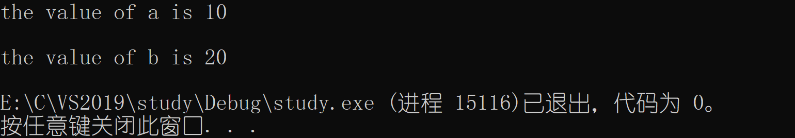

**结论**：使用`#`，把一个<u>宏参数变成对应的字符串</u>。

#### 2、##详解

**作用：**##可以把位于它两边的符号**合并**为一个符号。 它允许宏定义从分离的文本片段创建标识符。

**注意：** 这样的连接必须产生一个合法的标识符。否则其结果就是未定义的。

举例

```c
#define CONNECT(X,Y) X##Y
#include<stdio.h>
int main()
{
    int jing = 100;
    printf("%d\n", CONNECT(ji, ng));
    return 0;
}
```


### （四）带副作用的宏参数

当宏参数在宏的定义中出现超过一次时，如果参数带有副作用，那么在使用这个宏的时候，就可能出现危险，导致不可预测的后果。副作用就是表达式求值时，出现永久性效果。

代码如下：

````c
int b = a+1; //不带副作用
int b = a++; //带有副作用
````

**举例：**MAX比大小

```c
#define MAX(x,y) ((x)>(y)?(x):(y))
#include<stdio.h>
int main()
{
    int n1 = 10;
    int n2 = 20;
    printf("比较前：n1 = %d n2 = %d\n", n1, n2);
    int max = MAX(n1++, n2++);
    //等价于 int max = ((n1++) > (n2++) ? (n1++) : (n2++));
    printf("\n比较后：");
    printf("\n\tmax = %d\n", max);
    printf("\tn1 = %d n2 = %d\n", n1, n2);
}
```


**结论：**宏参数替换，属于**文本替换**，不会计算宏参数的表达式。

### （五）宏与函数对比

**示例**

````c
#define MAX(x,y) ((x)>(y)?(x):(y))
#include<stdio.h>
int Max(int x, int y)
{
    return (x > y ? x : y);
}
int main()
{
    int n1 = 10;
    int n2 = 20;
    int max1 = MAX(n1, n2);
    int max2 = Max(n1, n2);
    printf("max1 = %d\n", max1);
    printf("max2 = %d\n", max2);
}
````

假如我们要比较`float`类型，此时Max函数就无法使用，我们需要再写一个函数，比较麻烦。但是宏定义不同，它仍然可以使用。

- 宏的优点
  - 用于调用函数和从函数返回的代码可能比实际执行这个小型计算工作所需要的时间更多。所以<u>宏比函数在程序的规模和速度方面更胜一筹</u>。
  - 更为重要的是函数的参数必须声明为特定的类型。所以函数只能在类型合适的表达式上使用。反之这个宏可以适用于整形、长整型、浮点型等等可以用来比较的类型。<u>宏与类型是无关的</u>。

当然和函数相比，函宏也有劣势的地方。

- 宏的缺点
  - 使用宏时，一份宏定义的代码将插入到程序中。除非宏比较短，否则可能大幅度增加程序的长度。
  - 宏是不能调试的。
  - 宏由于类型无关，也就不够严谨。
  - 宏可能会带来运算符优先级的问题，导致程容易出现错。

<center style="color: #b91919; text-decoration: none; font-weight: bolder;">宏与函数对比图</center> 

|       属性       | #define定义宏                                                | 函数                                                         |
| :--------------: | ------------------------------------------------------------ | ------------------------------------------------------------ |
|     代码长度     | 每次使用，宏代码都会被插入到程序中。除了非常小的宏。这会导致程序的长度会大幅度增长。 | 函数代码只出现于一个地方。每次使用这个函数时，都调用那个地方的同一份代码。 |
|     执行速度     | 更快                                                         | 存在函数的调用和返回的额外开销， 所以相对慢一些。            |
|   操作符优先级   | 宏参数的求值是在所有周围表达式的上下文环境里进行的，除非加上括号，不然邻近操作符的优先级可能会产生不可预料的后果。所以书写宏时，建议适量使用括号。 | 函数参数只在函数调用时求值一次，它的值传递给函数。表达式的求值结果更容易预测。 |
| 带有副作用的参数 | 参数可能被替换到宏体中的多个位置，所以带有副作用的参数求值可能会产生不可预料的结果。 | 函数参数只在传参的时候求值一次， 结果更容易控制。            |
|     参数类型     | 宏的参数与类型无关，只要对参数的操作是合法的，它就可以使用于任何参数类型。 | 函数的参数与类型有关，如果参数的类型不同，就需要不同的函数。即使它们执行的任务是相同的。 |
|       调试       | 宏是不方便调试的。                                           | 函数是可以逐语句调试的。                                     |
|       递归       | 宏是不能递归的。                                             | 函数是可以递归的。                                           |

### （六）命名约定、#undef

1、命名约定

一般来说，函数的宏的使用语法很相似。所以语言本身没法帮我们区分二者。 我们的使用习惯是： <u>把宏名全部大写，函数名不要全部大写</u>。

2、#undef

作用：这条指令用于移除一个宏定义。

**举例**

```c
#define MAX(x,y) ((x)>(y)?(x):(y))
#undef MAX
//如果现存的一个名字需要被重新定义，那么它的旧名字首先要被移除。此时定义已失效。
```

### （七）命令行定义

许多C 的编译器提供了一种能力，允许在命令行中定义符号。用于启动编译过程。 例如：当我们根据同一个源文件要编译出一个程序的不同版本时，这个特性就有用处。假定某个程序中声明了一个某个长度的数组，如果机器内存有限，我们需要一个很小的数组，但另一个机器内存充足，我们需要一个很大的数组。

```c
//linux环境
#include<stdio.h>
int main()
{
    int i = 0;
    int arr[sz] = 0;
    for (i = 0; i < sz; i++);
    {
        arr[i] = i;
    }
    for (i = 0; i < sz; i++);
    {
        pritf("%d ", arr[i]);
    }
    return 0;
}
```

**编译指令**

````c
gcc -D ARRAY_SIZE=10 test.c
````

### （八）条件编译

#### 1、简单介绍

在编译一个程序的时候我们如果要将一条语句（一组语句）编译或者放弃是很方便的。因为我们有条件编译指令。调试性的代码，删除可惜，保留又碍事，所以我们可以选择性地编译。

**举例**

```c
#include<stdio.h>
int main()
{
    int arr[10] = { 1, 2, 3, 4, 5, 6, 7, 8, 9, 0 };
    int i = 0;
    for (i = 0; i < 10; i++)
    {
        arr[i] = 0;
#if DEBUG
        printf("%d ", arr[i]);
#endif
    }
    return 0;
}
```

#### 2、常见的条件编译指令

（1）单分支

````c
//常量表达式结果为真（不为0），执行打印语句；反之，不执行打印语句。
#include<stdio.h>
int main()
{
#if /*常量表达式*/
    printf("jinghu-moon\n");
#endif
    return 0;
}
````

（2）多分支

````c
#include<stdio.h>
int main()
{
#if 1==1
    printf("镜\n");
#elif 2==1
    printf("湖\n");
#else 
    printf("月\n");
#endif
    return 0;
}
````

（3）是否被定义

```c
//3.1 已定义
#define symbol
#include<stdio.h>
int main()
{
#if defined(symbol)
    printf("镜\n");
#endif

#ifdef symbol
    printf("镜\n");
#endif
    return 0;
    //以上两条指令等价
}

//3.2 未定义
#define symbol
#include<stdio.h>
int main()
{
#if !defined(symbol)
    printf("镜\n");
#endif

#ifndef symbol
    printf("镜\n");
#endif
    return 0;
    //以上两条指令等价
}
```

（4）嵌套指令

```c
//#define symbol1
#define symbol2
#define case1
#define case2
//#define case3
#define case4
#include<stdio.h>
int main()
{
#if defined(symbol1)
    #ifdef case1
    	printf("jing\n");
    #endif
    #ifdef case2
    	printf("hu");
    #endif
#elif defined(symbol2)
    #ifdef case3
    	printf("-\n");
    #endif
    #ifdef case4
    	printf("moon\n");
    #endif
#endif
    return 0;
}

//打印结果：moon
```

### （九）文件包含

`#include`指令一个源文件（`.c`）可以将另一个源文件（`.h`）的全部内容包含进来。替换的方式： 预处理器先删除这条（包含）指令，并用包含（头）文件的内容替换。如果一个源（头）文件被包含10次，那就实际被编译10次。

1、头文件被包含方式

- 本地文件包含

```c
#include "filename"
```

查找策略：先在<u>源文件所在目录</u>下查找，如果该头文件未找到，编译器就像查找库函数头文件一样，在<u>标准位置</u>查找头文件。如果找不到就提示编译错误。

<center style="color: #b91919; text-decoration: none; font-weight: bolder;">VS环境下标准头文件路径（个人）</center> 


注意按照自己的安装路径去找。推荐使用[Everything](https://www.voidtools.com/zh-cn/)搜索。

- 库文件包含

```c
#include <filename.h>
```

查找头文件直接去<u>标准路径</u>下去查找，如果找不到就提示编译错误。

**注意：**对于<u>库文件</u>，也可以使用`""`的形式包含。但这样做，查找的效率会降低，而且难以区分是库文件还是本地文件。不推荐使用。

- 嵌套文件包含


comm.h和comm.c是公共模块。test1.h和test1.c使用了公共模块。test2.h和test2.c使用了公共模块。test.h和 test.c使用了test1模块和test2模块。这样最终程序中就会出现两份comm.h的内容。**造成文件内容的重复。**

解决方法1：<u>条件编译</u>

```c
#ifndef __TEST_H__ 
#define __TEST_H__ 
/*头文件的内容*/
#endif
```

解决方法2：

```c
#pragma once
//作用：头文件的最开始加入这条杂注，就能够保证头文件只被编译一次。
```

#pragma once用法总结：https://www.cnblogs.com/qiang-upc/p/11407364.html

## 三、笔试题

题目：编写宏，计算结构体中某变量相对于首地址的偏移，并给出说明。

`````c
#define OFFSETOF(struct_name, member_name) (int)&(((struct_name*)0)->member_name)
#include<stdio.h>

struct S
{
    char c1;
    int a;
    char c2;
};

int main()
{
    struct S s;
    printf("%d\n", OFFSETOF(struct S, c1));
    printf("%d\n", OFFSETOF(struct S, a));
    printf("%d\n", OFFSETOF(struct S, c2));
    return 0;
}
`````


[offsetof 函数解析 ](https://www.cnblogs.com/zhangjing0502/archive/2012/06/01/2530939.html)

[^1]:缺省，英文：default，中文：系统默认状态。[缺省_百度百科](https://baike.baidu.com/item/缺省/86055?fr=aladdin)

[^2]:转移表：本质上就是函数指针数组。函数指针数组通过下标，取得数组元素（函数）的地址，从而执行相应的函数。例如下文的简单计算器实现。转移表的详细内容见《C和指针》13.3.2  转移表。[《C和指针》PDF链接](https://xianchengyue.lanzoui.com/irSj4szyrdc) 密码：6124。


