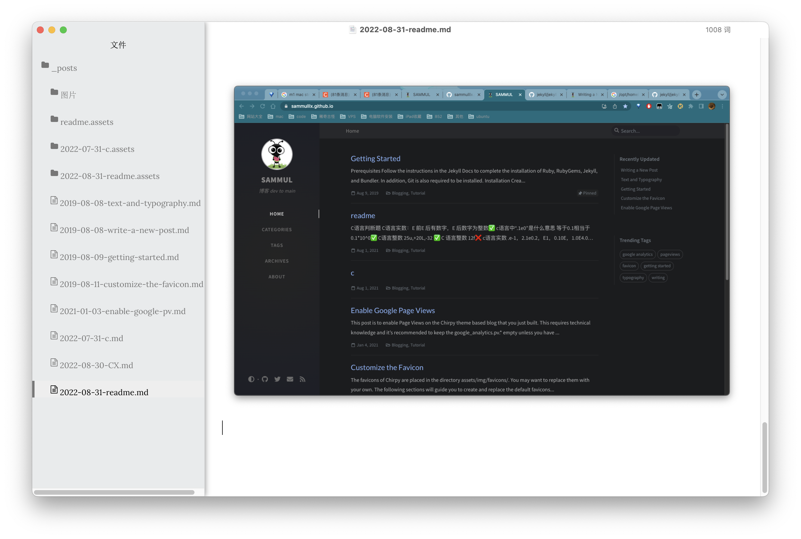

# C 语言判断题

---

- C 语言实数：E 前 E 后有数字，E 后数字为整数 ✅
- c 语言中“.1e0"是什么意思 等于 0.1 相当于 0.1\*10^0✅
- C 语言整数 25u,+20L,-32 ✅
- C 语言整数 12f❌
- c 语言实数 .e-1，2.1e0.2，E1，0.10E，1.0E4.0，1.2E1.2 ❌
- C 语言程序可以定义多个不同内容的 main 函数 ❌
- 可运行 C 语言程序不需要包含 main()函数 ❌
- C 程序必须由 main 语句开始 ❌
- C 程序的执行总是从 main 函数开始，在 main 函数结束。✅
- 结构化程序的三种基本结构是循环结构、选择结构、顺序结构 ✅
- 函数体必须由 {开始 ✅
- 注释中间可以嵌套另一个注释 ❌
- C 语言本身没有输入输出语句，printf 和 scanf 都是 C 语言标准函数库里实现的,并不是 C 语法里规定的,不是 C 的关键字 ✅
- C 语言中数据类型包括整型，实型（也称浮点型），字符型 ✅
- 函数是 C 语言的基本组成单位 ✅
- break 语句只能用在循环语句内部 ❌
- 可以根据需要在一个函数中定义另一个函数 ❌
- 对于字符串数组或字符串指针变量，由于数组名可以转换为数组和指针变量名本身就是地址，因此使用 scanf()函数时，不需要在它们前面加上"&"操作符。✅
- 井号 Define 不是 c 语句所以后面不用加分号，typedef 是 c 语句要加分号 ✅

# VIM

[vim 文字教程](https://www.tuyrk.cn/imooc/1129-vim/)

四种模式：普通，插入，命令，可视化。

- 插入模式的操作

  - i #insert 光标位置插入

  - a #appent 光标后一位插入

  - o #open a line below 光标所在行下新一行

  - A #appent after line 光标行最后位置插入

  - I #insert before line 光标所在行最前方位置插入

  - O #append a line above 光标所在行上一行插入

- 可视化模式的操作

  - v/V 进行可视化（光标/整行选中）操作,加 ctrl 可实现块状操作；

  - y 命令可以复制选中的块，p 可以粘贴复制的块，d 可以删除选中的块。命令模式中的操作

- - 命令模式中使用 set nu 设置行号

  - 用 syntax on 开启语法高亮

  - sp(split 水平)、vs(vertical split 垂直)可进行分屏编辑

  - % s/str1/str2/[g] 可进行文本[全局]替换。 （无需输入中括号）

- 输入模式下快速纠错(终端下也有类似的快捷键)

  - ctrl+h 删除上一个字符

  - ctrl+w 删除上一个单词

  - ctrl+u 删除当前行

  - ctrl+a (终端) 快速移动到开头

  - ctrl+e (终端)快速移动到结尾

  - ctrl+f (终端)光标后移

  - ctrl+b (终端)光标迁移

- 快速切换 insert 和 normal 模式

- insert->normal: ctrl+c 或者 ctrl+[

- gi: normal 模式切换到 insert 模式，且到上次编辑的地方

- 正常模式移动的快捷方式

  - w/W: 移动到下一个 word/WORD 开头

  - e/E: 移动到下一个 word/WORD 结尾

  - b/B: 移动到上一个 word/WORD 开头 (backword)

- 正常模式行间搜索移动

  - f{char}: 当前光标往行后搜索字符, 分号(;)下一个找到的字符，逗号(,)上一个找到的字符(无需打出大括号)

  - F{char}: 当前光标往前搜索字符

  - 0: 移动到行首第一个字符

  - ^: 移动到第一个非空白字符

  - $: 移动到行尾

  - g\_: 移动到行尾非空白字符

- 正常模式垂直移动

  - 使用括号()在句子间移动

  - 使用{}在段落中移动

  - 可用 esay-motion 插件移动

- 正常模式页面移动

  - gg: 文件开头

- G: 文件结尾
  - H: 屏幕的开头(Head)
- M: 屏幕的中间(Middle)
  - L: 屏幕的结尾(Lower)
- crtl+u: 上翻页（upword）
  - ctrl+f: 下翻页（forword）
- zz: 屏幕置为中间

<iframe allow="autoplay *; encrypted-media *; fullscreen *; clipboard-write" frameborder="0" height="175" style="width:100%;max-width:660px;overflow:hidden;background:transparent;" sandbox="allow-forms allow-popups allow-same-origin allow-scripts allow-storage-access-by-user-activation allow-top-navigation-by-user-activation" src="https://embed.music.apple.com/cn/album/%E7%9B%B8%E5%8F%8D%E7%9A%84%E6%88%91/905219110?i=905219117"></iframe>
